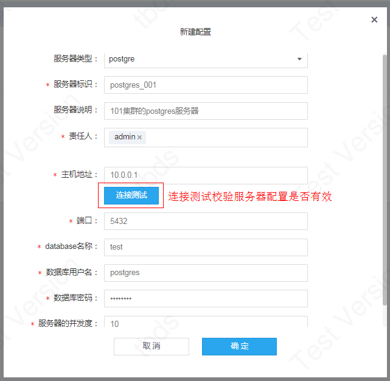
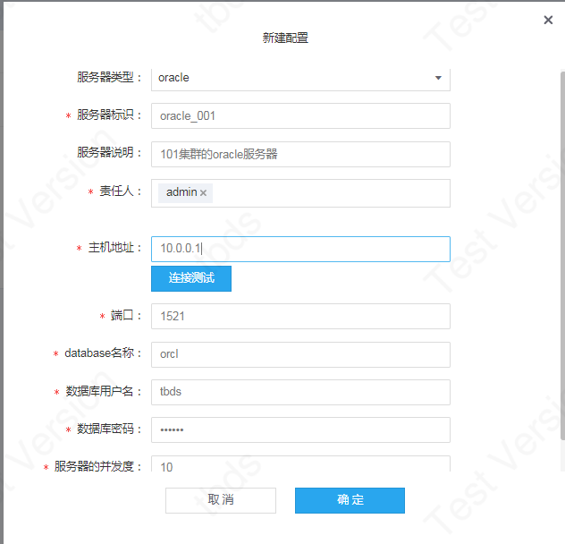
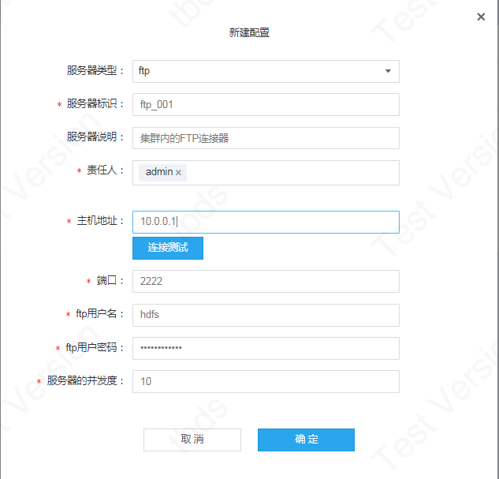
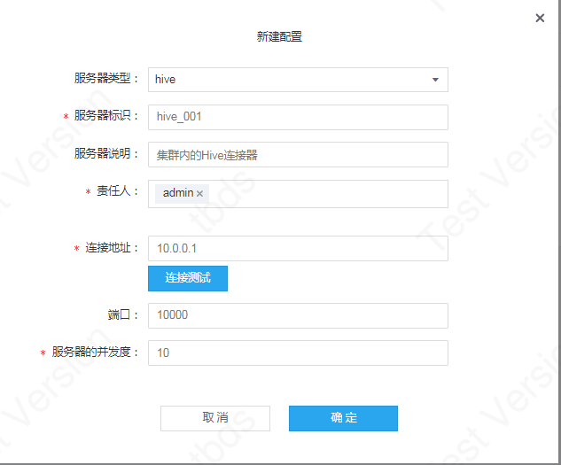

### 服务器配置操作
点击服务器配置右上角按钮【新建配置】创建新增服务器配置。

#### 1、MYSQL
选择服务器类型:mysql，进行MYSQL类型的服务器配置，配置完成后，可以点击【连接测试】按钮，校验服务器配置是否有效。【连接测试】会根据所填的服务器信息去进行连接的测试，判断连接是否正常。

参数说明：
- 服务器类型：选择服务器的类型，目前支持8种：mysql, postgres, oracle, sqlserver, hive, ftp, hdfs, mr-group；
- 服务器标识：设置服务器的唯一标识，创建后不支持修改；
- 服务器说明：服务器的备注信息，便于管理、识别；
- 责任人：服务器只能被责任人进行修改；
- 主机地址：MYSQL的连接IP地址，如：10.0.0.1；
- 端口：MYSQL的连接端口，默认：3306
- database名称：服务器配置所指向的MYSQL database；
- 数据库用户名：连接MYSQL并进行后续相应任务操作的用户名；
- 数据库密码：连接MYSQL的用户所对应的密码；
- 服务器并发度：并行执行的数量，默认是10，在运行任务时，规定使用该server的任务实例数的上限。

#### 2、POSTGRES
选择服务器类型:postgre，进行POSTGRES类型的服务器配置。

- 主机地址：POSTGRES的连接IP地址，如：10.0.0.1；
- 端口：POSTGRES的连接端口，默认：5432
- database名称：服务器配置所指向的POSTGRES database；
- 数据库用户名：连接POSTGRES并进行后续相应任务操作的用户名；
- 数据库密码：连接POSTGRES的用户所对应的密码；

#### 3、ORACLE
选择服务器类型:oracle，进行ORACLE类型的服务器配置。
- 主机地址：ORACLE的连接IP地址，如：10.0.0.1；
- 端口：ORACLE的连接端口，默认：1521；
- database名称：ORACLE数据库的实例名，常用：orcl；
- 数据库用户名：连接ORACLE并进行后续相应任务操作的用户名；
- 数据库密码：连接ORACLE的用户所对应的密码；

#### 4、SQLSERVER
选择服务器类型:sqlserver，进行SQLSERVER类型的服务器配置。
- 服务器版本：SQLSERVER的版本：MSSQL_2008：SQLSERVER 2008版本；
- 主机地址：SQLSERVER的连接IP地址，如：10.0.0.1；
- 端口：SQLSERVER的连接端口，默认：1433；
- database名称：SQLSERVER连接的database
- 数据库用户名：连接SQLSERVER并进行后续相应任务操作的用户名；
- 数据库密码：连接SQLSERVER的用户所对应的密码；

#### 5、FTP
选择服务器类型:ftp，进行FTP类型的服务器配置。
- 主机地址：FTP服务的连接IP地址，如：10.0.0.1；
- 端口：FTP的连接端口，默认：2222；
- ftp用户名：连接FTP用户
- ftp用户密码：连接FTP的用户所对应的密码；

**备注：** 选择创建FTP服务器配置时，默认会加载套件内安装的FTP服务的配置信息，如果新增非套件内的FTP服务器，则修改对应的连接信息即可。

#### 6、HIVE
选择服务器类型:hive，进行HIVE类型的服务器配置。

- 连接地址：Hive server的主机地址；
- 端口：Hive server的端口，默认：10000；

**备注：**
1. 选择创建Hive服务器配置时，默认会加载套件内安装的Hive服务的配置信息；
2. 服务器配置目前仅支持套件内的Hive集群，不支持外部的Hive集群；
3. Hive的连接信息用户默认取任务的执行用户和对应的LDAP密码；

#### 7、HDFS
选择服务器类型:HDFS，进行HDFS类型的服务器配置。

- namenode主机地址：默认获取集群内HDFS的namenode主机IP，若namenode为HA，则获取配置的文件空间，集群内默认是：hdfs://hdfsCluster

**备注：**
1. 选择创建HDFS服务器配置时，默认会加载套件内安装的HDFS服务的配置信息；
2. 服务器配置目前仅支持套件内的HDFS集群，不支持外部的HDFS集群；

#### 8、MR_GROUP

选择服务器类型:mr_group，进行MR_GROUP类型的服务器配置。MR_GROUP的配置与HDFS配置保持一致。MR_GROUP主要用于跑MR任务，指定MR任务使用的HDFS。

**备注：**
服务器责任人可以对服务器配置进行修改和删除操作，非责任人，只能查看服务器配置信息。

