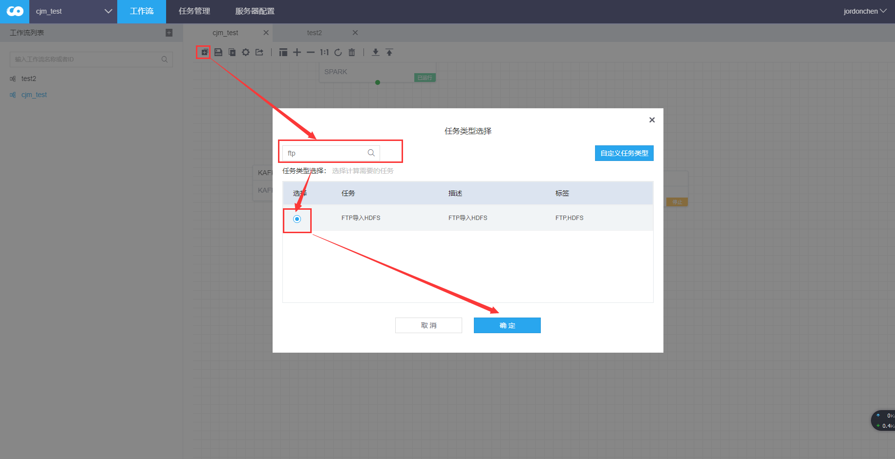
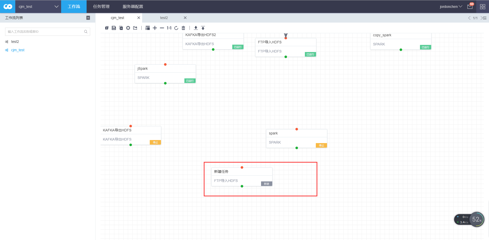
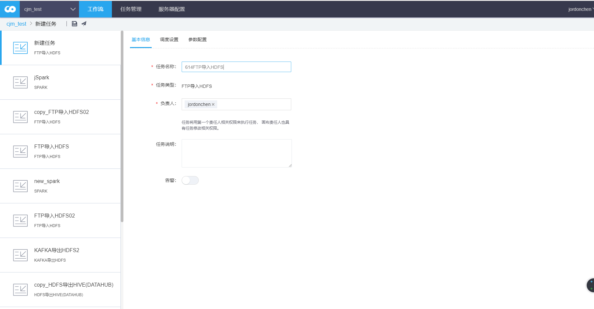
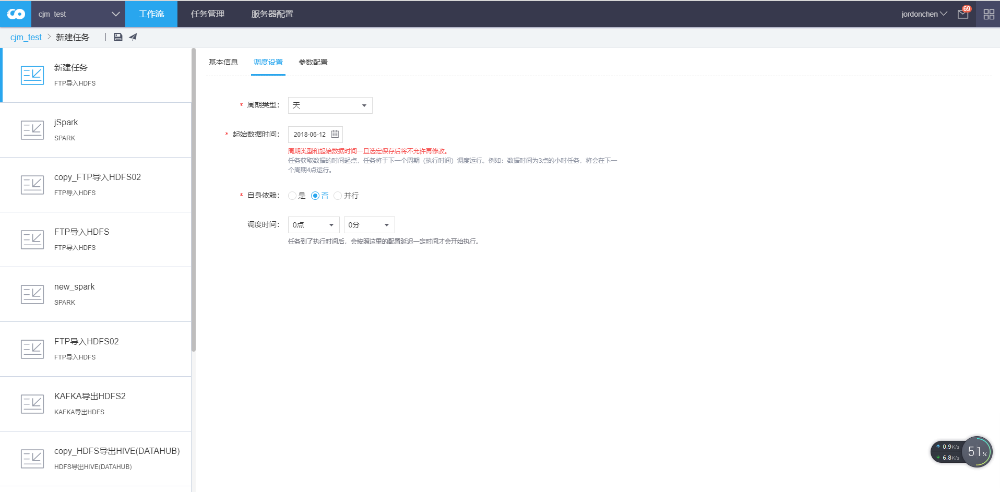
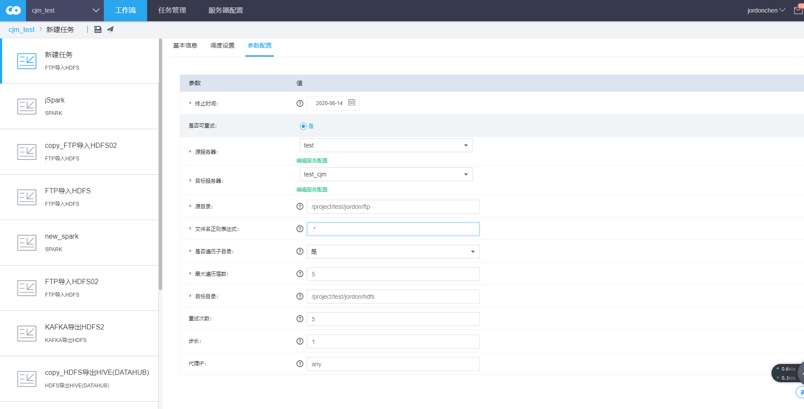
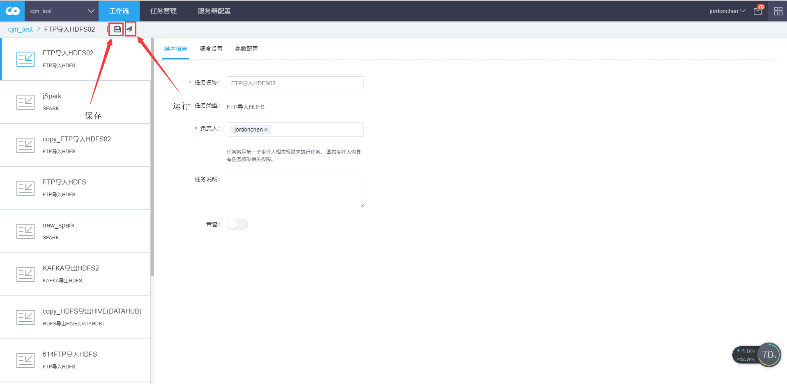
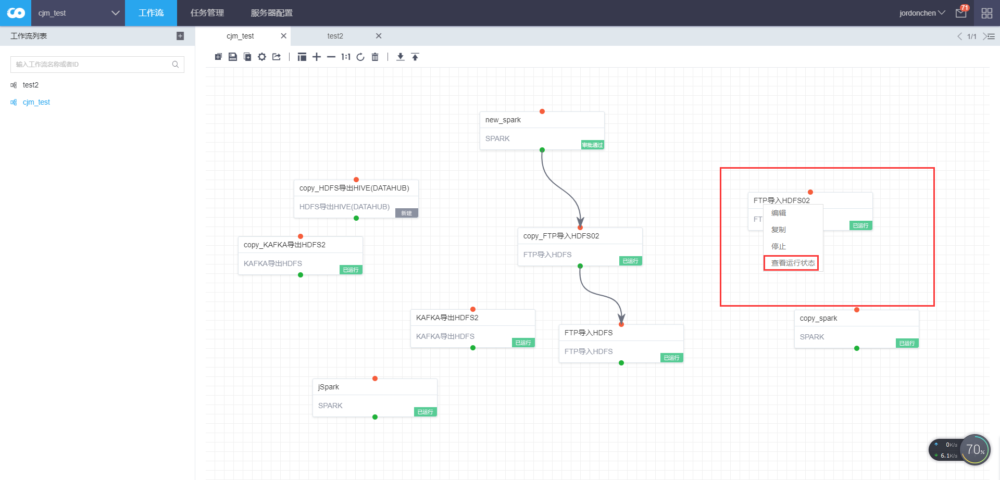
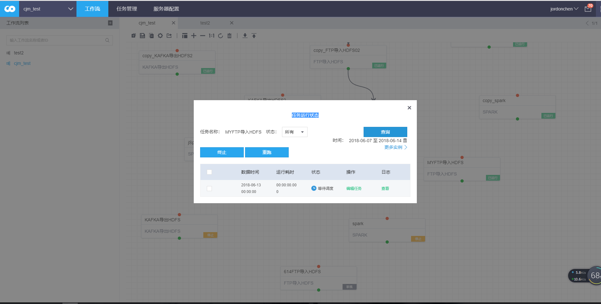
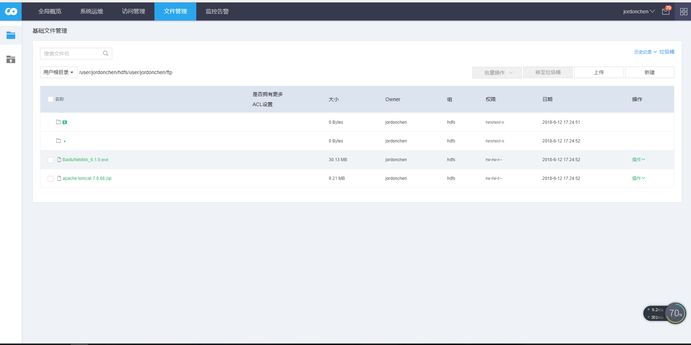

FTP导入HDFS
-----------

### 步骤（1）：新建工作流任务

将图中的“+”控件拖拽到画布中，搜索spark任务，选择spark任务，确认。

### 步骤（2）：填写基本信息

在画布中找到新建任务，双击编辑

### 步骤（3）：填写调度设置

步骤（4）：填写参数配置

1.  源服务器  
    源服务器是ftp
    服务器连接信息。[更多参数](https://tbds-book.gitbooks.io/tbds/workflow/services/readme.html)

2.  目标服务器  
    目标服务器是hdfs
    服务器连接信息。[更多参数](https://tbds-book.gitbooks.io/tbds/workflow/services/readme.html)

3.  源目录  
    指定将ftp 服务器哪些目录数据导入hdfs。  
    该参数不能直接到文件。请务必确保源目录用户有权限访问。  
    支持[时间隐式参数](https://tbds-book.gitbooks.io/tbds/workflow/workflow/more/implicitVariable.html)

4.  文件名正则表达式  
    支持java 正则表达规则， .\*
    为任意文件，支持[时间隐式参数](https://tbds-book.gitbooks.io/tbds/workflow/workflow/more/implicitVariable.html)

5.  是否遍历子目录  
    选择是，表示任务会遍历源目录下的子目录，遍历的深度由最大遍历层数决定。  
    选择否，表示不会遍历源目录下的子目录，最大遍历层数 不会生效。

6.  最大遍历层数  
    只有将是否遍历子目录设置为 是，该设置才会生效。当前目录为初始值为1。

7.  目标目录  
    ftp 数据导入hdfs的目的路径。  
    注意： 如果遍历子目录，系统会保留ftp 子目录结构。

#### 补充：编辑服务器配置

详情请查看<https://tbds-book.gitbooks.io/tbds/workflow/services/operation.html>

FTP:

选择服务器类型:ftp，进行FTP类型的服务器配置。

-   主机地址：FTP服务的连接IP地址，如：10.0.0.1；

-   端口：FTP的连接端口，默认：2222；

-   ftp用户名：连接FTP用户

-   ftp用户密码：连接FTP的用户所对应的密码；

**备注：** 选择创建FTP服务器配置时，默认会加载套件内安装的FTP服务的配置信息，如果新增非套件内的FTP服务器，则修改对应的连接信息即可。

HDFS

选择服务器类型:HDFS，进行HDFS类型的服务器配置。

-   namenode主机地址：默认获取集群内HDFS的namenode主机IP，若namenode为HA，则获取配置的文件空间，集群内默认是：hdfs://hdfsCluster

**备注：**

1.  选择创建HDFS服务器配置时，默认会加载套件内安装的HDFS服务的配置信息；

2.  服务器配置目前仅支持套件内的HDFS集群，不支持外部的HDFS集群；

### 步骤（4）：保存和运行任务

### 步骤（5）：查看任务状态

步骤（6）：在文件管理中查看结果

在运维中心-\>文件管理处，进入到所在的目录，查看结果。

