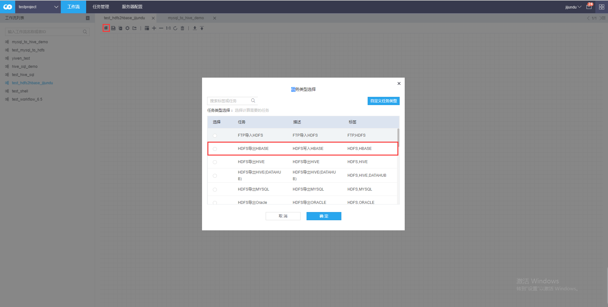
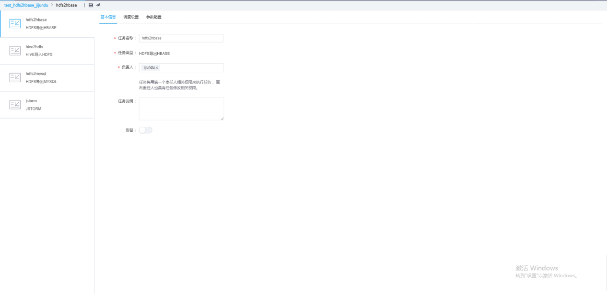
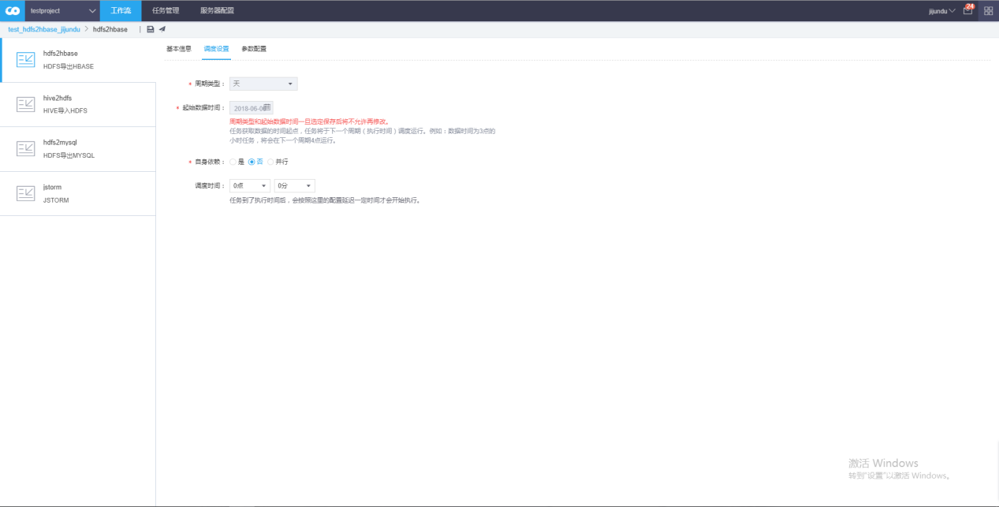
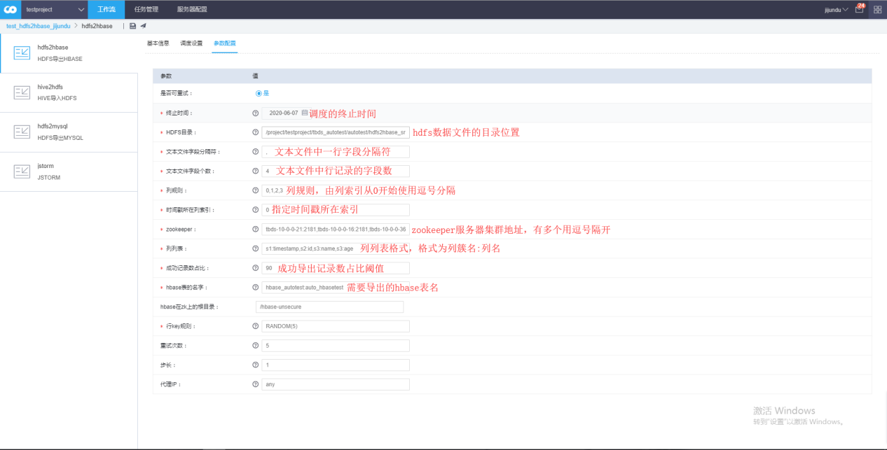
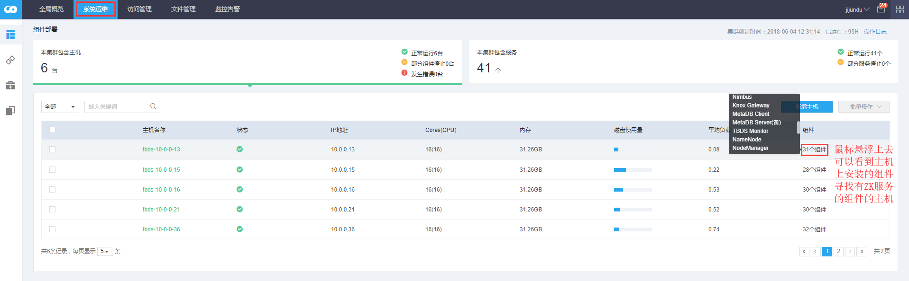
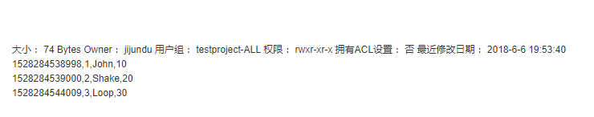
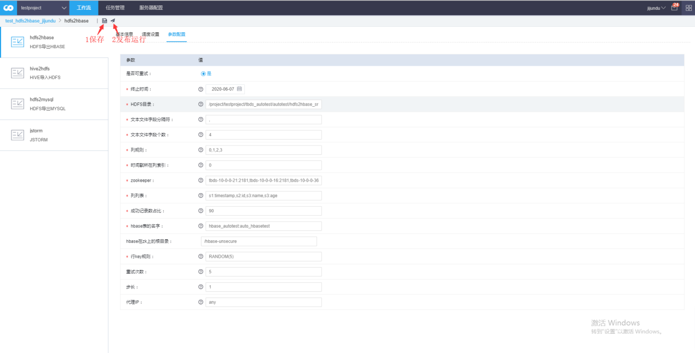
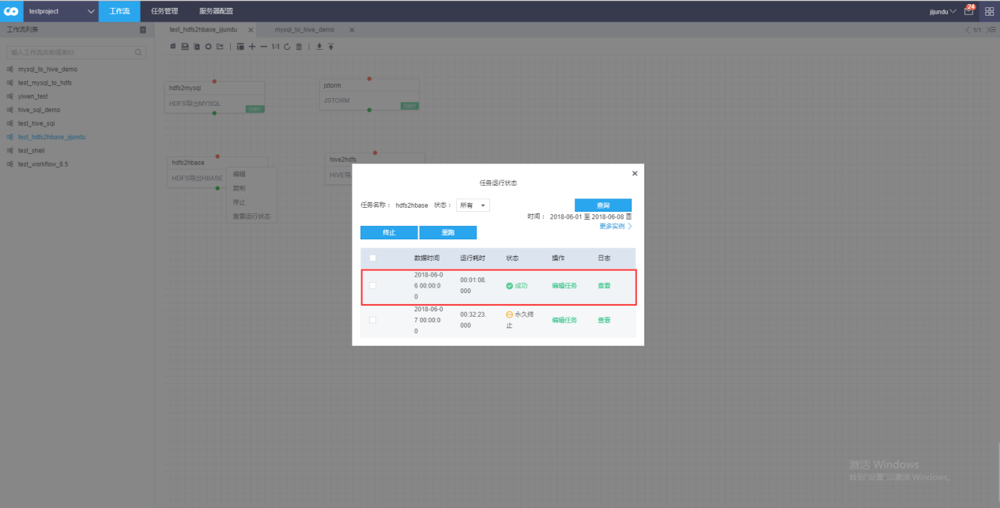
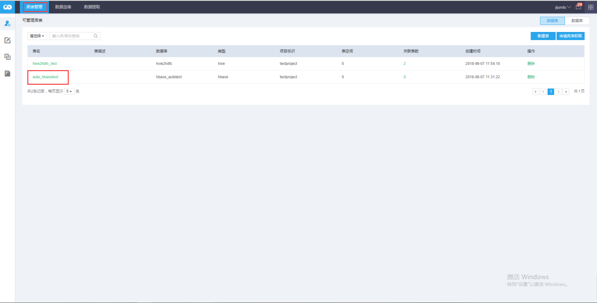

HDFS导出HBASE
----------------

### 步骤（1）新建工作流

如下图，拖拽新建一个任务，选择HDFS导出HBASE类型。

### 步骤（2）配置工作流参数

双击新建的任务，或者右键任务点击编辑进入参数配置界面，配置参数如下。

·基本信息

·调度设置

·参数配置

**HDFS导出hbase 参数设置只需要 hbase 配置信息。**

**HDFS 连接信息使用的集群默认HDFS地址。**

·HDFS配置

1、HDFS目录

待写入hbase的hdfs 文件所在目录（或文件）。不支持目录不存在。该参数直接作为job
inputpath 参数（替换here）：FileInputFormat.addInputPath(job, here);

2、文本文件字段个数

hdfs存放的数据文件，每行记录被分隔符切分的个数。表示对应切分的数据字段个数

实际使用位置为map类map方法，对应value进行切分后的个数判断。

3、文本文件字段分隔符

指定hdfs存放的数据文件，每行记录被切分为字段值的分隔符。

·hbase 配置

1、hbase表名

格式为dbName:tableName ,如：hbase_autotest:auto_kafka_hbase

2、列列表

将行数据使用逗号分隔，得到的行数据字段列表，用来表示hbase需要写入数据的字段。

格式为：列簇1名:列1名,列簇1名:列2名,列簇2名:列3名,列簇2名:列4名,列簇3名:列5名。

3、行key规则

指定行主键的生成方式：

a. RANDOM(n)表示生成生成一个随机长度n个数字作为hbase的row key.

b. REVERSE(n) 表示使用hdfs记录中被切分后的第n个部分反转值作为主键.

c. n 表示使用hdfs记录中被切分后的第n个部分作为主键.

d. '__' 表示使用常量__作为row key.

e. PADLEFT(n;m;str) 表示使用hdfs记录中被切分后的第n个部分，作为row key
最右边的部分，余下的m-n个部分由str组成。比如PADLEFT(0;5;c) 表示row key
最右边的部分为hdfs记录被切分的第一部分内容，余下不足的部分由字符串c 填充。

f. PADRIGHT(n;m;a) 表示使用hdfs记录中被切分后的第n个部分，作为row key
最左边的部分，余下的m-n个部分由str填充。比如PADRIGHT(0;5;c) 表示row key
最左边的部分为hdfs记录被切分后的第一个内容，余下不足的部分由字符串c 填充。

——

PS: 当然你也可以使用以上几者的组合比如RANDOM(5),'__',0
，主键将是随机的五个数字加__加hdfs记录被切分后的第一个部分作为rowkey

4、列规则

使用逗号分隔，跟列列表对应。用来表示hdfs记录被切分生成的数组值按照位置下标写入到hbase列列表对应位置的列名中。

如hdfs 其中一行的为: hello,word,i,come,from,20171216120000

列列表为 f1:c1,f1:c2,f1:c3,f2:c4,f3:c5,f4:c6

列规则为 0,1,2,3,4,5

则表示 hello 将被写入 列簇为f1 列名为c1的位置

5、时间戳所在列索引

为-1时，使用HConstants.LATEST_TIMESTAMP。其他情况下，将使用列规则对应位置的数值为下标的被切分的数组的数值。该数值必须能够被转为long
类型，否则该记录写入hbase失败。

例如：

如hdfs 其中一行的为: hello,word,i,come,from,20171216120000

列列表为 f1:c1,f1:c2,f1:c3,f2:c4,f3:c5,f4:c6

列规则为 0,1,2,3,4,5

时间戳所在列索引为5 ，则表示hdfs上的该记录对应的时间戳为20171216120000

如果时间戳所在列索引为0 ，表示将hello作为时间戳，那么记录写入hbase则会失败。

6、zookeeper连接地址

hbase 所在zk
集群。由于HBASE是需要依赖Zookeeper的，而zookeeper的配置项需要根据集群环境需求来进行变更，一般默认的就是集群的主机地址中，如果不清楚，可以到“运维中心”-“系统运维”下查看主机名和ip。

7、hbase在zk上的根路径

为hbase 在zk 上的根目录, 默认为：/hbase-unsecure

·其他配置项

1、成功记录数占比

写入成功的记录数超过该设置的值，任务成功，否则失败。

### 步骤（3）准备数据文件

下一步就是上传数据文件，注意，数据文件的格式一定要根据配置选项中所定义的结构一致。

### 步骤（4）保存并发布运行工作流

最后我们启动工作流任务，等待审批通过后运行工作流。

发现工作流运行成功。

### 步骤（5）查看工作流运行结果

最后我们查看一下hbase中的数据，从平台外部选择“数据资产”-“库表管理”，选择我们导入的hbase表，再选择记录数趋势页面，我们可以看到3条记录对应已经写入到hbase表当中。

