HDFS导出Mysql
----------------------

### 步骤（1）新建工作流

如下图，拖拽新建一个任务，选择HDFS导出mysql类型。

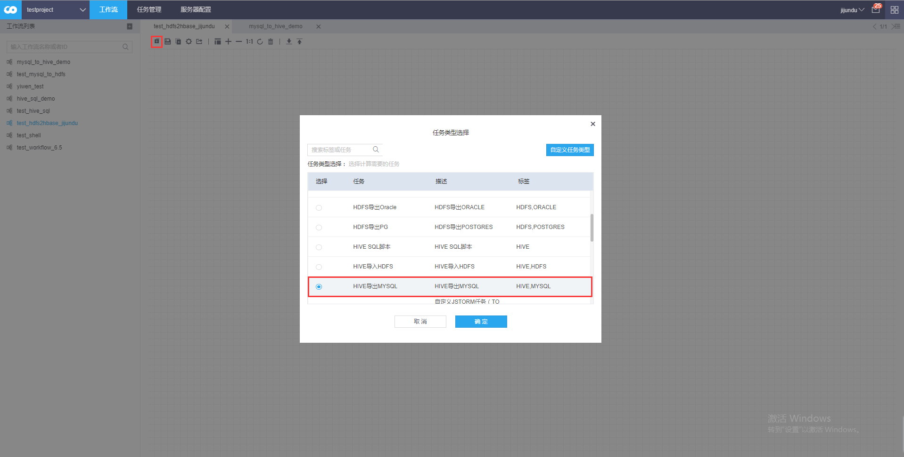

### 步骤（2）配置工作流参数

双击新建工作流，或点击编辑进入工作流参数编辑界面。配置如下。

·基本信息

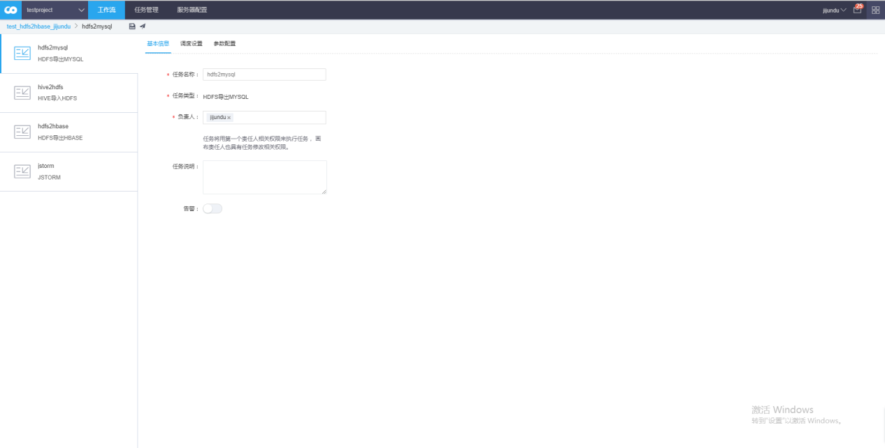

·调度设置

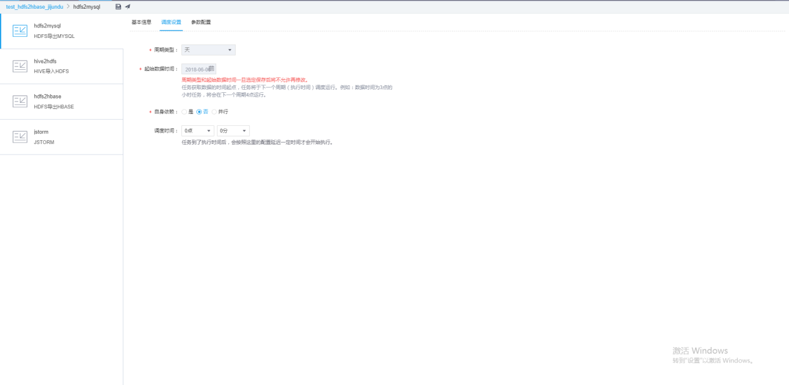

·参数配置

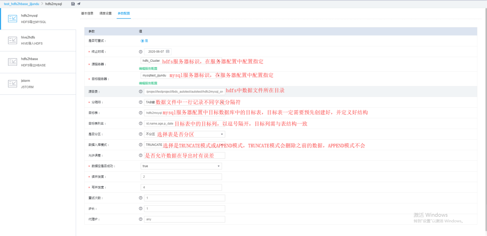

参数含义：

1、源服务器

源目标服务器是hdfs
服务器连接信息。可以通过配置服务配置链接进行配置，详见**步骤（3）**

2、目标服务器

目标服务器是mysql
服务器连接信息。可以通过配置服务配置链接进行配置，详见**步骤（3）**

3、源目录

指定hdfs 上哪些目录（文件）数据导入mysql。不支持 hdfs 数据目录不存在。

4、分隔符

源服务器上待导入到mysql 的hdfs
数据文件字段内容分隔符。一个任务只能支持同一个分隔符。

5、目标表

待写入数据的mysql
表名。表对应的数据库已经在服务器配置中指定，这里不需要重复指定。如果插入的数据有中文，请确保创建的mysql表编码格式为utf8。我们必须要提前去定义表和结构。

6、目标表列名

待写入数据的mysql 表对应的字段，其字段个数和顺序需要和hdfs
数据文件内容列要匹配。不同的列名使用逗号分隔。不支持db 表字段以整数开头

7、是否分区

是否分区是指mysql 表是否为分区表。

如果选择否，直接写入数据。

如果选择是，则需要进一步制定分区字段格式，目前只支持时间格式，通常任务调度周期和字段分区类型对应。比如任务调度周期是天，数据按天分区，分区字段选择P_\${YYYYMMDD}
。在将数据写入mysql 中，执行的sql 语句中会嵌入partition 关键字。

8、数据入库模式

append和truncate两种模式。

使用truncate模式，写入数据之前会将对应的分区数据删除，如果mysql不是分区表，那么会将mysql
表所有数据删除。append 模式不会删除历史数据。

请谨慎选择truncate模式。

9、允许误差

允许出错的百分比，20代表允许有20%的数据可以读或者写失败，0代表不允许有任何数据读写失败。读写各算一次失败。

10、数据为空是否成功

如果数据源数据为空，任务是否成功。

选择是，读写数据为空，任务实例成功。

选择否，读写数据为空，任务实例失败。

11、读并发度

读hdfs 数据的并发线程数。

12、写并发度

数据写入mysql的并发线程数。

### 步骤（3）配置服务器

这里需要注意的是，我们的源服务器和目标服务器是需要进行预先配置的。我们点击编辑服务配置去进行服务器配置。这里可以看到我之前预先建立的一个服务器，只有我们自己建的服务器才能被我们编辑和删除。

假设没有任何hdfs和mysql服务器，那么我们分别新建这两个服务器。

·新建HDFS服务器

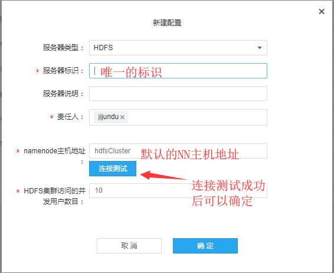

·新建mysql服务器

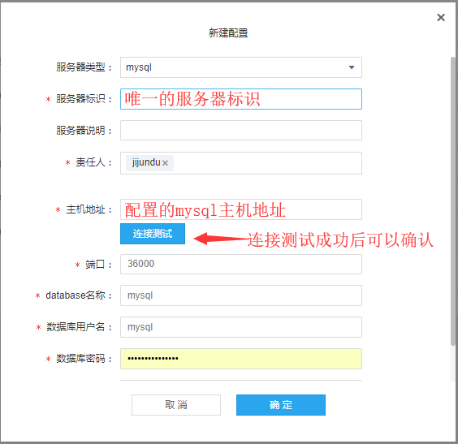

### 步骤（4）准备数据库结构和数据

需要注意的是在hdfs服务器会默认配置一个数据库，我们的数据库和表需要预先建立好，如下图所示。

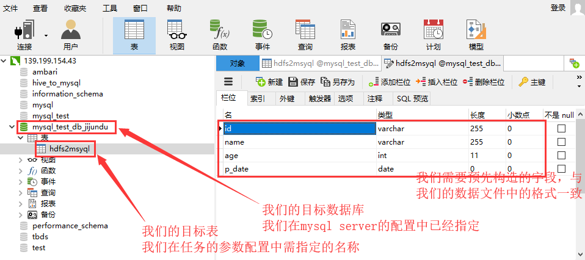

然后我们需要上传数据文件到hdfs服务器中，如下图所示

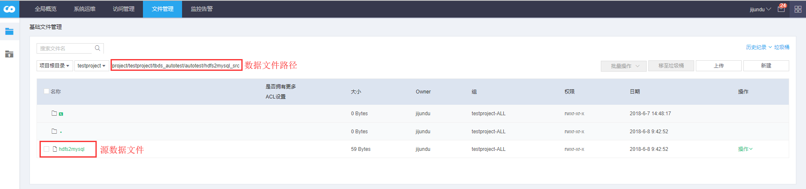

点击数据文件，我们可以看到数据文件中的数据

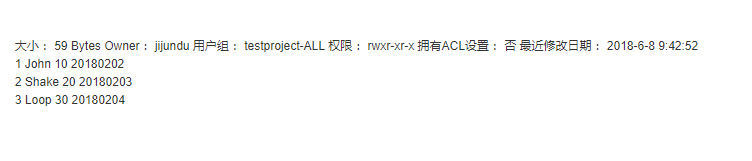

### 步骤（5）保存并发布运行工作流

我们保存工作流并运行工作流，最后等待管理员审核通过后运行。

最后我们看到运行成功！

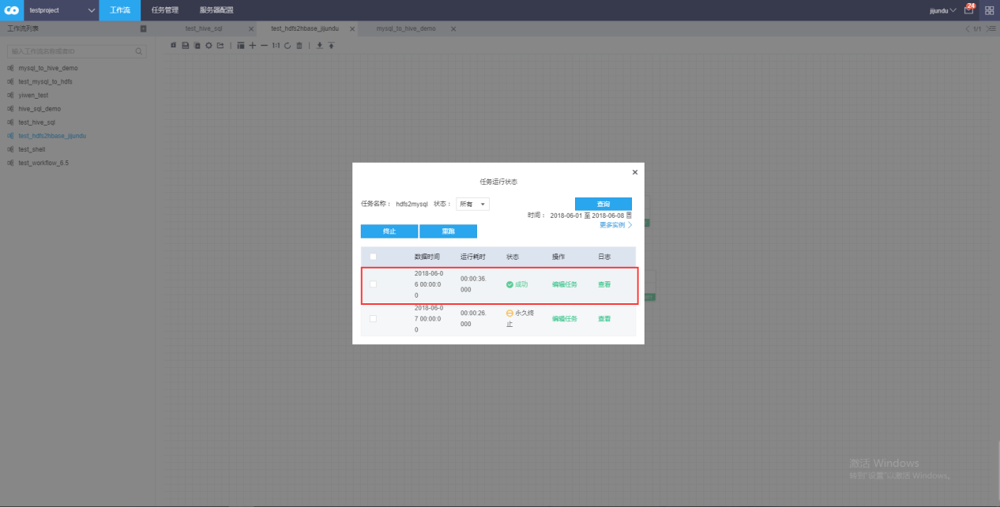

### 步骤（6）查看工作流运行结果

最后我们看到mysql中，发现数据也都输出进去了。工作流完成。

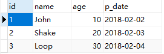