Hive SQL脚本
============

步骤（1）新建工作流
-------------------

点击工作流列表右上角的“+”，在弹出的窗口中输入工作流名称“hive_sql_demo”，点击“确定”完成工作流的创建。

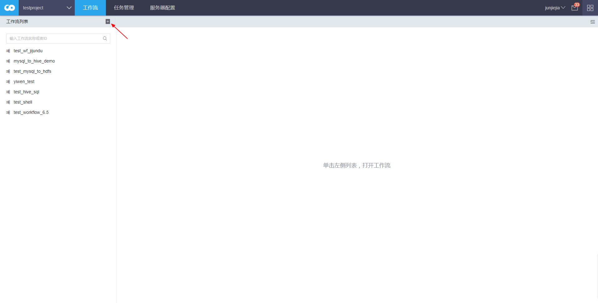

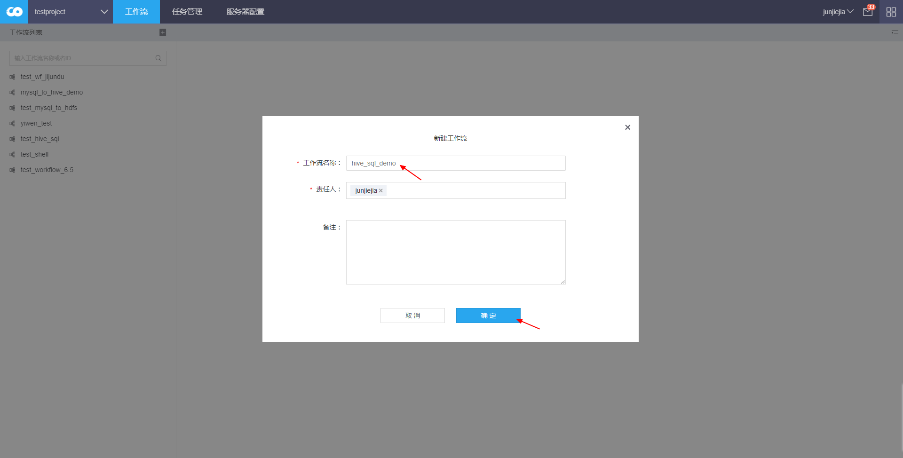

步骤（2）新建任务
-----------------

拖拽画布左上角“+”，在弹出的窗口中选中“HIVE SQL脚本”，点击“确定”完成任务的创建。

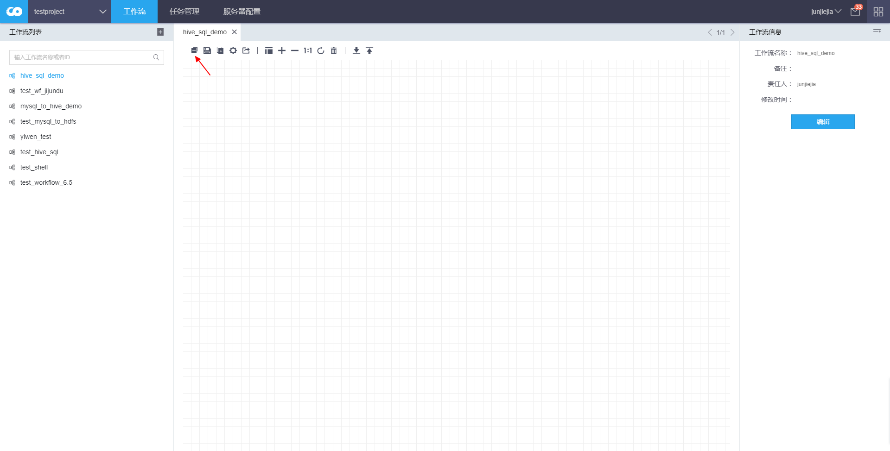

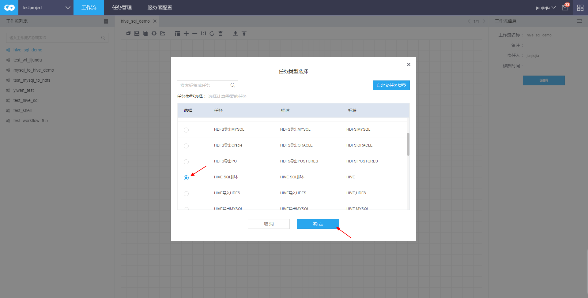

步骤（3）填写任务基本信息
-------------------------

右键点击任务框，点击“编辑”进入任务的编辑界面。

在“基本信息”中填写任务名称“hive_sql_demo”。

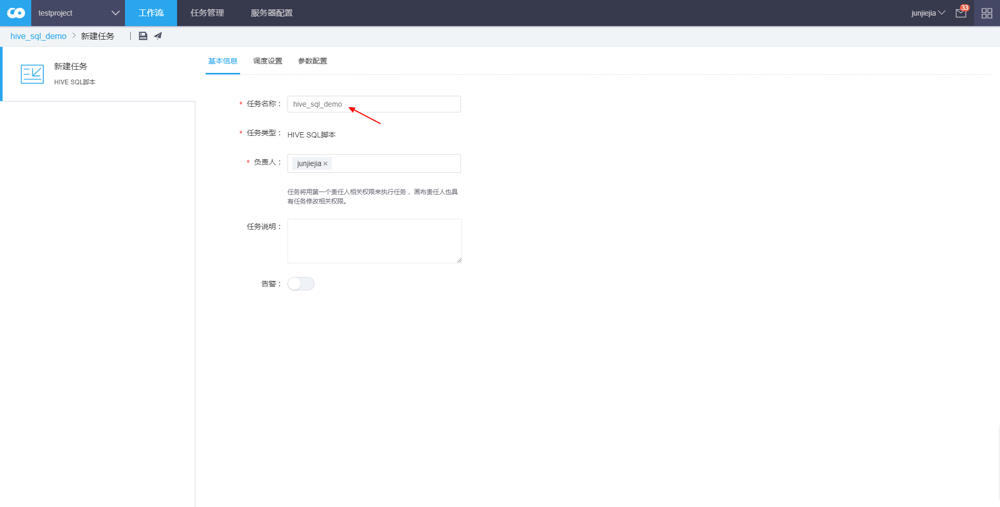

步骤（4）填写任务调度设置
-------------------------

在“调度设置”中选择周期类型“一次性非周期”。

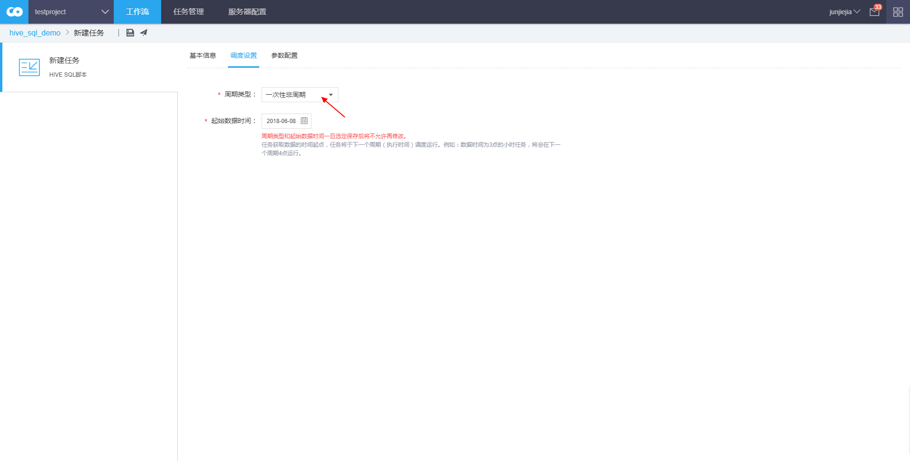

步骤（5）填写任务参数设置
-------------------------

在“参数配置”中选择源服务器“hive_server”。点击“上传脚本”，在弹出的窗口中上传Hive
SQL脚本文件“hive_sql_demo.sql”。脚本文件内容：

show databases;

use hive_test;

select \* from mysql_user;

select count(\*) from mysql_user;

注意：

（1）务必确保任务的第一责任人有权限访问脚本文件中的Hive表；

（2）脚本中可以使用时间参数\${YYYYMMDDHH}，运行时会使用实例时间进行替换；

（3）如果脚本文件含有中文，务必确保文件是无BOM的UTF-8编码格式。

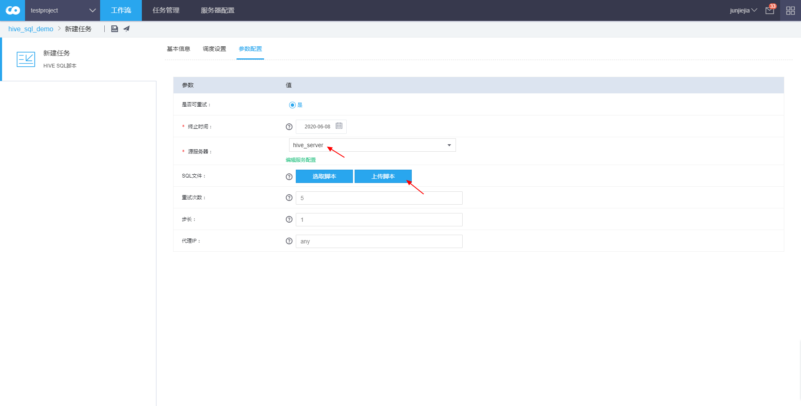

点击保存图标保存任务配置。

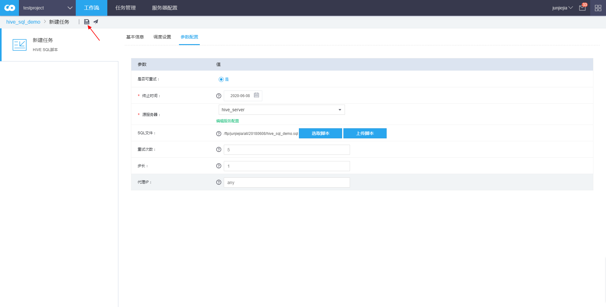

步骤（6）任务审批
-----------------

返回工作流画布。右键点击任务框，点击“运行”，在弹出的窗口中勾选“审批通过后自动运行”，点击“确定”。

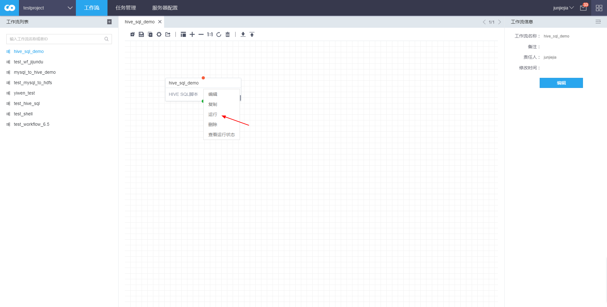

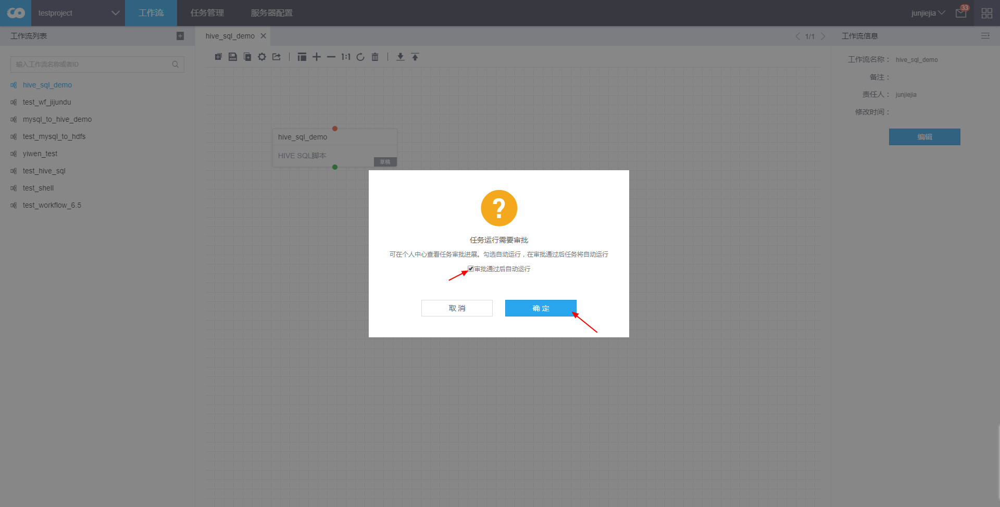

任务进入“审批中”状态，等待审批结果。

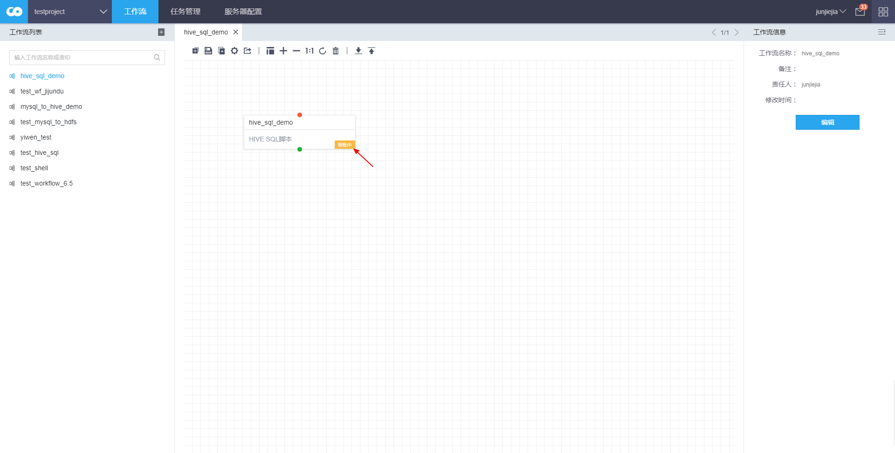

步骤（7）查看任务状态
---------------------

审批通过后，任务进入“运行”状态，右键任务框，点击“查看运行状态”，依次为显示“等待调度”和“运行中”。

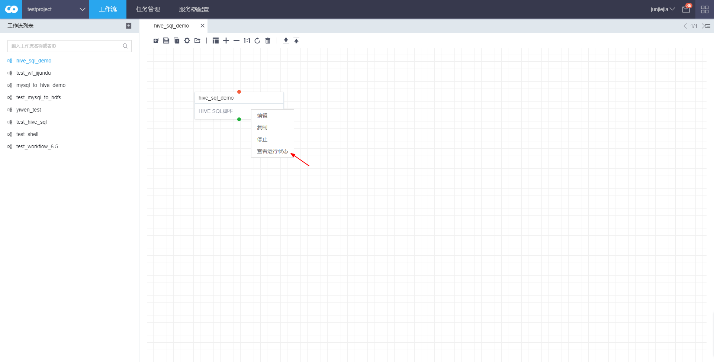

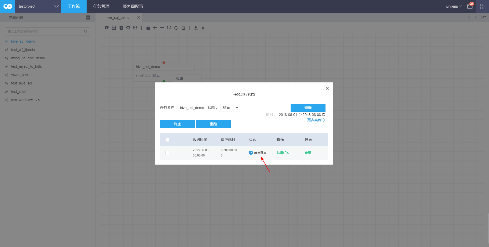

步骤（8）验证任务是否成功
-------------------------

状态变为“成功”后，点击“查看”，可以看到执行的Hive SQL脚本和运行结果。

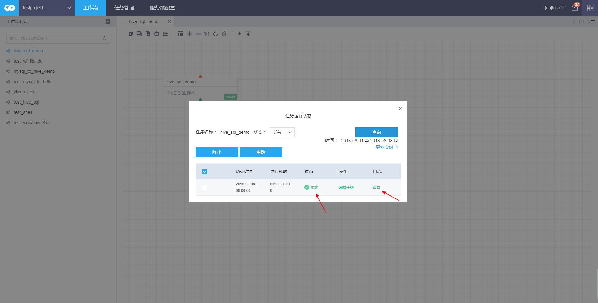

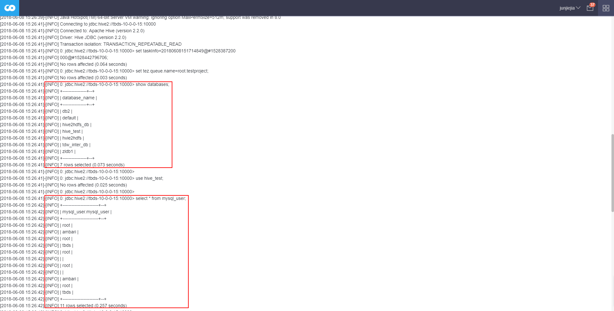

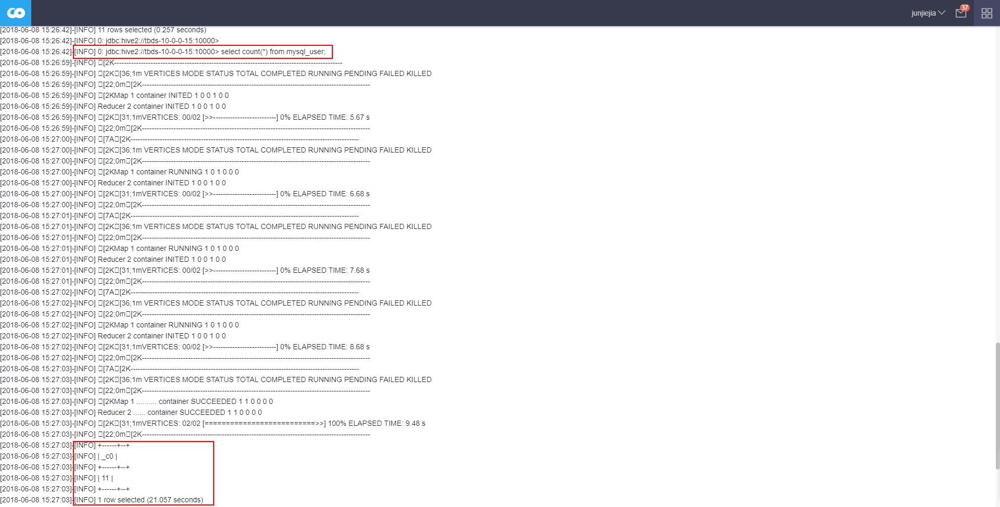

