Hive导入HDFS
---------------

### 步骤（1）新建工作流

如下图，拖拽新建一个任务，选择Hive导入HDFS类型。

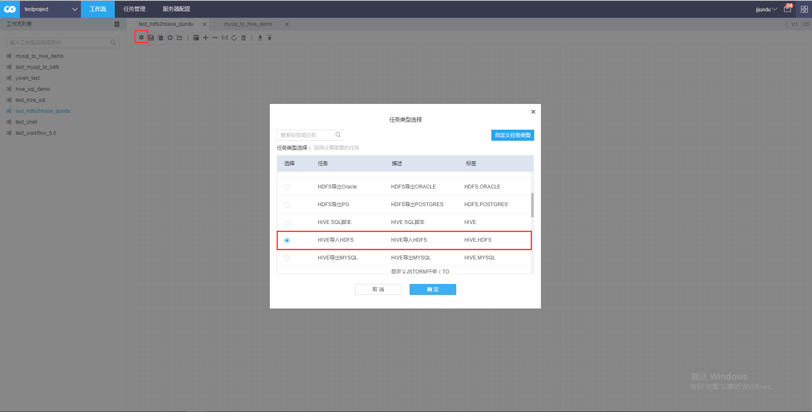

### 步骤（2）配置工作流参数

双击新建工作流，或点击编辑进入工作流参数编辑界面。配置如下。

·基本信息

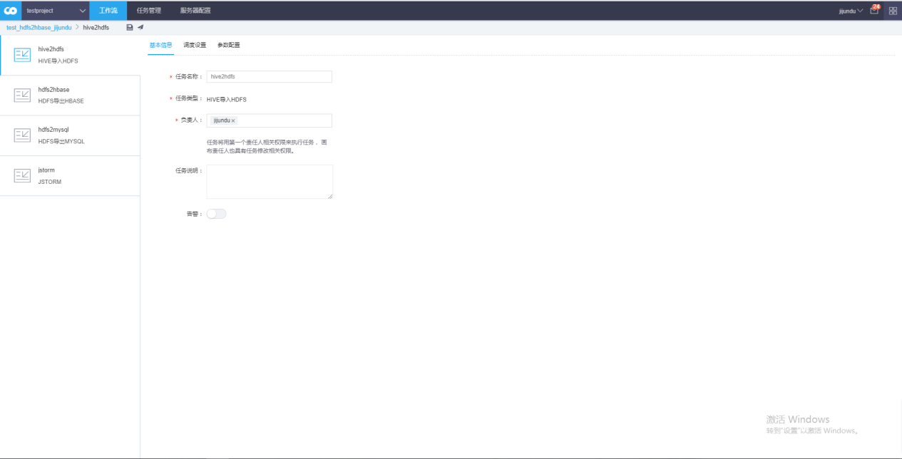

·调度设置

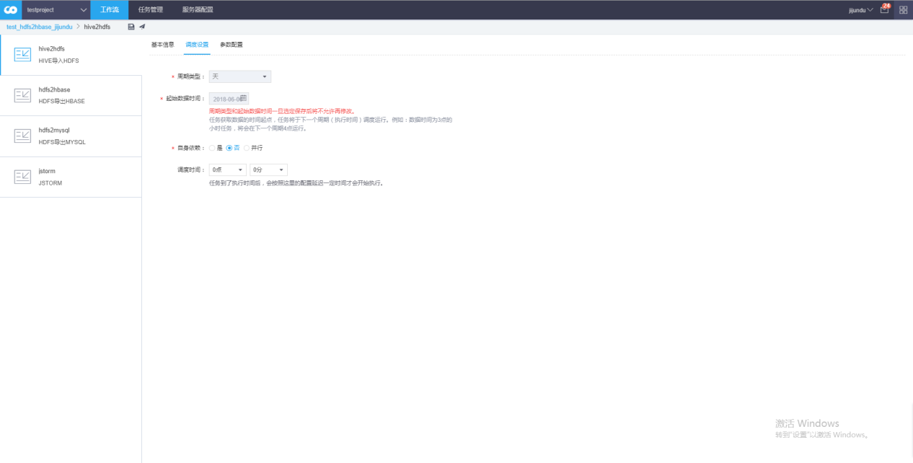

·参数配置

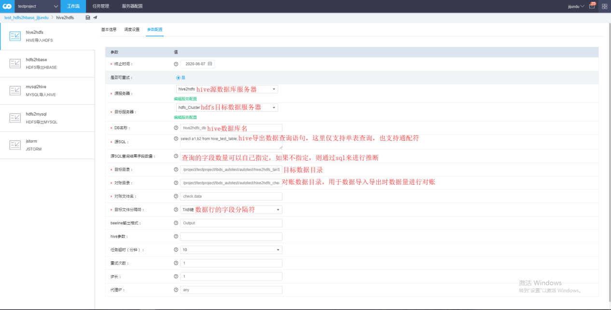

·源服务器

执行hive sql 查询语句所在的hive server。更多信息参考服务器配置

·目标服务器

存储最终结果所在的HDFS server。更多信息参考服务器配置

3.3 DB名称

指定查询sql 所在hive db库

3.4 源SQL

hive sql导出数据查询语句，仅支持单表上的查询。支持时间隐式参数

3.5 源SQL查询结果字段数量（可选）

对于稍微复杂的查询，可能会出现无法识别查询结果的字段个数，需要特别指定查询结果字段个数。

select \* 这种查询结果可以识别，不用担心。

如果用户不指定的情况下，会使用系统识别到的结果个数，如果用户指定了查询结果字段个数，则优先使用用户指定的查询结果个数。

3.6 目标目录

查询结果存放HDFS路径。需要保证路径存在。

3.7 对账目录

通过确保对账文件内容和目标目录数据文件一致，确定数据入库完成，切数据没有丢失。

3.8 对账文件名

对账文件名称

3.9 目标文件分隔符

落地到hdfs目标数据分隔符，用来切分数据的字段结果。

3.10 beeline输出格式

hive beeline 命令行的输出格式，基于4.0.3.1 的hive 采用默认值 Output:

3.11 hive参数

用来支持非tbds 集群安装的hive 集群，可能需要的特殊参数

### 步骤（3）配置服务器

这里需要注意的是，我们的源服务器和目标服务器是需要进行预先配置的。我们点击编辑服务配置去进行服务器配置。

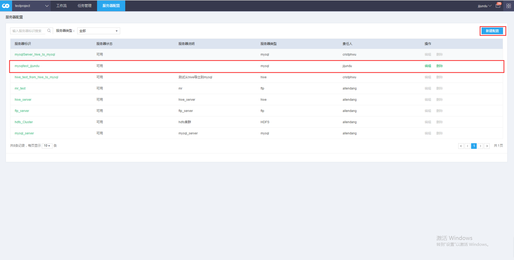

我们选择hive类型的服务器并创建完成。

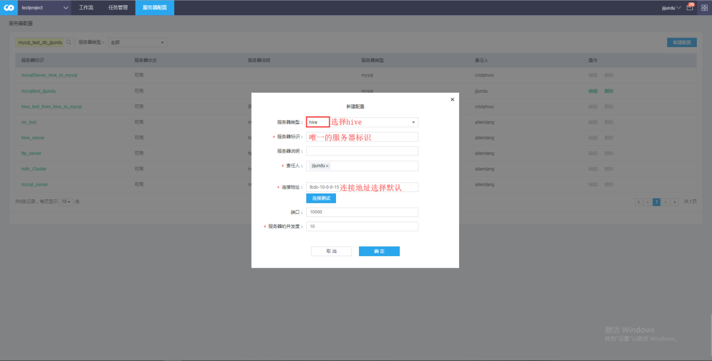

### 步骤（4）准备hive数据

由于hive中如果没有数据则导出数据会失败，所以我们可以利用mysql导出hive工作流来向hive产生一批数据。具体mysql导入hive工作流的流程见**mysql导入hive。**这里给出一部分的参数配置信息。

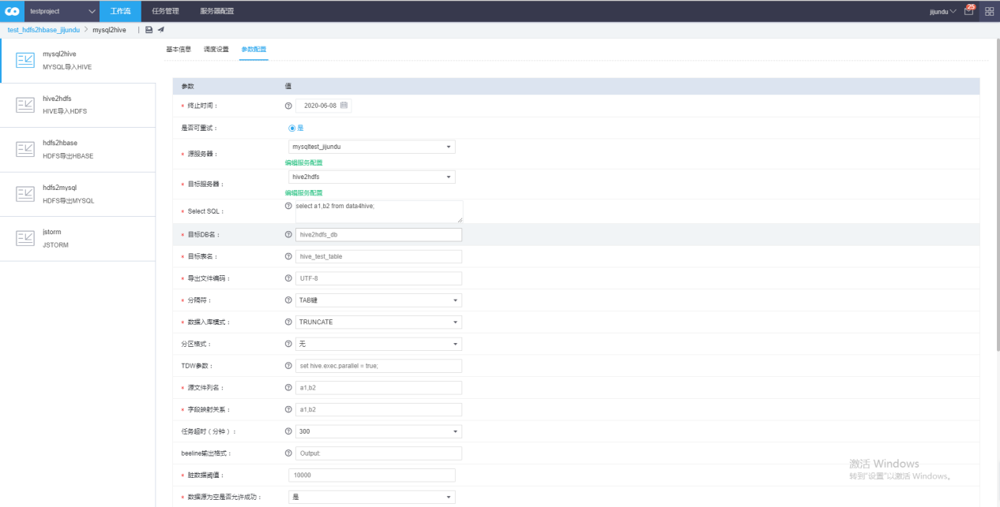

然后我们看到提前往mysql中写入的一些数据。

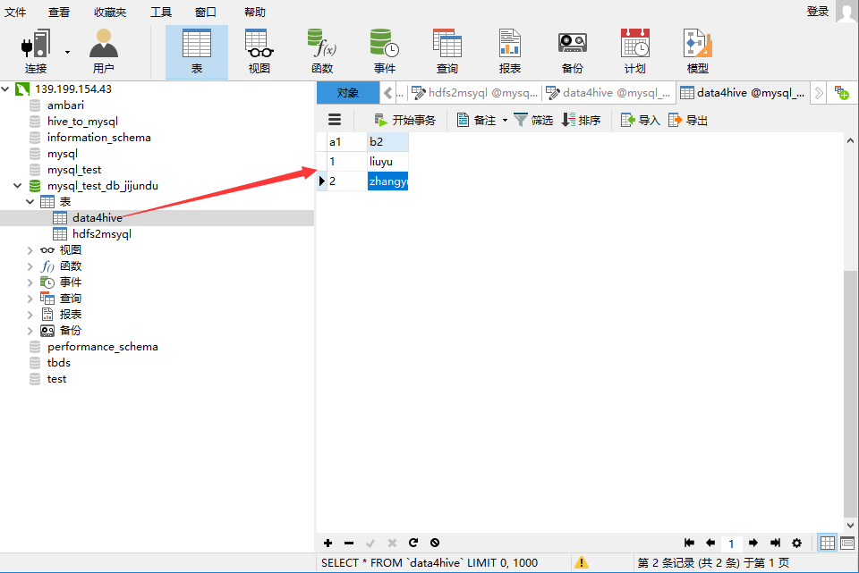

我们mysql导入hive成功。

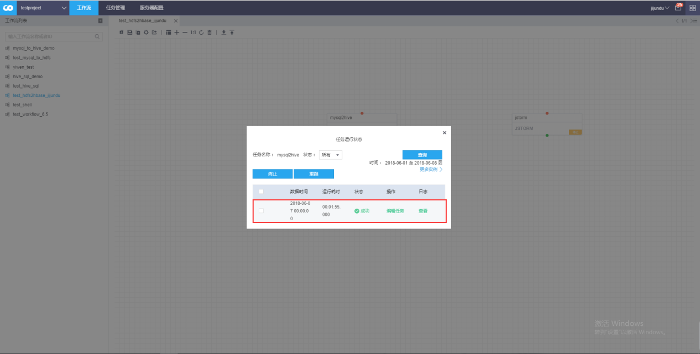

### 步骤（5）保存并发布运行工作流

最后我们保存，并发布运行工作流，等待系统管理员审批完成后，工作流运行。

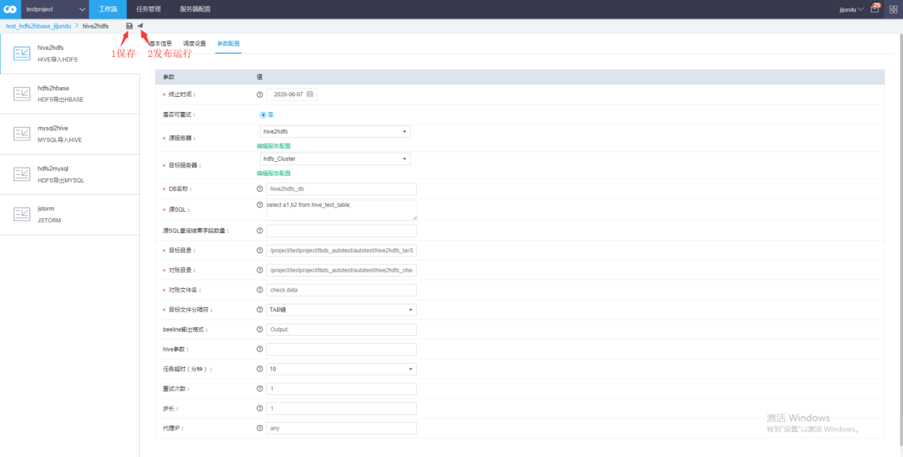

我们看到工作流运行成功。

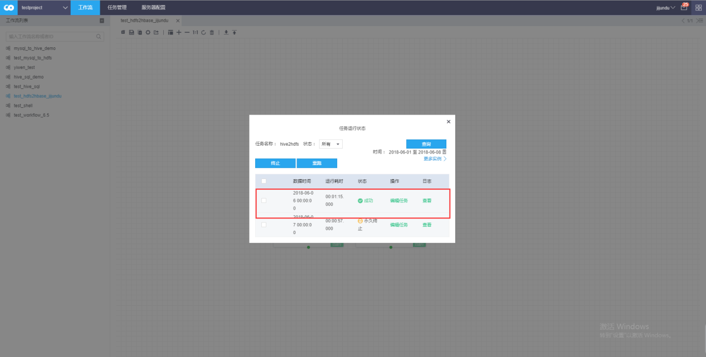

### 步骤（6）查看工作流运行结果

最后我们到配置文件所指向的路径下去观察数据文件。可以看到数据文件和一开始mysql中的数据文件是一致的。

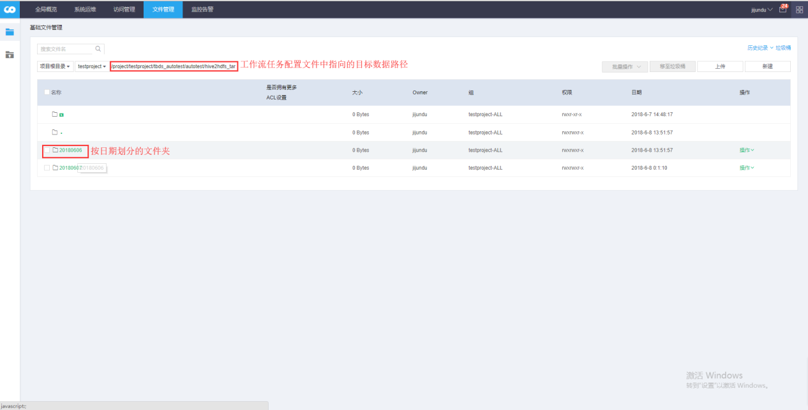

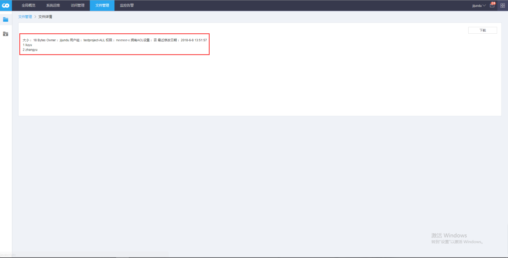

4、自定义JStorm任务
-------------------

### 步骤（1）新建工作流任务

我们先拖拽一个新建任务的按钮来新建一个JStorm任务，选择JStorm任务类型，任务新建完成后，双击任务或右键任务点击编辑进入参数编辑页面执行任务编辑。

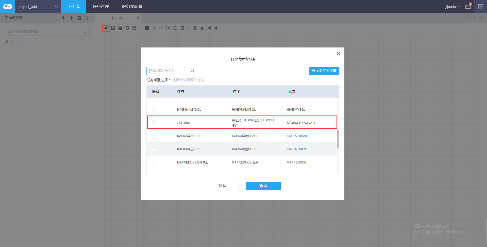

### 步骤（2）配置任务参数

**·基本信息**

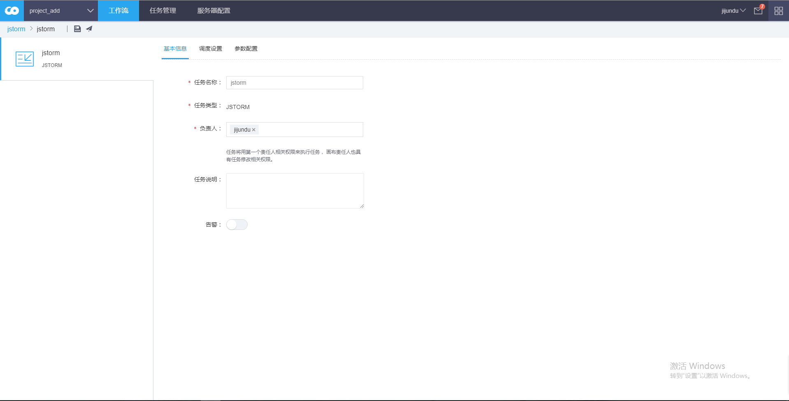

**·调度设置**

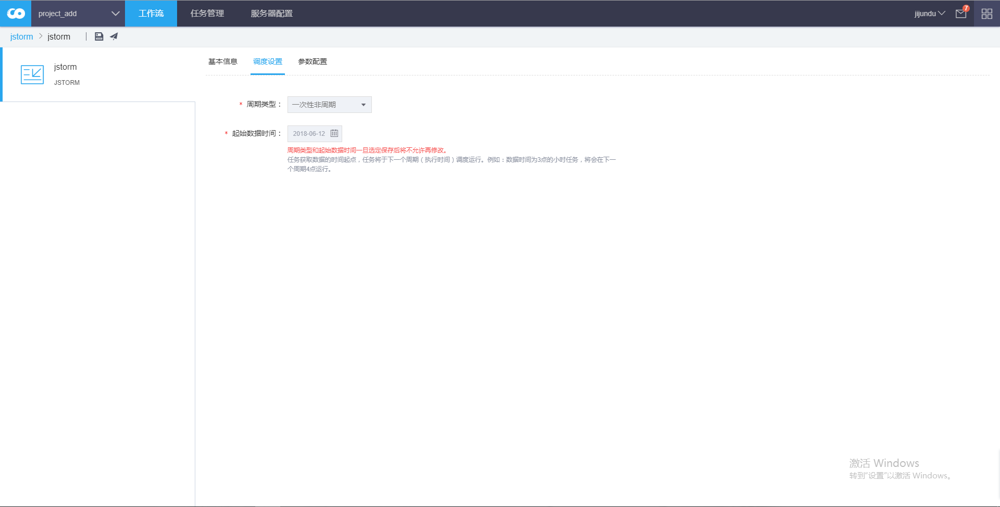

**·参数配置**

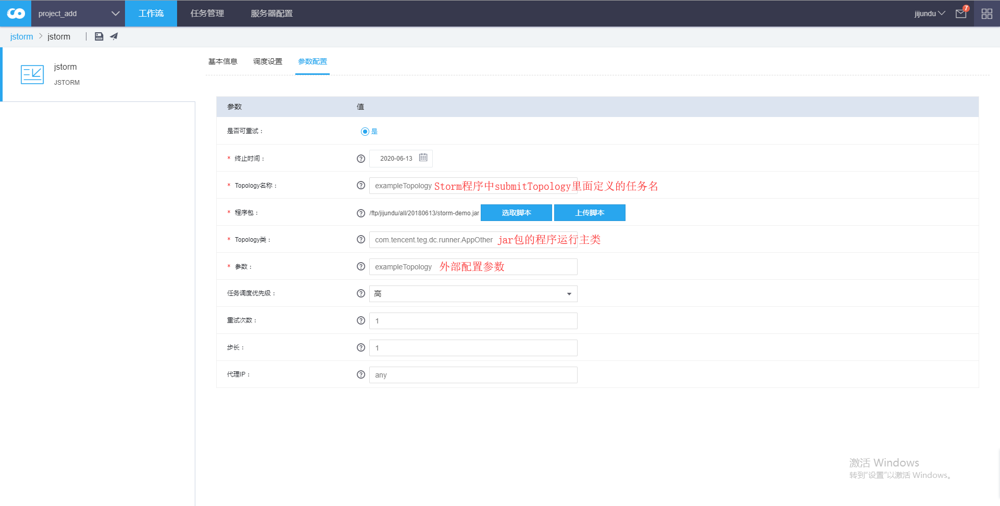

参数说明

1、Topology名称

提交到storm 集群topology名称.建议从参数中获取。

2、程序包

topology可执行jar,当前环境建议使用如下依赖

org.apache.storm

storm-core

0.9.6

Provided

3、Topology类

可执行jar 对应的函数入口。

4、参数

根据提交的可执行jar 自行确定。

### 步骤（3）保存并发布运行工作流

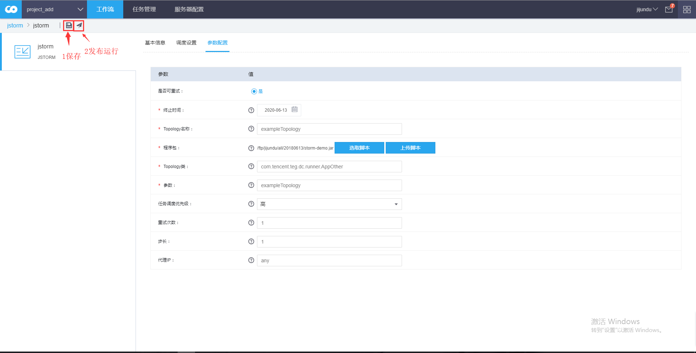

待审核完成之后，我们可以看到任务已经在运行中了。

### 步骤（4）查看工作流运行情况

Storm任务的运行不会变更为运行成功的状态，因为Storm任务是一直运行的，除非我们手动去终止或者运行过程中出现异常，则任务状态会变更为失败或永久终止。

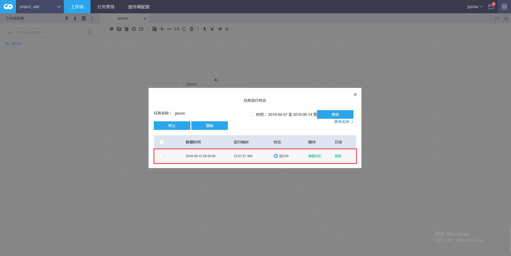
