Hive导出MySQL
-------------

### 步骤（1）新建任务

拖拽画布左上角“+”，在弹出的窗口搜索框中输入hive，选中“HIVE导出MYSQL”，点击“确定”完成任务的创建。

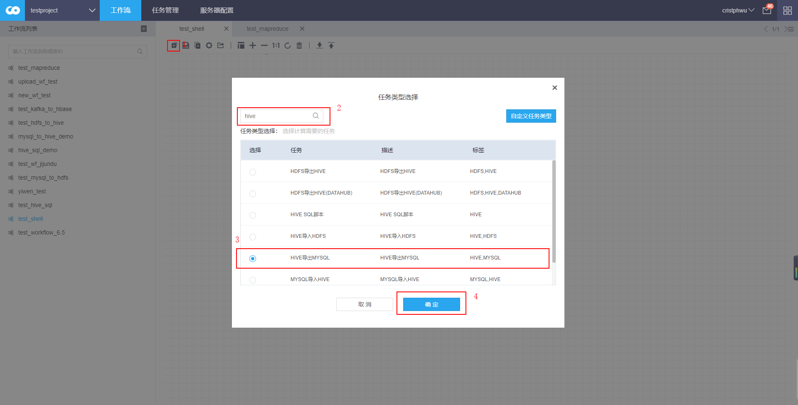

### 步骤（2）填写任务基本信息

鼠标双击任务框，进入任务的编辑界面。

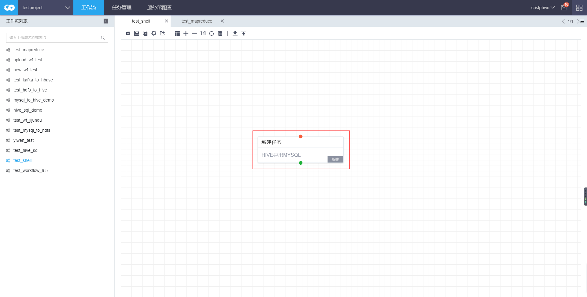

在“基本信息”中填写任务名称。

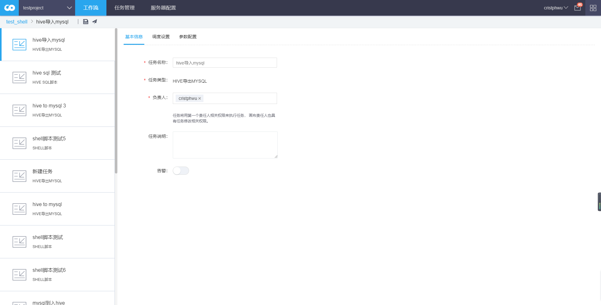

### 步骤（3）填写任务调度设置

在“调度设置”中选择周期类型“一次性非周期”。

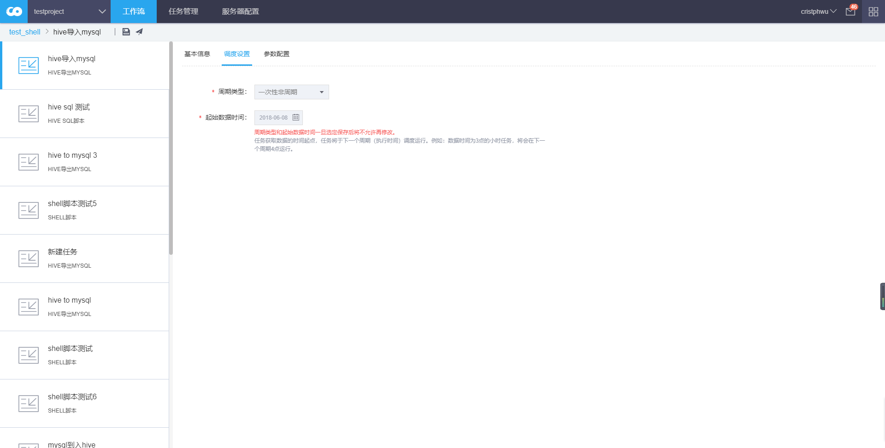

### 步骤（4）填写任务参数设置

#### 1．配置源服务器

点击“服务器配置”页面的“新建配置”图标，在弹出窗口中，选择服务器类型“hive”，输入服务器标识“hive_server”，填写Hive服务器配置，包括连接地址和端口。点击“连接测试”图标显示成功即可。

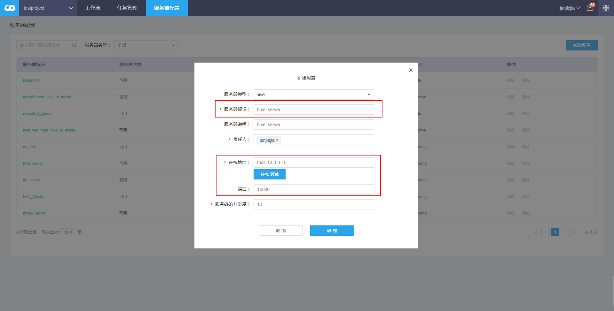

#### 2．配置目标服务器

点击“服务器配置”页面的“新建配置”图标，在弹出窗口中，选择服务器类型“mysql”，输入服务器标识“mysqlServer_hive_to_mysql”，填写MySQL服务器配置，包括主机地址、端口、database名称、数据库用户名和数据库密码。点击“连接测试”图标显示成功即可。

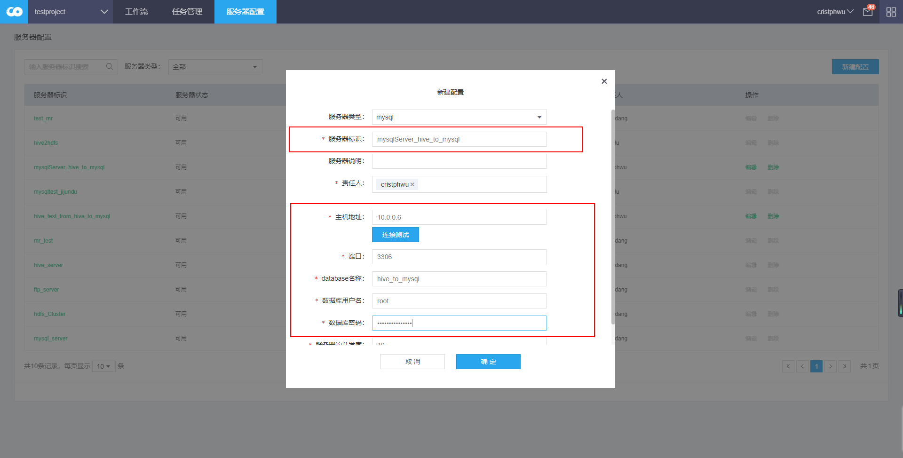

#### 3．创建Hive表

进入数据资产页面，点击左侧边栏“可读写表”图标，选择左上角“创建表”。

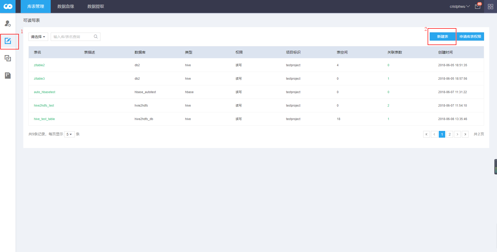

选择“所属项目”为当前对应项目，选择表类型为“hive”，所属数据库为“hive_test”，表名为“ab”，字段与分区一栏中，新建字段名分别为“a1”和“b2”，字段类型选择String，字段描述填写对应信息，然后确认提交。

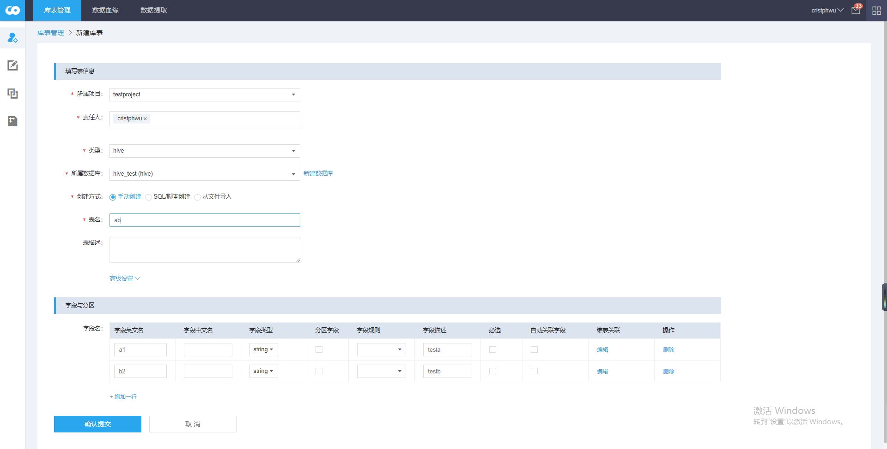

新建完成以后在可管理库表中可以看到自己新建的表，选择右上角“管理库表权限”，在弹出对话框中，选择库表类型为“Hive”，申请库表名为“hive_test(hive)”，申请表名为“ab”，权限关联项目为对应项目，申请权限为“读写”。然后确定，等待管理员审批通过。

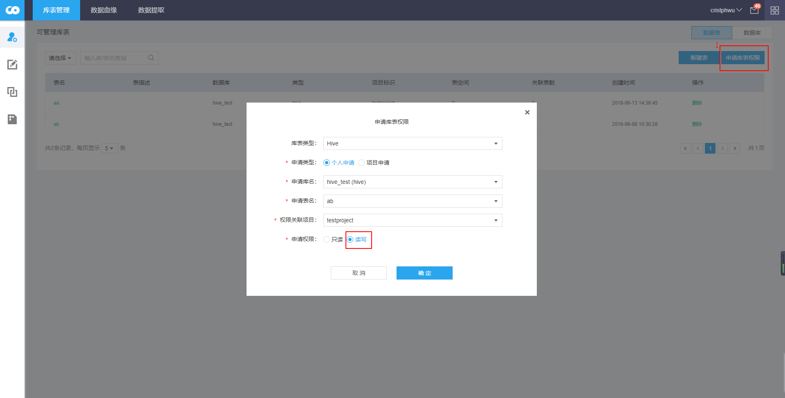

#### 4．具体参数设置

在“参数配置”中选择源服务器“hive_server”，目标服务器“mysqlServer_hive_to_mysql”，源DB名称为“hive_test”，源SQL输入
“select a1,b2 from
ab;”，目标表(Mysql)为“hive_to_mysql_table”，目标表列名“a1,b2”，目标表名“mysql_user”，源文件列名“mysql_user”。注意：应确保存在上述服务器、DB、表和字段。

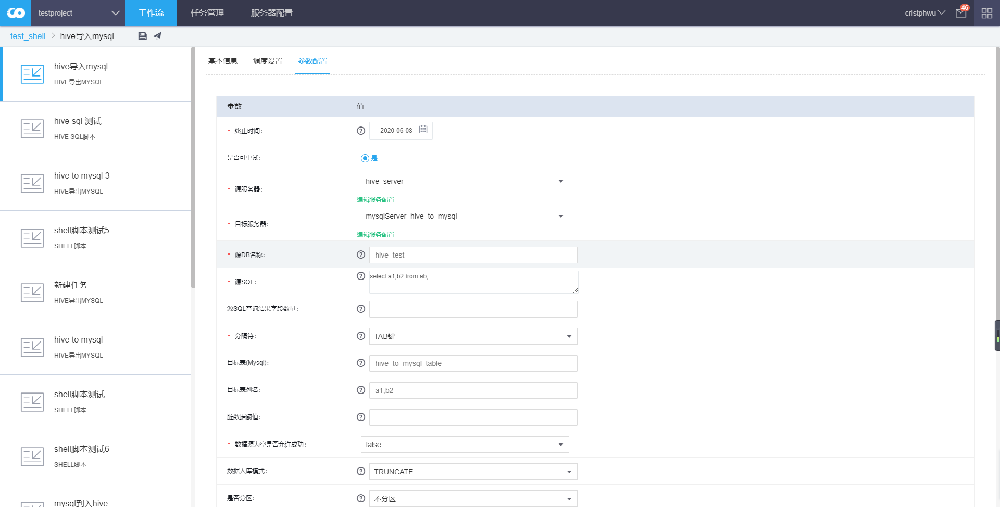

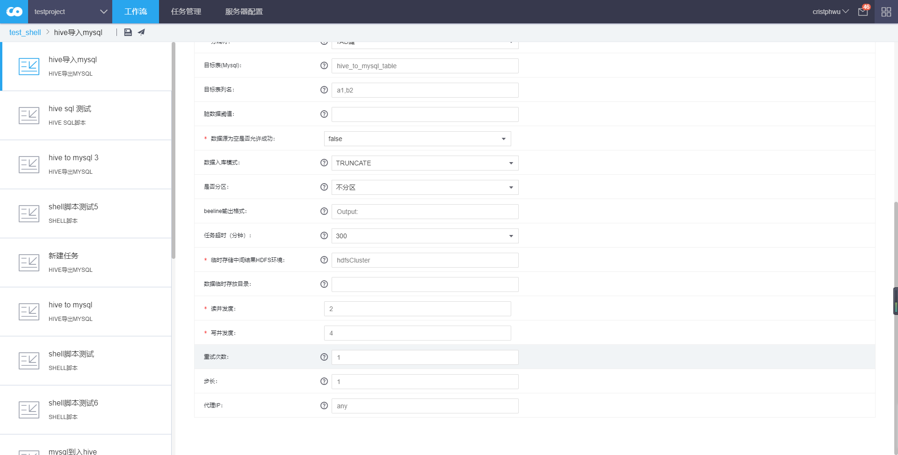

参数说明：

1.  源服务器  
    待导出数据所在的 HIVE server

2.  目标服务器  
    存储最终结果的 MYSQL server

3.  源db名称  
    hive db名称

4.  源SQL  
    从hive导出数据的sql

5.  源SQL查询结果字段数量  
    对复杂的sql 查询，需要指定源sql查询结果的字段个数，简单查询可以不填。

6.  分隔符  
    创建hive 外表，以及读取临时hdfs 数据会用到

7.  目标表（mysql）  
    mysql 表名，此处不要追加db名称，目标服务器字段已经指定。

8.  目标表列名  
    目标表列名，跟hdfs临时数据字段保持一致。

9.  脏数据阀值  
    允许出错的百分比，20代表允许有20%的数据可以读或者写失败，0代表不允许有任何数据读写失败。读写各算一次失败。

10. 数据源为空是否允许成功  
    若为false，当数据源为空时，即使流程执行完成没有错误异常，任务仍然失败。

11. 数据入库模式  
    有两种模式可选，append和truncate  
    append模式不会删除原有数据。当重跑实例时，可能会重复插入数据。  
    truncate 模式会删除原有数据。如果目标hive
    表是分区表，则会删除数据时间对应的分区，如果hive
    不是分区表，则会将整个hive表记录删除。

12. 是否分区  
    是否分区是指目标表是否为分区表。

    -   如果选择否，直接写入数据。

    -   如果选择是，则需要进一步制定分区字段格式，目前只支持时间格式，通常任务调度周期和字段分区类型对应。比如任务调度周期是天，数据按天分区，分区字段选择P_\${YYYYMMDD}
        。在将数据写入mysql 中，执行的sql 语句中会嵌入partition 关键字。

13. beeline输出格式  
    连接的源服务器，对应的beeline 输出格式

14. 任务超时(分钟)  
    当前没有使用

15. 临时存储中间结果HDFS环境  
    存放临时结果的hdfs 连接地址。

16. 数据临时存放目录  
    存放临时结果的hdfs上的目录，默认在/user/\${portalUser}/hm/ 目录下

17. 读并发度  
    读hdfs 数据的并发线程数。

18. 写并发度  
    数据写入mysql的并发线程数。

19. 读并发度

读hdfs 数据的并发线程数。

1.  写并发度

数据写入mysql的并发线程数。

1.  重试次数

任务失败后的重试次数（重试次数为0，任务不下发）

1.  步长

间隔多少周期执行一次，周期单位按照调度设置里面的周期类型来计算

1.  代理IP

任务执行机所在IP

### 步骤（5）查看任务状态

审批通过后，任务进入“运行”状态，右键任务框，点击“查看运行状态”，依次为显示“等待调度”和“运行中”。

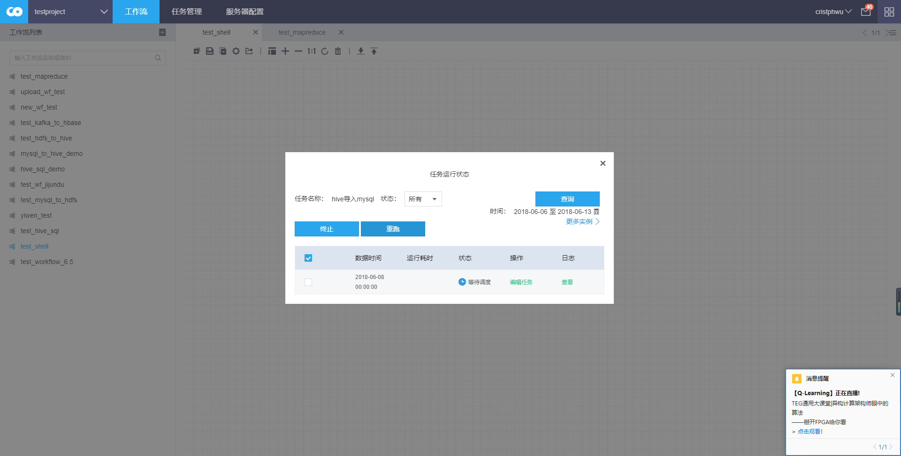

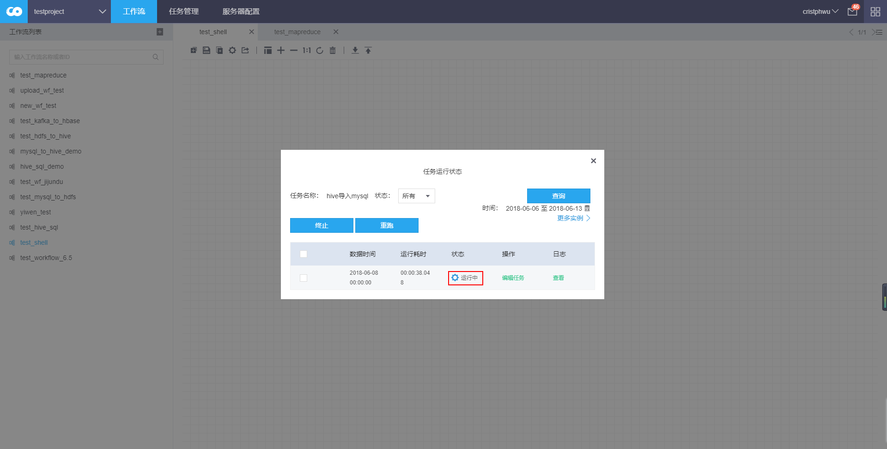

### 步骤（6）验证任务是否成功

状态变为“成功”后，点击“查看”，可以看到执行Hive导出MySQL状态和运行结果。

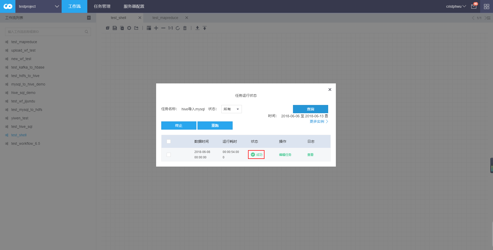

