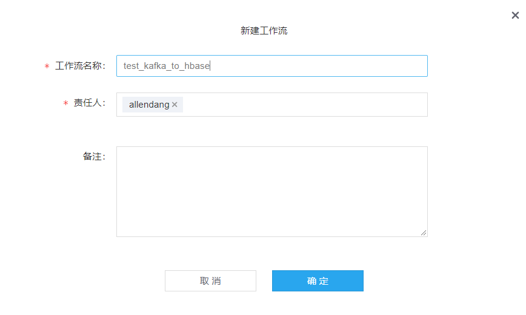
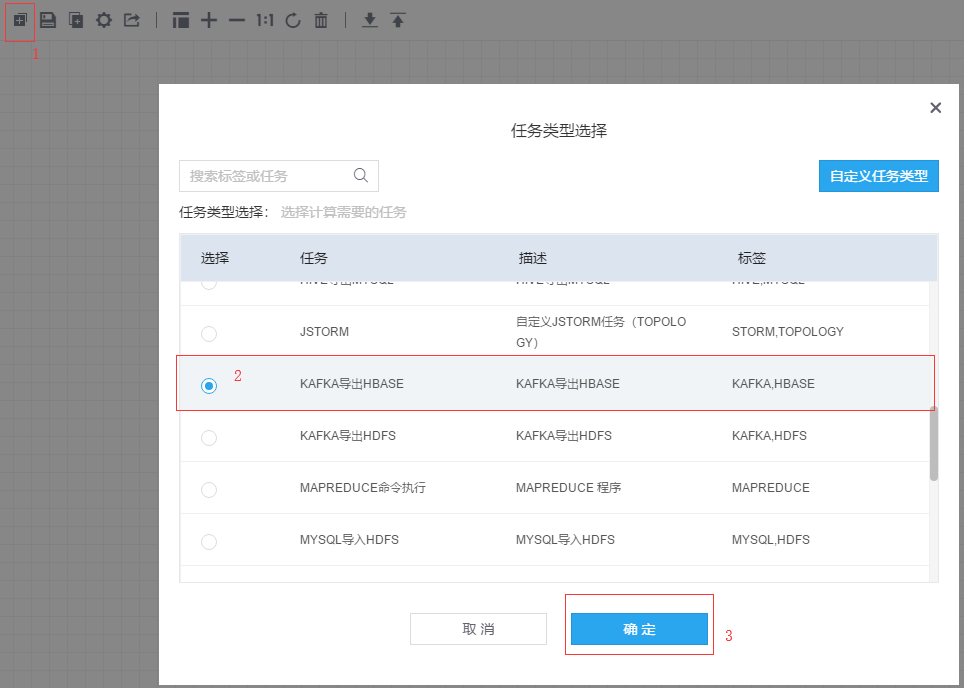
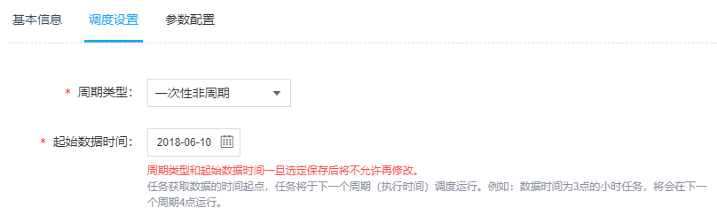
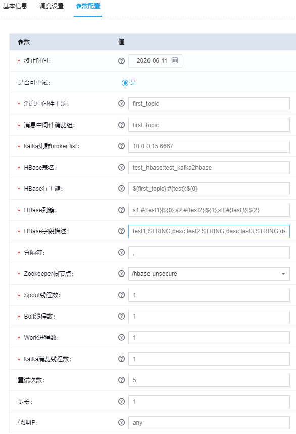
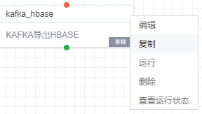
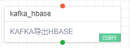
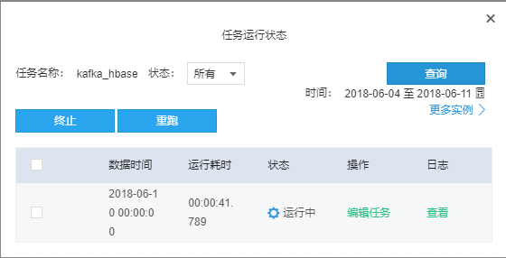

KAFKA导出HBASE
------------------

### 步骤（1）新建工作流

此处为了方便阅读和表明工作流的专门用途，填写为“test_kafka_to_hbase”。工作流名称可以自定义，中英文都可。

### 步骤（2）新建任务

首先，点击如图左上角的添加任务按钮，其次，任务类型选择“KAFKA导出HBASE“，最后点击”确定“。如图中标号1
2 3。

### 步骤（3）填写任务基本信息

需要填写的基本信息主要有：

1.  任务名称：用于唯一标识此次任务的名称，中英文均可。本次填写：kafka_hbase。

2.  责任人：指可以修改和操作该任务的用户，一个任务可以有多个责任人。默认是任务的创建者。

3.  告警方式：提供两种告警方式，分别是邮件和短信。（邮件和短信设置都可在用户基本信息中添加和修改）。

4.  告警接收人：指应该收到告警的用户，通常设置为责任人和运维人员，如果不添加的话，默认为责任人。

5.  告警类型：分为超时告警和失败告警两种。

6.  任务对应实例失败（终止）会触发失败告警。

7.  超时告警需要设置“预计任务耗时“，任务实例执行时长超过此时间，就会触发超时告警。

8.  预计任务耗时：任务预计执行时间。

### 步骤（4）填写任务调度设置

此处主要填写的内容有:

1.  周期类型：周期类型支持分钟，小时，天，周，月四种周期类型。非周期即为一次性任务，任务整个生命周期只有一个实例。此处选择为“一次性非周期”。

2.  起始数据时间：指任务开始时间，如果不选择，默认为当天。

### 步骤（5）填写任务参数设置

本示例为“Kafka导出HBase”，即HBase从Kafka中消费数据，则需要配置的参数有：

1.  消息中间件主题：kafka topic
    在创建任务前，需要确保topic已经存在，系统不会创建对应的topic。本次在kafka
    shell中创建的topic为：first_topic。

2.  消息中间件消费组：此项为kafka的消费组，可以随意指定，但需要确保消费组全局唯一。本次使用的为：first_topic。

3.  kafka集群broker列表：格式为 ip1:port，ip地址为Kafka
    Broker服务所在节点ip。Port为kafka开放给客户端的连接端口。本次使用为：10.0.0.15：6667。

4.  HBase表名：格式为dbName:tableName ,本次Demo使用test_hbase: test_kafka2hbase

5.  HBase行主键：每次插入一条记录，会根据配置的行主键信息生成行主键，格式\${topic}:\#{abc}:\${1}。topic
    为kafka 主题，\#{}内容（
    如：abc）为随意指定的一个固定值，可以方便查询。最后一个参数\${n}为，消息被分隔符切分得到的数组下标所对应的值(n是整数)。假如现在从kafka
    集群主题为firstTopic 消费了一条内容为“a,b,c,d”的记录，设置分割符为 “,”
    ,行主键设置是\${topic}:\#{ABC}:\${1}。则这条记录插入hbase ，生成的主键为
    主题为firstTopicABCb，本次项目配置为：\${first_topic}:\#{test}:\${0}

6.  HBase列簇：列簇1名:列1名\|列1值,列2名\|列2值;列簇2名:列3名\|列3值,列4名\|列4值。比如：s1:\#{name}\|\${0};s2:\#{age}\|\${1}，\${n}
    其中n
    为整数，为消费消息被切分之后，组成的数组所在索引对应的值。本次设置为：s1:\#{test1}\|\${0};s2:\#{test2}\|\${1};s3:\#{test3}\|\${2}

7.  HBase字段描述：字段名1,字段类型1,字段备注1:字段名2,字段类型2,字段备注2，比如：name,STRING,desc:age,STRING,desc。当前只支持STRING类型。

>   本次设置为：test1,STRING,desc:test2,STRING,desc:test3,STRING,desc:

1.  分隔符：切分消息使用的分隔符。

2.  Zookeeper根节点：为hbase 在zk 上的根目录, 默认为：/hbase-unsecure

3.  Work进程数：该任务所占storm 集群的槽位，默认为1.

4.  Spout线程数：设定spout 启动的线程数

5.  Bolt线程数：设定bolt 启动线程数

6.  kafka消费线程数：设定kafka 消费线程数

HBase建库建表如附录所示。

### 步骤（6）任务审批

点击确定之后，系统会将任务状态设为“新建”，然后对画布中的任务点击右键，在弹出列表中点击“运行”

接着会弹出任务审批对话框，此处可选择审批通过后自动运行，或者审批之后手动开启，具体表现为是否勾选下图中红色部分。

系统会向此项目的管理员发送审批邮件，由管理员来确定任务是否通过审批，若管理员通过此次任务运行，可以看到任务状态会变成下图所示。

### 步骤（7）查看任务状态

再右键点击任务，选择“查看运行状态”，即可看到此次任务的运行状态

至此，此次Demo完毕。