KAFKA导出HDFS（SASL_PALIN认证访问）
-----------------------------------

### 步骤（1）：新建工作流任务

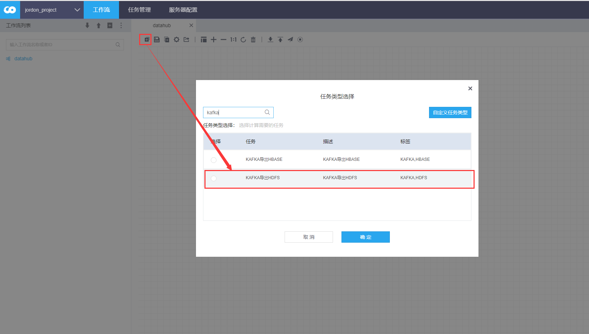

### 步骤（2）：双击进入任务编辑栏

### 步骤（3）：基本信息编辑：

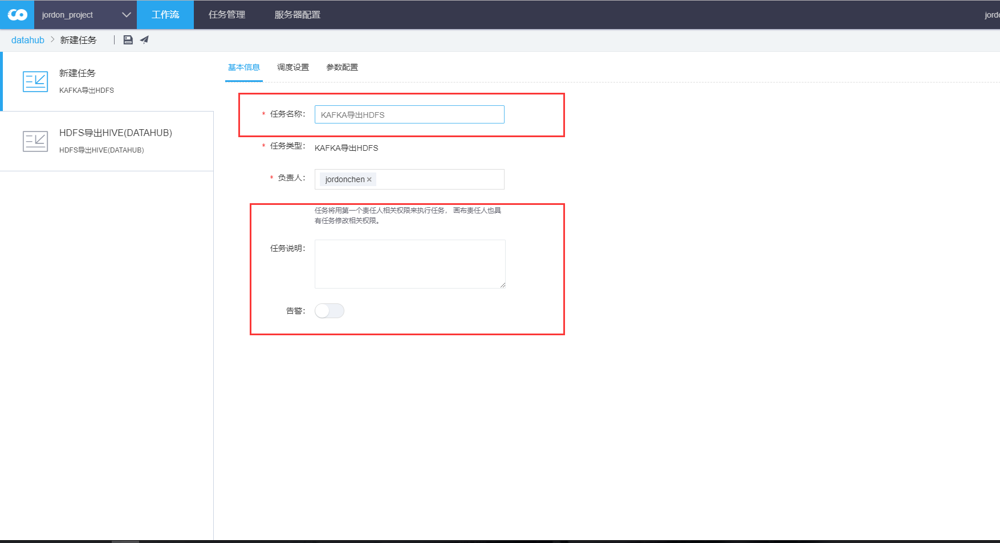

### 步骤（4）：调度设置编辑

### 步骤（5）：参数配置

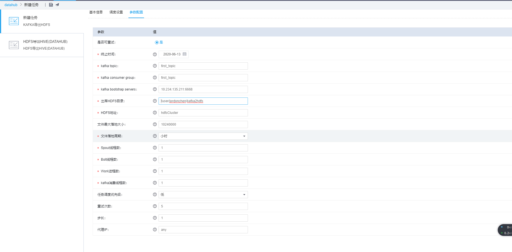

kafka 接入hbase 参数设置分成三个部分：kafka 连接信息，hdfs 连接信息，topology
配置信息。

#### 3.1 kafka 配置信息

1.  消息中间件主题  
    kafka topic
    在创建任务前，需要确保topic已经存在，系统不会创建对应的topic。（注意，需要确保其他工作流不能同时使用同一个topic进行消费，否则会导致数据无法正常落地）

2.  消息中间件消费组  
    kafka消费组 可以随意指定，但需要确保消费组全局唯一。

3.  kafka集群bootstrap servers 列表  
    kafka集群bootstrap servers 列表，格式为 ip1:port,ip2:port  
    ip地址为Kafka Broker 服务所在节点ip  
    port kafka 开放给client 连接端口，可以参考kafka broker 服务配置。

实际上，bootstrap servers就是tdw管理页面的broker servers list。如下图。

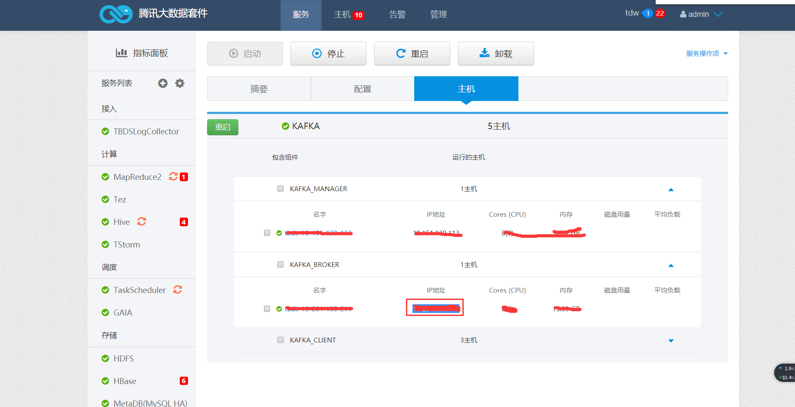

端口：

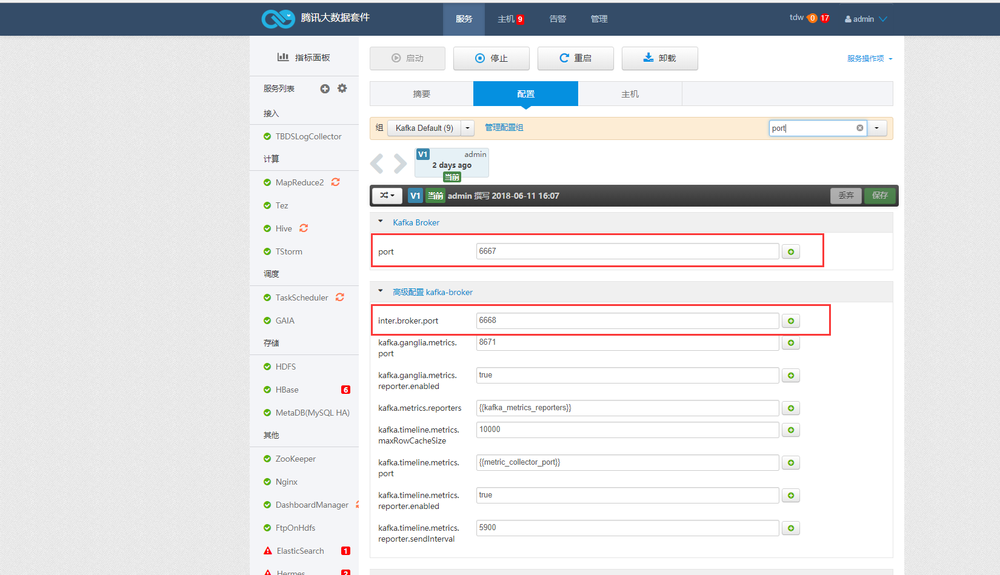

需要注意的是，这里有两个端口都可以进行生产和消费，一个是6667，另外一个6668，6667是TBDS访问模式，6668是SASL_PLAIN是访问模式。详情可参考以下这个网址<https://tbds-book.gitbooks.io/tbds/%E7%BB%84%E4%BB%B6%E4%BD%BF%E7%94%A8/kafka/kafka.html>

其实两种访问模式对于用户来说的区别就是生产和消费数据的端口不一样了。

#### 3.2 hdfs配置

1.  出库HDFS目录  
    数据落地目录

2.  HDFS地址  
    数据落地所属的HDFS环境（连接地址）

3.  文件最大落地大小  
    单位为：Byte 。如果文件最大落地大小设置的值小于64k，会使用64k
    ，如果设置的值大于64k，将使用实际设置的值。  
    实际落地hdfs 的文件大小会稍微小于设置的文件最大落地大小。

4.  文件最小落地周期  
    单位为小时，必须整数。  
    如果时间周期到了，系统会将缓存的数据保存到hdfs
    ,这是时候落地的数据可能少于64k ，也可能稍微大于设置的文件最小落地大小。

#### 3.3 toplogy配置

1.  Work进程数  
    该任务所占storm 集群的槽位，默认为1.

2.  Spout线程数  
    设定spout 启动的线程数

3.  Bolt线程数  
    设定bolt 启动线程数

4.  kafka消费线程数  
    设定kafka 消费线程数

### 步骤（6）：保存和运行任务

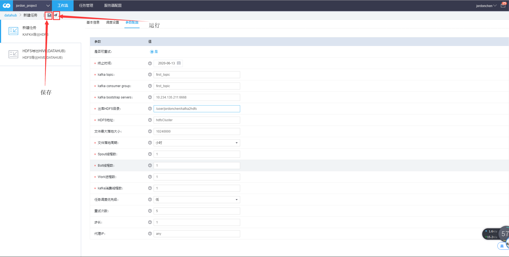

### 步骤（7）：获取kafka broker IP 

如下图，可以找到kafka broker server IP

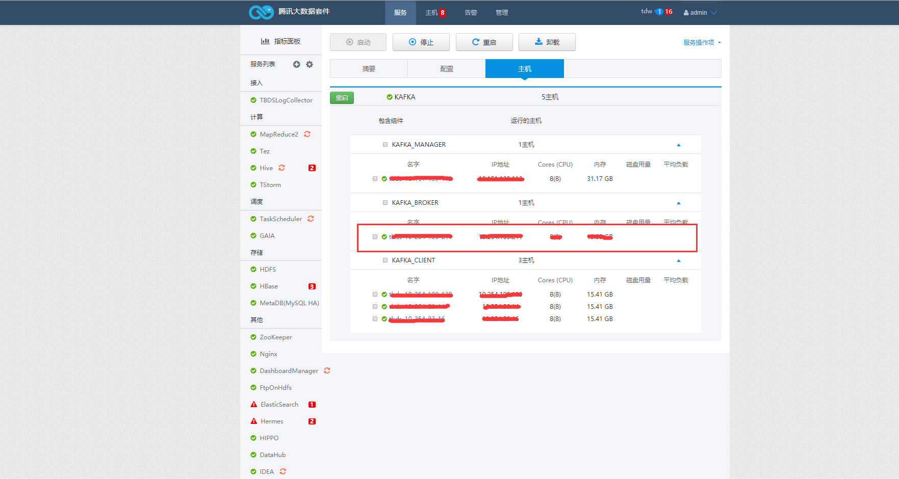

### 步骤（8）：根据kafka broker IP，使用shell连接相应的主机

ssh root\@IP 然后输入密码（或者使用shell直接连接到相应的主机）

### 步骤（9）：cd 进入到kafka的安装目录

为了方便，可以设置一个临时的全局变量

export KAFKA_HOME=\`pwd\`

### 步骤（10）：新建一个配置文件

cd进入到\$KAFKA_HOME/config目录，创建一个配置文件。

### 步骤（11）：填写配置文件的信息

由于这里我们使用的是6668的端口，是SASL_PLAIN访问方式，因此我们的配置文件应该填写如下内容：

security.protocol=SASL_PLAINTEXT

sasl.mechanism=PLAIN

详情可以查看如下网址：

<https://tbds-book.gitbooks.io/tbds/%E7%BB%84%E4%BB%B6%E4%BD%BF%E7%94%A8/kafka/kafka.html>

### 步骤（12）：执行kafka生产脚本：

cd .. 回到\$KAFKA_HOME的目录下。

Kafka的生产脚本如下：

\$KAFKA_HOME/bin/kafka-console-producer.sh --broker-list broker_ip:6668 --topic
first_topic --producer.config ./config/client_sasl.properties

其中，\$KAFKA_HOME如果已经在前面设置了临时的全局变量，就不需要修改了，如果没有设置，则需要把\$KAFKA_HOME更换成kafka的安装目录。

broker_ip为当前kafka集群的broker的IP。

first_top是需要生产数据的topic。

./config/client_sasl.properties 是配置文件所在地址

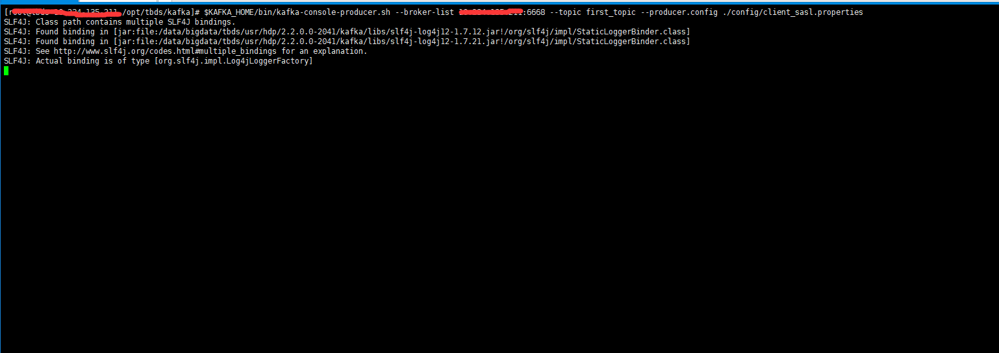

步骤（13）：输入数据

这里提供一个java程序，随机生成数据

**import** java.io.BufferedWriter;

**import** java.io.FileNotFoundException;

**import** java.io.FileOutputStream;

**import** java.io.IOException;

**import** java.io.OutputStreamWriter;

**import** java.util.UUID;

**public class Test** {

**public static void main**(**String**[] args) {

**try** {

**BufferedWriter bw** = **new** BufferedWriter(**new**
OutputStreamWriter(**new** FileOutputStream("F://test.txt")));

**for**(**int i**=0;i\<100000;i++) {

bw.write(**UUID**.randomUUID().toString()+"\\r\\n");

}

bw.flush();

bw.close();

**System**.**out**.println("hello");

} **catch** (**FileNotFoundException e**) {

e.printStackTrace();

} **catch** (**IOException e**) {

e.printStackTrace();

}

}

}

执行这个java程序之后，可以在f盘看到生成的test.txt数据文件，拷贝全量数据，粘贴到命令行即可。

### 步骤（13）：在相应的目录下找到落地的数据

运维中心-\>文件管理-\>进入到对应的路径下查找即可

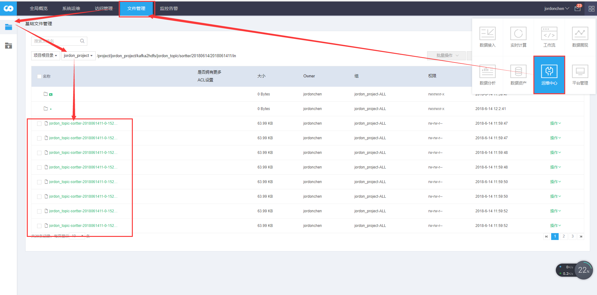

### 常见问题：

#### 数据无法落地：

可能原因：

1.  工作流使用的topic，已经被其他工作流占用，这样会导致数据无法落地。切记要保证当前只有一个工作流在使用当前topic。

KAFKA导出HDFS(TBDS认证访问)
---------------------------

### 步骤（1）：新建工作流

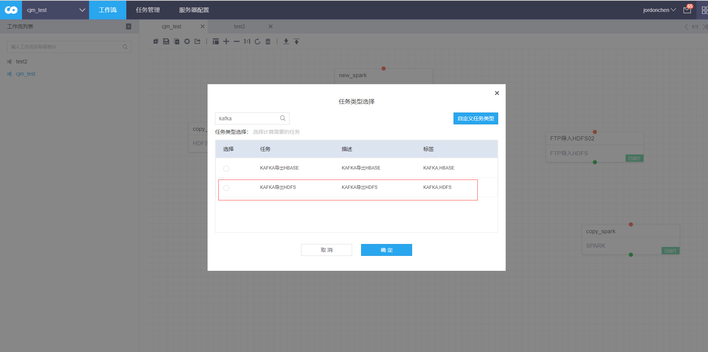

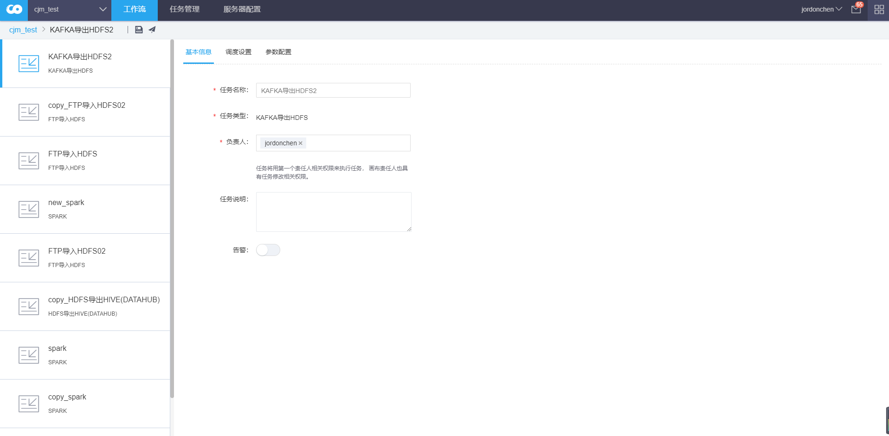

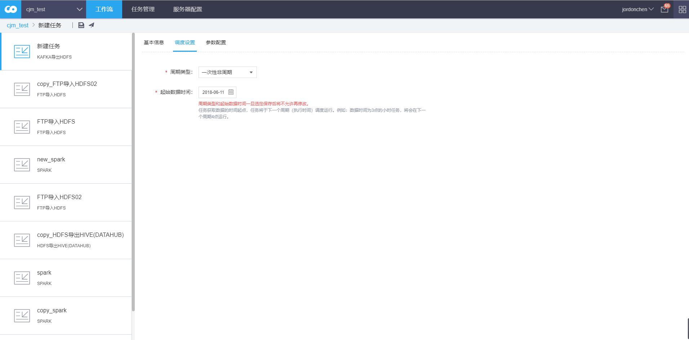

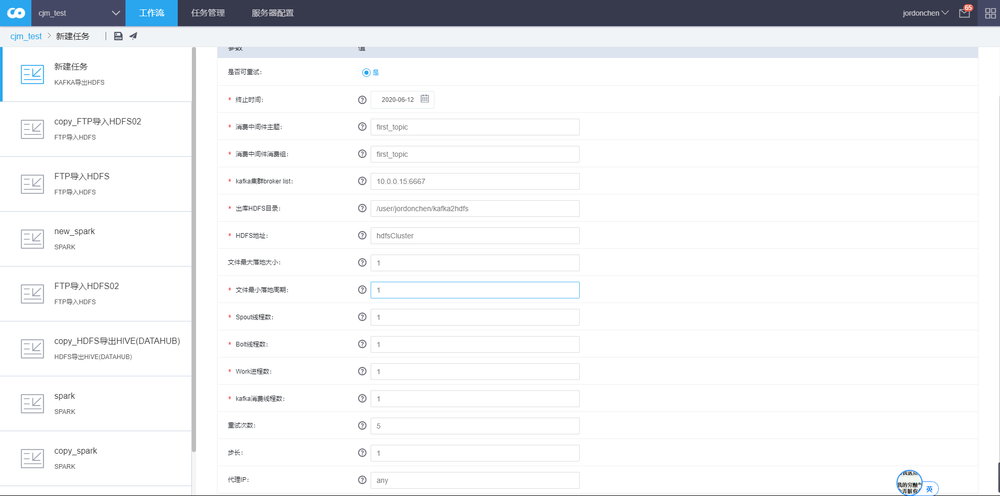

kafka 接入hbase 参数设置分成三个部分：kafka 连接信息，hdfs 连接信息，topology
配置信息。

#### a. kafka 配置信息

1.  消息中间件主题  
    kafka topic 在创建任务前，需要确保topic已经存在，系统不会创建对应的topic。

2.  消息中间件消费组  
    kafka消费组 可以随意指定，但需要确保消费组全局唯一。

3.  kafka集群broker 列表  
    kafka broker 列表，格式为 ip1:port,ip2:port  
    ip地址为Kafka Broker 服务所在节点ip  
    port kafka 开放给client 连接端口，可以参考kafka broker 服务配置。

#### b. hdfs配置

1.  出库HDFS目录  
    数据落地目录

2.  HDFS地址  
    数据落地所属的HDFS环境（连接地址）

3.  文件最大落地大小(注意，作为测试用例，如果这个参数设置过大，那么需要更多的数据才可以看到结果，所以我在这里设置为1KB)  
    单位为：Byte 。如果文件最大落地大小设置的值小于64k，会使用64k
    ，如果设置的值大于64k，将使用实际设置的值。  
    实际落地hdfs 的文件大小会稍微小于设置的文件最大落地大小。

4.  文件最小落地周期（注意，作为测试用例，如果这个设置过大，也会导致需要更长的最短周期才能看到结果，所以这里我也是设置为1小时）  
    单位为小时，必须整数。  
    如果时间周期到了，系统会将缓存的数据保存到hdfs
    ,这是时候落地的数据可能少于64k ，也可能稍微大于设置的文件最小落地大小。

#### c. toplogy配置

1.  Work进程数  
    该任务所占storm 集群的槽位，默认为1.

2.  Spout线程数  
    设定spout 启动的线程数

3.  Bolt线程数  
    设定bolt 启动线程数

4.  kafka消费线程数  
    设定kafka 消费线程数

### 步骤（2）：审批后运行：

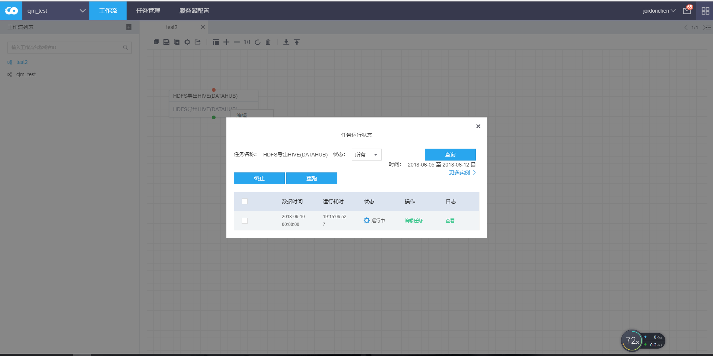

### 步骤（3）：编写java程序生成测试数据

因为是kafka导出hdfs，需要kafka生产数据，因此我写了一个java小程序，自动生成数据。

Java程序：

**import** java.io.BufferedWriter;

**import** java.io.FileNotFoundException;

**import** java.io.FileOutputStream;

**import** java.io.IOException;

**import** java.io.OutputStreamWriter;

**import** java.util.UUID;

**public class Test** {

**public static void main**(**String**[] args) {

**try** {

**BufferedWriter bw** = **new** BufferedWriter(**new**
OutputStreamWriter(**new** FileOutputStream("F://test.txt")));

**for**(**int i**=0;i\<100000;i++) {

bw.write(**UUID**.randomUUID().toString()+"\\r\\n");

}

bw.flush();

bw.close();

**System**.**out**.println("hello");

} **catch** (**FileNotFoundException e**) {

e.printStackTrace();

} **catch** (**IOException e**) {

e.printStackTrace();

}

}

}

执行完后，在F:/可以看到一个名为test.txt的文件，打开并且全选拷贝全部内容

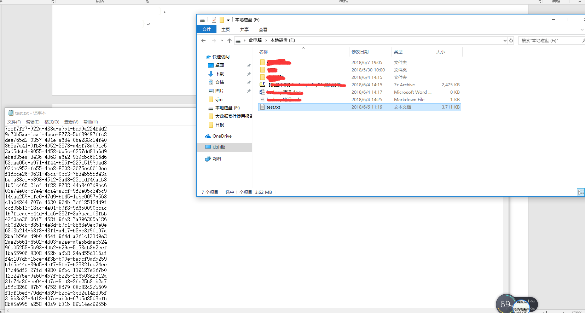

### 步骤（4）：连接kafka主机：

然后，我们需要通过ssh连接kafka主机，首先我们要先知道主机的IP：

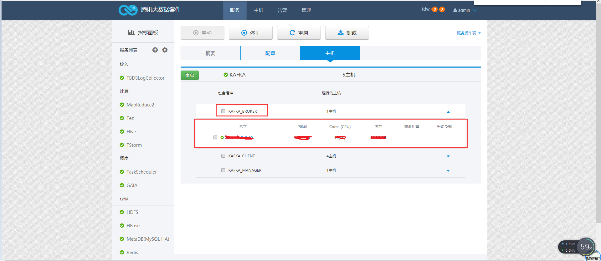

Shell进入

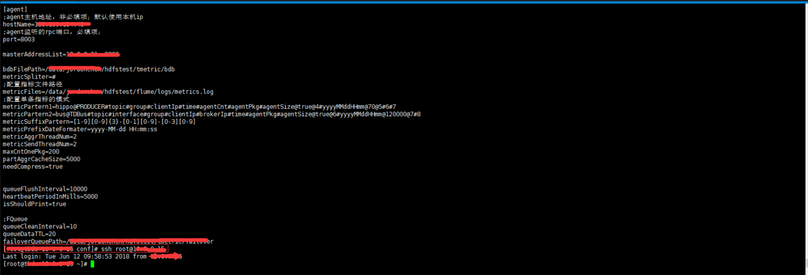

### 步骤（5）：配置kafka启动配置文件：

之后，我们进入到/opt/tbds/kafka

根据说明文档指示，因为我们采用的是6667端口，因此我们使用TBDS认证的方式进行生产数据。

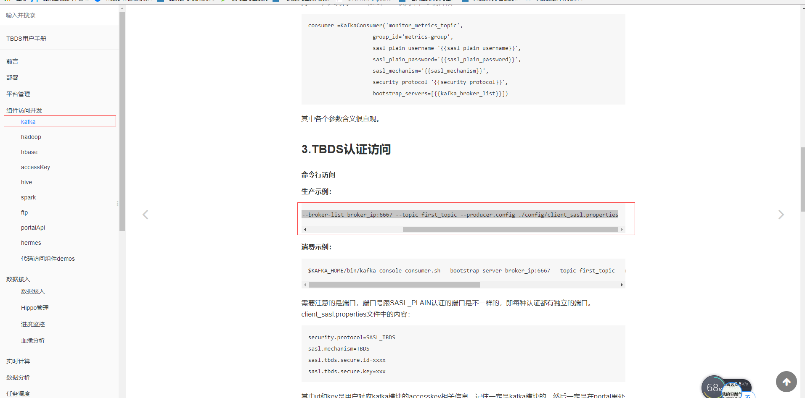

\$KAFKA_HOME/bin/kafka-console-producer.sh --broker-list broker_ip:6667 --topic
first_topic --producer.config ./config/client_sasl.properties

为了方便，我们可以设置一个环境变量为当前路径，命令为：

export KAFKA_HOME=\`pwd\`

然后我们修改\$KAFKA_HOME/config/client_sasl.properties的配置，如下图

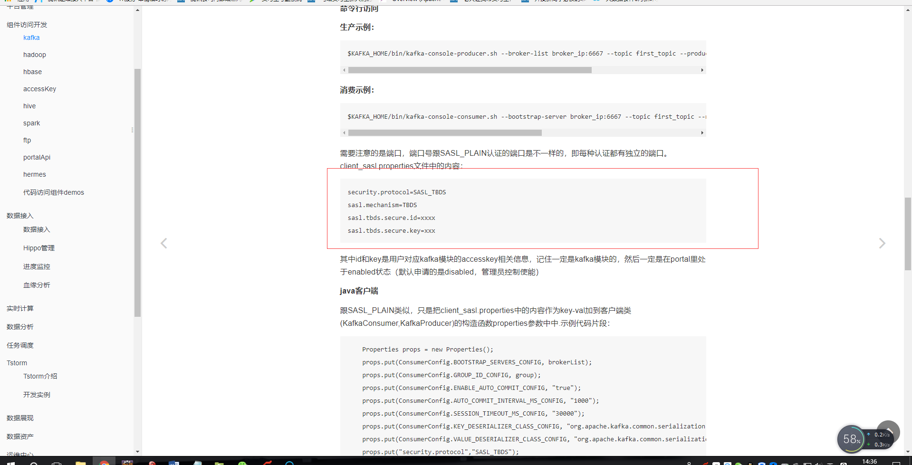

可以发现，我们还缺少一个id和key。

### 步骤（6）：添加kafka密钥

我们在平台管理-\>用户管理-\>密钥管理里面，看到了密钥的添加。

我们需要添加一个自己的kafka密钥，如下图

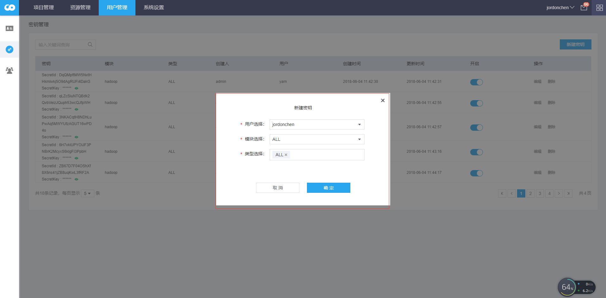

然后我们可以看到自己创建的id和key，如下图

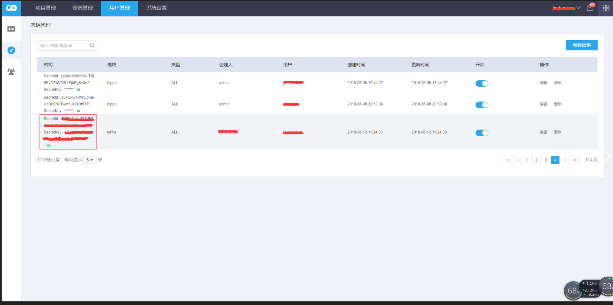

### 步骤（7）：配置kafka启动配置文件（完成）

拷贝复制到\$KAFKA_HOME/config/client_sasl.properties，如下图

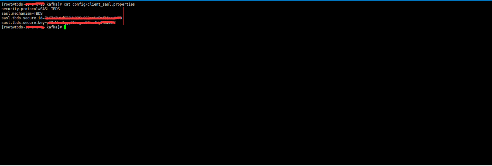

### 步骤（8）：启动kafka client

然后我们执行如下脚本：

\$KAFKA_HOME/bin/kafka-console-producer.sh --broker-list \$你的kafka的IPlist
--topic first_topic --producer.config ./config/client_sasl.properties

然后我们就进入到了kafka的客户端：

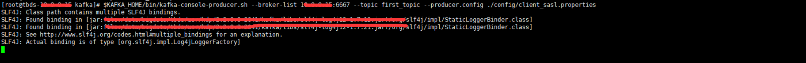

### 步骤（9）：尝试启动kafka

随便输入一行数据，报错如下图，

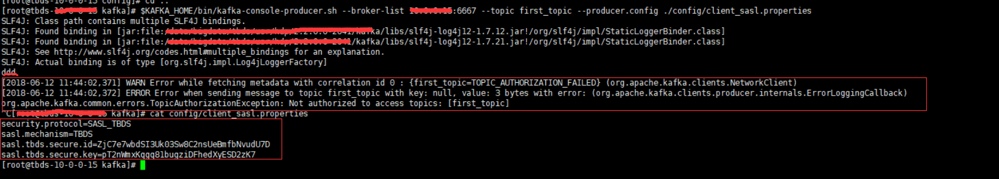

### 步骤（10）：配置ranger权限

>   现在还需要配置一个ranger权限。我们选择运维中心-\>访问策略-\>kafka

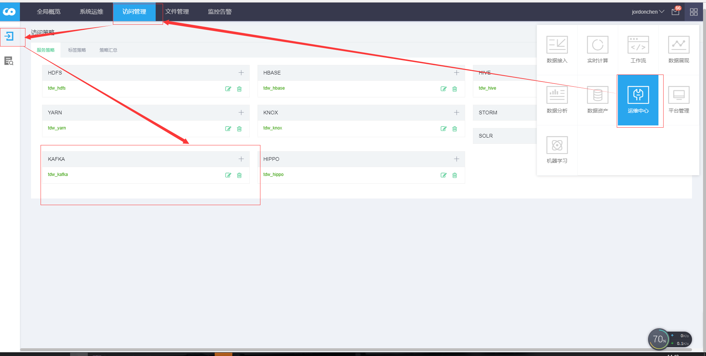

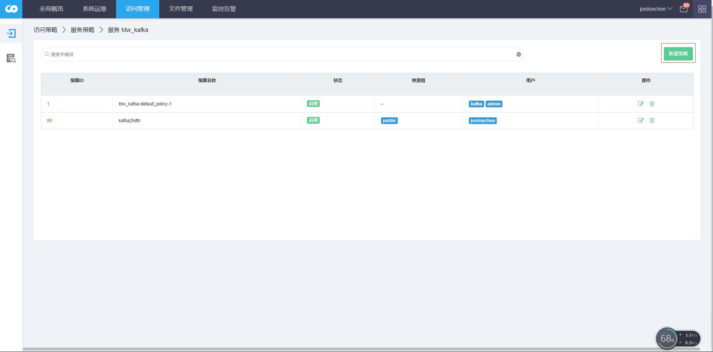

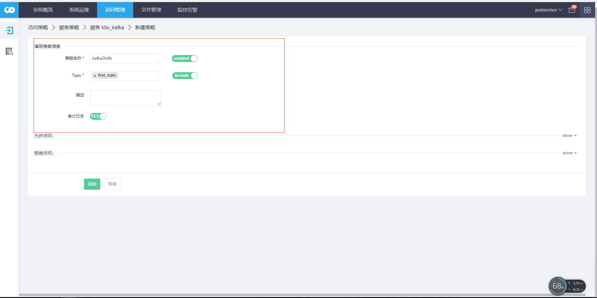

>   配置完成后，我们又进入到shell，

### 步骤（11）：生产数据

之后，我们把之前用java程序生成的数据，直接拷贝到kafka客户端上。

经过一段时间的等待之后，数据输入完毕。

### 步骤（12）：等待任务执行 

耐心等待一段时间。

### 步骤（13）：查看数据落地

我们可以在运维中心-\>文件管理处看到相应的文件夹生成

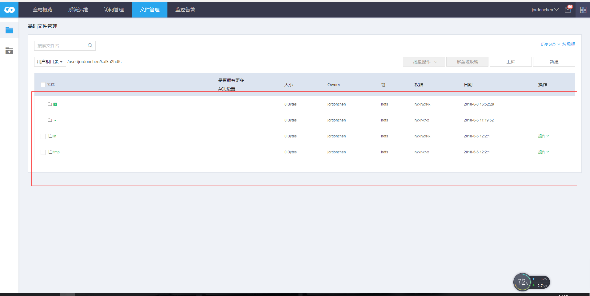

在进入in，可以看到已经落地的数据

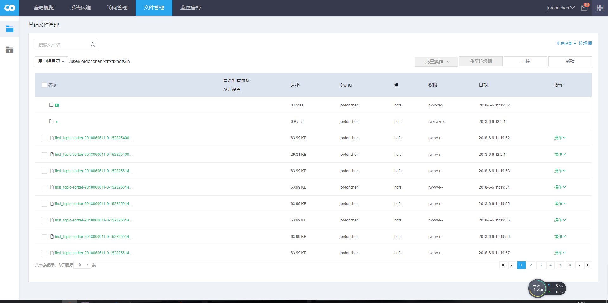

### 常见问题：

#### 数据无法落地：

可能原因：

工作流使用的topic，已经被其他工作流占用，这样会导致数据无法落地。切记要保证当前只有一个工作流在使用当前topic。

