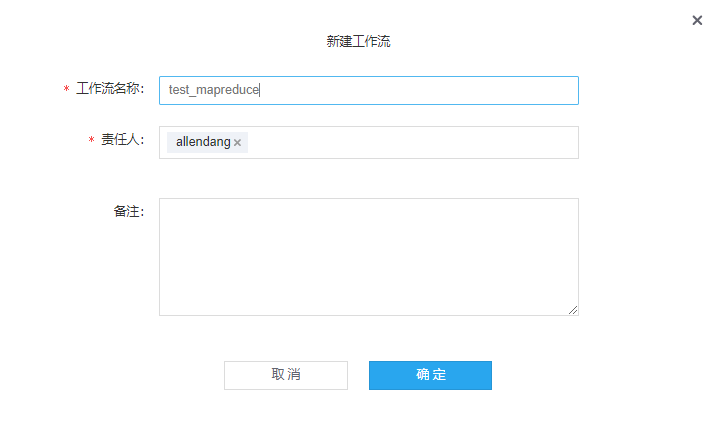
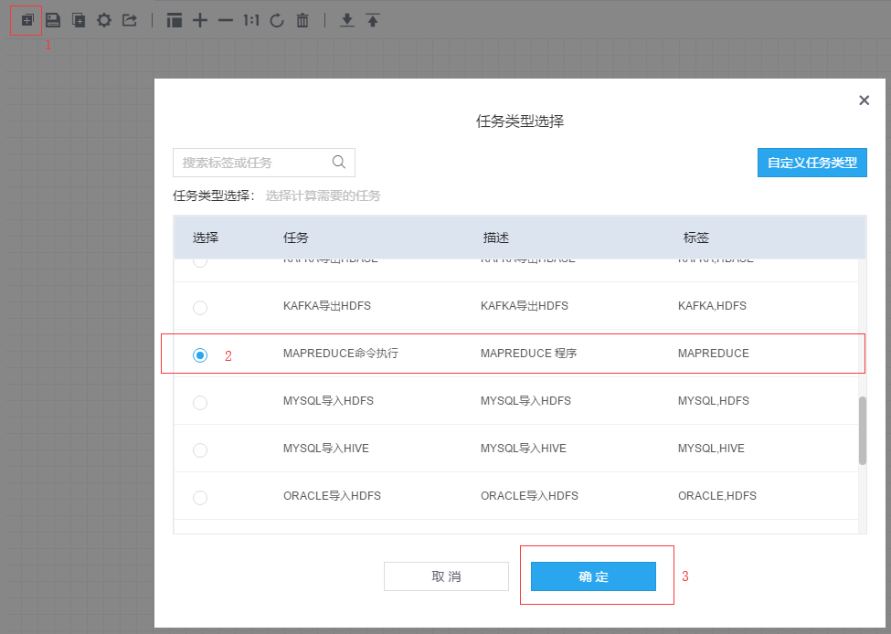
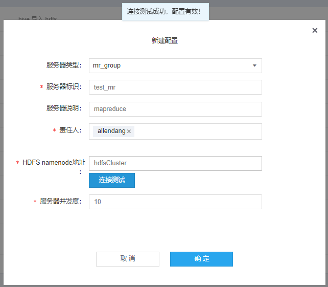
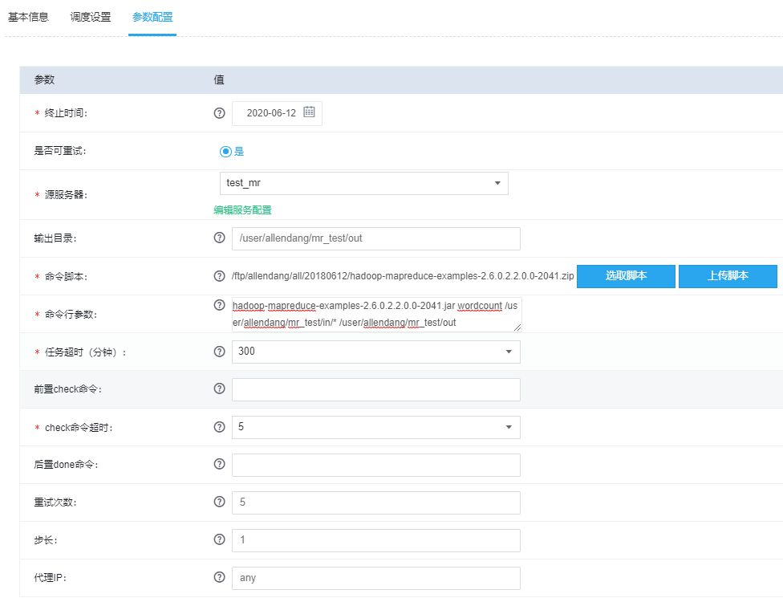
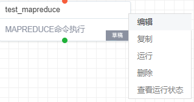
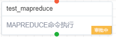
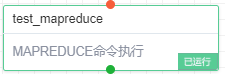
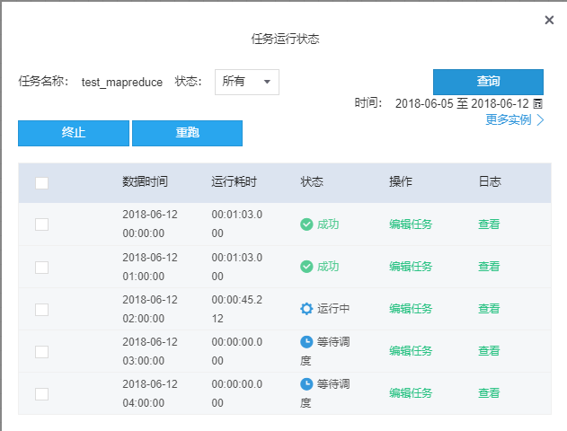
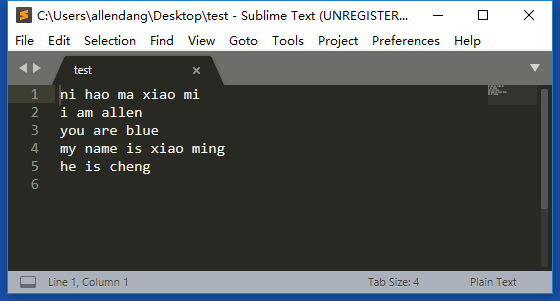
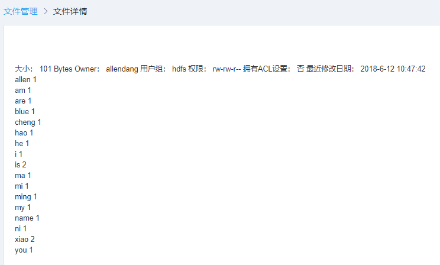

MAPREDUCE
---------------------

### 步骤（1）新建工作流

此处为了方便阅读和表明工作流的专门用途，填写为“test_mapreduce”。工作流名称可以自定义，中英文均可。

### 步骤（2）新建任务

首先，点击如图左上角的添加任务按钮，其次，任务类型选择“MAPREDUCE命令执行“，最后点击”确定“。

### 步骤（3）填写任务基本信息

需要填写的基本信息主要有：

1.  任务名称：用于唯一标识此次任务的名称，中英文均可。本次填写：test_mapreduce。

2.  责任人：指可以修改和操作该任务的用户，一个任务可以有多个责任人。默认是任务的创建者。

3.  告警方式：提供两种告警方式，分别是邮件和短信。（邮件和短信设置都可在用户基本信息中添加和修改）。

4.  告警接收人：指应该收到告警的用户，通常设置为责任人和运维人员，如果不添加的话，默认为责任人。

5.  告警类型：分为超时告警和失败告警两种。

6.  任务对应实例失败（终止）会触发失败告警。

7.  超时告警需要设置“预计任务耗时“，任务实例执行时长超过此时间，就会触发超时告警。

8.  预计任务耗时：任务预计执行时间。

### 步骤（4）填写任务调度设置

此处主要填写的内容有:

1.  周期类型：周期类型支持分钟，小时，天，周，月四种周期类型。非周期即为一次性任务，任务整个生命周期只有一个实例。此处选择为“一次性非周期”。

2.  起始数据时间：指任务开始时间，如果不选择，默认为当天。

### 步骤（5）填写任务参数设置

#### 1．配置源服务器

本示例为“MAPREDUCE命令执行”，则源服务器类型为mr_group，参数配置如下：

1.  服务器类型：此处为源服务器，选择mr_group。

2.  服务器标识：应命名唯一标识，即可唯一识别此服务器的名称，此处命名test_mr。

3.  HDFS namenode主机地址：系统默认填写hdfsCluster。

4.  HDFS集群访问的并发用户数目：可同时访问此集群的用户数目，系统默认为10。

最后，点击连接测试，显示“连接测试成功，配置有效！”，则表明，配置成功。

#### 2．填写任务参数

1.  源服务器：源服务器是mr_group服务器连接信息。本次创建为：test_mr。

2.  输出目录：指定mr
    数据输出目录，系统会在执行任务前，清理输出目录，因此不要在输出目录中存重要数据，尽量不要和别的任务复用统一目录。本次设置为：/user/allendang/mr_test/out

3.  执行脚本：mr 可执行脚本,可以包括多个文件，最终压缩为zip

4.  执行脚本参数：执行mr 需要用到的参数，通常格式为 jar名 函数入口 参数，比如：
    hadoop-mapreduce-examples-2.6.0.2.2.0.0-2041.jar wordcount args1
    args2，这里不需要添加hadoop
    安装目录。本次设置为：hadoop-mapreduce-examples-2.6.0.2.2.0.0-2041.jar
    wordcount /user/allendang/mr_test/in/\* /user/allendang/mr_test/out

5.  任务超时时间：执行hadoop jar
    命令超时时间，超过设置的时间，任务会被终止，实例失败。

6.  前置check命令：执行mr 之前，用户可以执行前置命令，比如判断hdfs
    数据目录是否存在，或者执行一些前置shell 命令（执行shell
    脚本），可以输入多个前置命令，也可选择不填，本次不填。

7.  前置check命令超时时间：前置check
    命令如果存在多个，每个前置命令执行时间不超过5min,总执行时间不超过该设置值（min）。

8.  后置done命令：任务执行后的done命令,在hdfs中创建一个文件或执行清理脚本。在hdfs中创建一个文件，使用“done
    hdfsdir”; 对于清理脚本，采用“ \*.sh argv”， 也可选择不填，本次不填。

### 步骤（6）任务审批

点击确定之后，系统会将任务状态设为“新建”，然后对画布中的任务点击鼠标右键，在弹出列表中点击“运行”

接着会弹出任务审批对话框，此处可选择审批通过后自动运行，或者审批之后手动开启，具体表现为是否勾选下图中红色部分。

点击确定之后，系统会向此项目的管理员发送审批邮件，由管理员来确定任务是否通过审批，若管理员通过此次任务运行，可以看到任务状态会从审批中变成已运行。

### 步骤（7）查看任务状态

鼠标右键点击任务，选择“查看运行状态”，即可看到此次任务的运行状态

### 步骤（8）检查任务是否成功

本次Demo，运行一个WordCount程序，即统计一段文字中的单词数量，测试文件test的内容，如下图所示，

MPAREDUCE任务执行成功后，输出文件可以按照创建任务时设置的路径在运维中心的文件管理模块找到，内容为：

对比发现，统计结果正确，至此，此次Demo完毕。