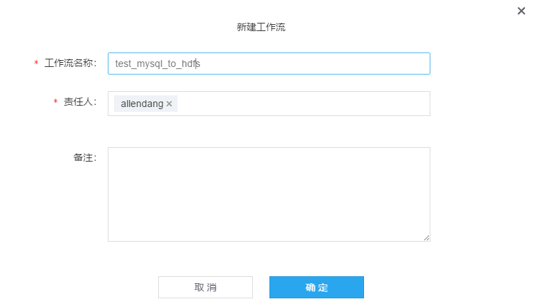
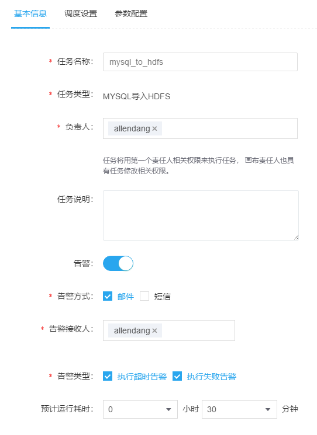
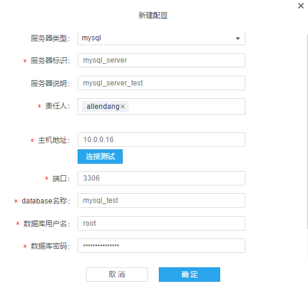
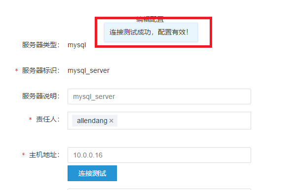
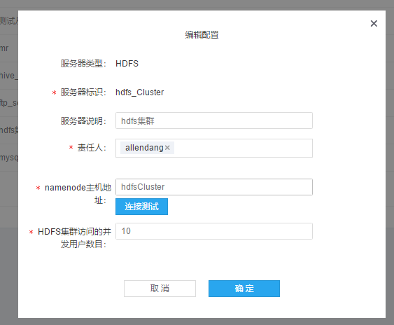
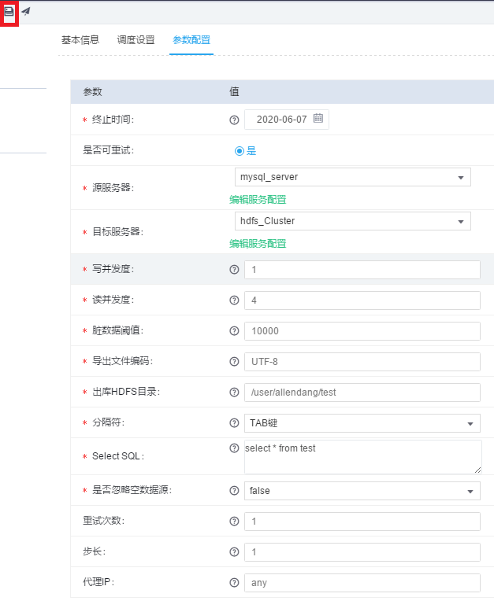
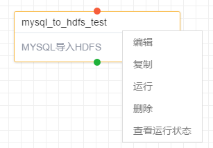
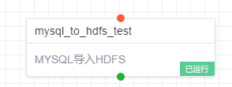
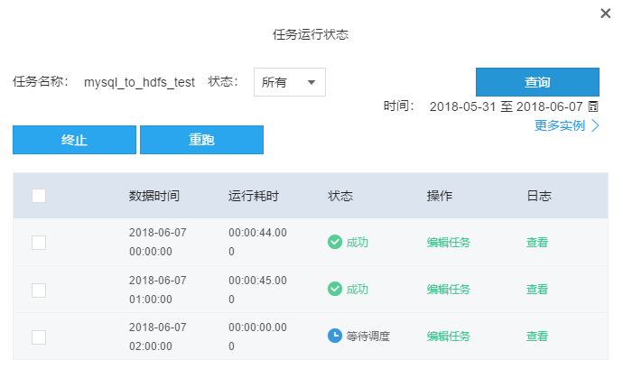
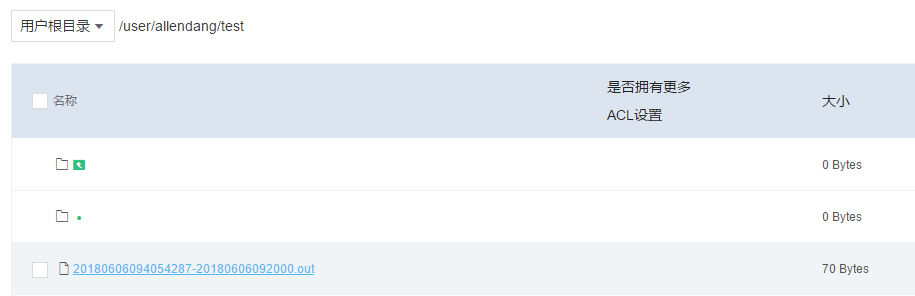

MYSQL导入HDFS
-----------------

### 步骤（1）新建工作流

此处为了方便阅读和表明工作流的专门用途，填写为“test_mysql_to_hdfs”。工作流名称可以自定义，中英文都可。

### 步骤（2）新建任务

首先，点击如图左上角的添加任务按钮，其次，任务类型选择“MYSQL导入HDFS“，最后点击”确定“。

### 步骤（3）填写任务基本信息

需要填写的基本信息主要有：

1.  任务名称：用于唯一标识此次任务的名称，中英文均可。本次填写：mysql_to_hdfs。

2.  责任人：指可以修改和操作该任务的用户，一个任务可以有多个责任人。默认是任务的创建者。

3.  告警方式：提供两种告警方式，分别是邮件和短信。（邮件和短信设置都可在用户基本信息中添加和修改）。

4.  告警接收人：指应该收到告警的用户，通常设置为责任人和运维人员，如果不添加的话，默认为责任人。

5.  告警类型：分为超时告警和失败告警两种。

6.  任务对应实例失败（终止）会触发失败告警。

7.  超时告警需要设置“预计任务耗时“，任务实例执行时长超过此时间，就会触发超时告警。

8.  预计任务耗时：任务预计执行时间。

### 步骤（4）填写任务调度设置

此处主要填写的内容有:

1.  周期类型：周期类型支持分钟，小时，天，周，月四种周期类型。非周期即为一次性任务，任务整个生命周期只有一个实例。此处选择为“小时”。

2.  起始数据时间：指任务开始时间，如果不选择，默认为当天。

3.  自身依赖：指任务实例之间的依赖关系，选项有：是，否，并行。此处选择：否。

4.  是：当前实例依赖前一个周期的实例的状态，即前一个周期实例运行成功之后，才会开始运行当前实例）。

5.  否：当前实例和前一个周期实例没有依赖关系，如果一个任务同时存在多个实例，系统随机选取一个实例运行，也就是说同一时间只有一个实例是运行状态。

6.  并行：前一个周期实例和后一个周期实例之间没有依赖关系，如果一个任务同时存在多个实例，多个实例会同时运行。

7.  调度时间：与周期类型有关，系统会显示周期类型的下一子集供用户选择。若不填写，默认为零，小时任务会从整点开始，分钟任务从0秒开始，天任务从0点开始，月任务从每月1号开始，周任务从每周一开始。

### 步骤（5）填写任务参数设置

#### 1．配置源服务器

本示例为“MYSQL导入HDFS”，即从MYSQL中导出数据，则源服务器类型为mysql，参数配置如下：

1.  服务类型：此处源服务器，选择为：mysql。

2.  服务器标识：为以英文字母开头，并且只能为字母，数字和下划线的组合。此处填写：mysql_server。

3.  主机地址：为提供mysql服务的主机IP地址。

4.  端口号：连接mysql服务所使用的端口，默认为3306。

5.  database名称：mysql中已有的数据库名称。

6.  数据库用户名：mysql账号

7.  数据库密码：mysql密码

>   最后，点击连接测试，显示“连接测试成功，配置有效！”弹框，则表明，配置成功。

若显示“温馨提示”对话框，则会提示连接错误，需要重新检查参数之后再进行测试。

#### 2．配置目标服务器

本示例为“Mysql导入HDFS”，则目标服务器类型为HDFS，参数配置如下：

1.  服务器类型：此处为目标服务器，选择hdfs。

2.  服务器标识：应命名唯一标识，即可唯一识别此服务器的名称，此处命名hdfs_Cluster。

3.  HDFS namenode主机地址：系统默认填写hdfsCluster。

4.  HDFS集群访问的并发用户数目：可同时访问此集群的用户数目，系统默认为10。

最后点击连接测试，显示“连接测试成功，配置有效！”，则表明，配置成功。

#### 3．填写任务参数

本示例为“MYSQL导入HDFS”，具体参数配置如下：

1.  写并发度：指写入hdfs 时使用的写并发线程数。

2.  读并发度：指读取db 数据时使用的读并发线程数。

3.  脏数据阈值：允许失败的条数，如果不填，则表示不允许失败。

4.  导出文件编码：指写入hdfs数据的编码格式，默认为UTF-8。

5.  出库HDFS目录：指写入到的HDFS目录。

6.  分隔符：指hdfs文件中数据的分隔符号。

7.  Select SQL：sql语句，一般是查询语句。

8.  是否忽略空数据源：即对数据库为空的情况如何处理，若

9.  选择是 ，查询sql结果记录数为0，任务成功。

10. 选择否 ，查询sql结果记录数为0，任务失败

### 步骤（6）任务审批

点击确定之后，系统会将任务状态设为“新建”，然后对画布中的任务点击右键，在弹出列表中点击“运行”

接着会弹出任务审批对话框，此处可选择审批通过后自动运行，或者审批之后手动开启，具体表现为是否勾选下图中红色部分。

系统会向此项目的管理员发送审批邮件，由管理员来确定任务是否通过审批，若管理员通过此次任务运行，可以看到任务状态会变成下图所示。

### 步骤（7）查看任务状态

再右键点击任务，选择“查看运行状态”，即可看到此次任务的运行状态

### 步骤（8）验证任务是否成功

任务执行成功后，可以在运维中心的文件管理模块中，按照任务设置中的输出路径找到对应的生成文件。

文件下载后，用记事本打开可以看到其中数据与“mysql_test”数据库中“test”内的数据是一致的。

至此，此次Demo完毕。
