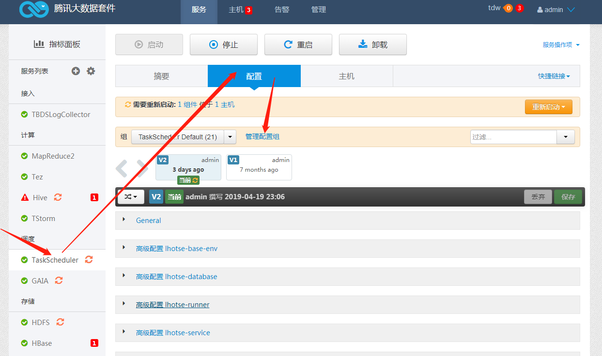
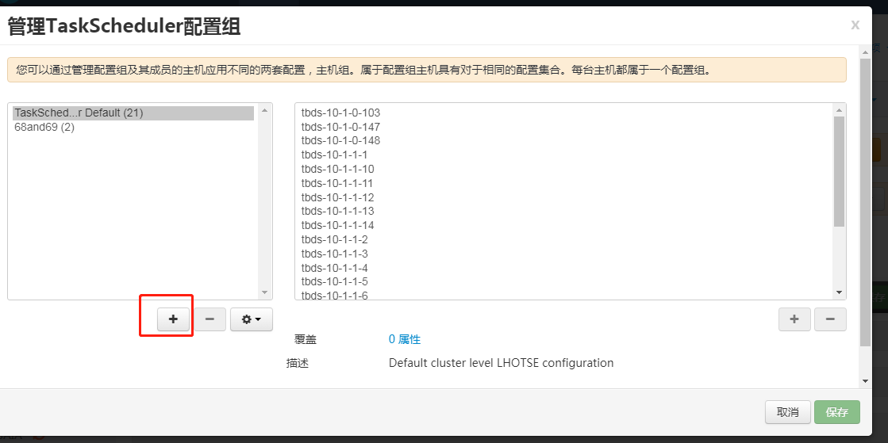
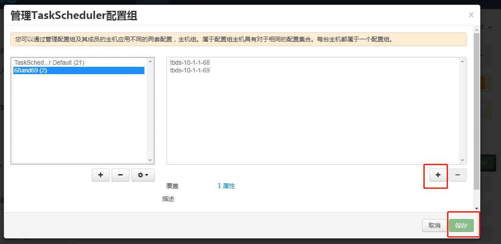
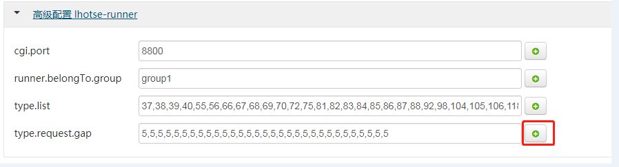
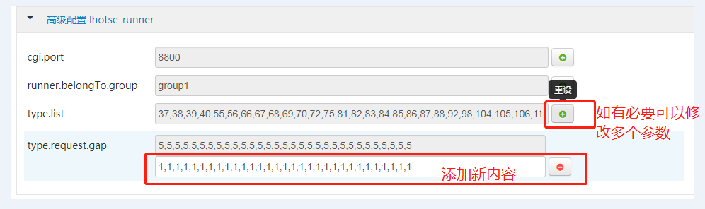

配置文件可以分组设置，不同的分组可以包括不同的节点。

**ps:** 支持V411,V50  

1. taskScheduler runner 分组  
可以用来设置不同runner 请求不同的任务类型，不同的任务类型loader 请求频率不同  
**1.1 进入8080页面  **

**1.2添加一个新的配置分组  **

**1.3 给新的配置分组添加指定节点  **

**1.3 修改配置属性  **  
如下是修改loader 请求不同任务类型的时间间隔

修改后的结果  

2. taskScheduler base 分组（暂不支持）  
可以用来设置不同的base 处理不同的任务类型
