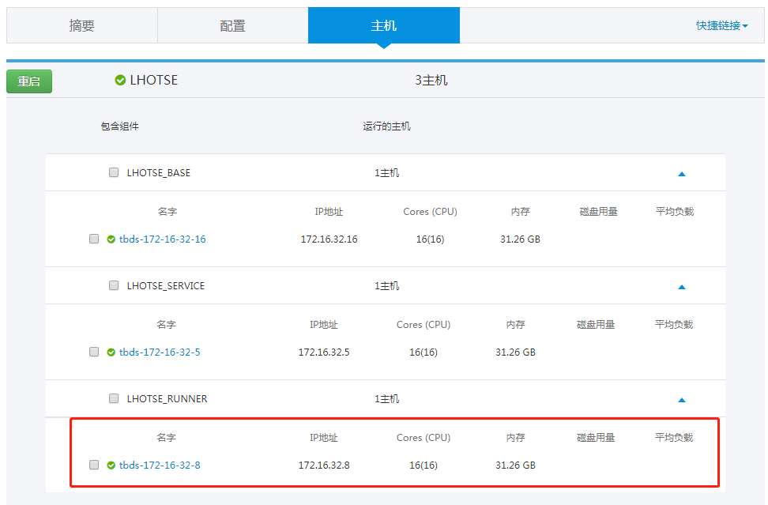
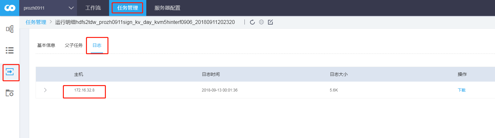

## 定位问题常用的操作

#### 1. 查询安装runner组件安装的节点

#### 2. 查看任务信息所在数据库

#### 3. 查看任务实例运行节点

#### 4. 通过portal日志定位问题
portal 节点执行  tailf /usr/local/tbds-portal/log/application.log  
页面触发对应操作，获取后台异常日志

更多操作：  
清理日志  
echo "" >  /usr/local/tbds-portal/log/application.log  
日志重定向  
tailf /usr/local/tbds-portal/log/application.log|tee /tmp/portal.log

#### 5. 通过lhotse-service 日志定位问题
切到LHOTSE_SERVICE 节点执行  
tailf /usr/local/lhotse_service/logs/lhotse_service.log  
触发相应操作，获取后台异常日志

更多操作：  
清理日志  
echo "" >  /usr/local/lhotse_service/logs/lhotse_service.log  
日志重定向  
tailf /usr/local/lhotse_service/logs/lhotse_service.log  |tee /tmp/tmp.log

#### 6. 查看lhotse-base 日志
lhotse-base 有三个日志：
1. lhotse_base.log  
存放系统运行日志  

2. base_schedule.log  
存放实例调度过程的记录  

3. base_schedule_statistic.log  
存放实例化，依赖判断，下发正常的记录信息

#### 7. 查看lhotse-runner 运行日志
存放loader 请求和执行runner 记录
lhotse_task_loader.log
