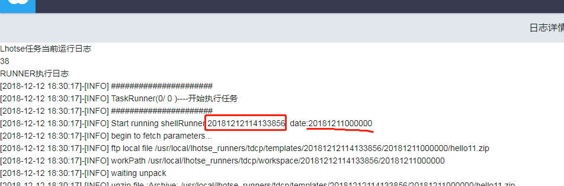
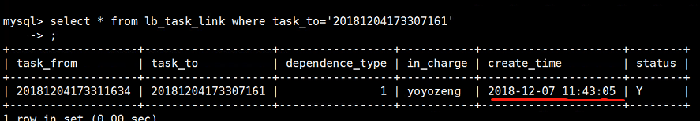

##### 父子依赖不生效有两种情况：  
1. 工作流页面创建了边，但是任务管理-任务运行管理-父子任务查询结果为空。
2. 如果第一种情况不为空，但父子任务在同一个时间区间的实例，子实例开始时间在父实例结束时间之前。
3. 如果出现第二种情况，确认依赖失效时间。

##### 问题分析：
###### 1. 如果出现第一种情况  
任务之间的边依赖关系没有生效，确认方法是查询lb_task_link 表确认有其记录。
如果没有数据库记录，可以通过停止-运行父任务（或子任务）来解决。

###### 2. 如果出现第二种情况  
2.1 如果子实例开始时间和父实例结束时间差距很小（几秒），是正常情况。因为我们这里的开始时间不是实例运行的时间而是判断实例可以下发的时间。  
实例开始运行时间和结束时间可以在下图所在位置确认。

或  
  
2.2 如果子实例开始时间和父实例结束时间差距很大（几分钟以上），则不是正常情况。  
可以分两种情况来分析：即父任务（子任务）实例的生成时间是否等于数据时间+一个周期（天任务就是一天）  
如下图任务生成时间和数据时间差了两个周期。  
  
1. 差距是一个周期，则表示是正常生成。  
2. 差距多余一个周期，则表示是补录的任务。  

###### 3. 如果通过上面方式确认父子任务对应的实例依赖失效，需要通过查询db确认link 生效时间。
1. 通过任务实例日志确认任务对应的调度ID和数据时间（父任务和子任务）

红框部分为调度Id,划线部分为数据时间
2. 通过lhotse_open.lb_task_link 确认边生效时间

3. 通过比较上图create_time 和 任务生成时间来判断依赖是否生效。 
