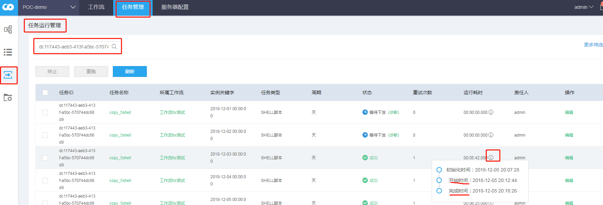
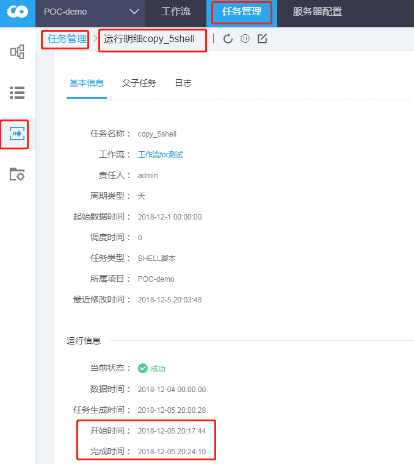
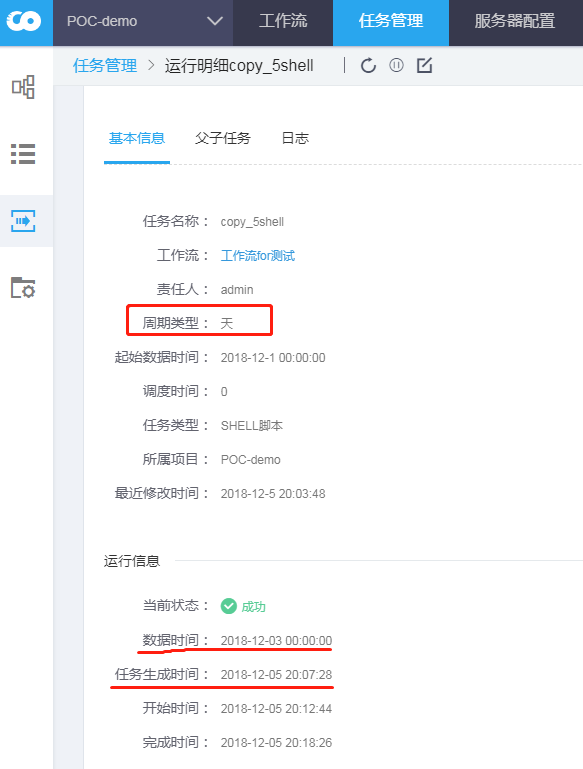

##### 父子依赖不生效有两种情况：  
1. 工作流页面创建了边，但是任务管理-任务运行管理-父子任务查询结果为空。
2. 如果第一种情况不为空，但父子任务在同一个时间区间的实例，子实例开始时间在父实例结束时间之前。

##### 问题分析：
###### 1. 如果出现第一种情况  
任务之间的边依赖关系没有生效，确认方法是查询lb_task_link 表确认有其记录。
如果没有数据库记录，可以通过停止-运行父任务（或子任务）来解决。

###### 2. 如果出现第二种情况  
2.1 如果子实例开始时间和父实例结束时间差距很小（几秒），是正常情况。因为我们这里的开始时间不是实例运行的时间而是判断实例可以下发的时间。  
实例开始运行时间和结束时间可以在下图所在位置确认。

或  
  
2.2 如果子实例开始时间和父实例结束时间差距很大（几分钟以上），则不是正常情况。  
可以分两种情况来分析：即父任务（子任务）实例的生成时间是否等于数据时间+一个周期（天任务就是一天）  
如下图任务生成时间和数据时间差了两个周期。  
  
1. 差距是一个周期，则表示是正常生成。
请找系统管理员，处理解决

2. 差距多余一个周期，则表示是补录的任务。
尝试重跑子任务对应实例。
