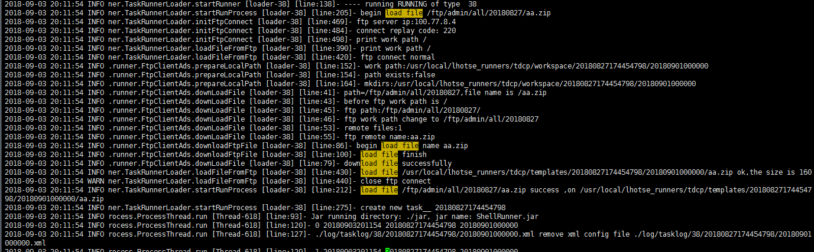

该文档帮助解决实例日志中出现load file from ftp failed 异常。  
通常只有shell,mr ,spark,hive sql 任务会出现该异常。

#### 后台实现逻辑
shell,mr ,spark,hive sql这四中任务类型的任务都会涉及到从ftp拉取文件。但文件拉取不是runner进程直接拉取，而是委托给loader拉取文件。如果loader拉取文件失败，则会在实例日志中提示load file from ftp failed 异常。  

#### 问题定位
可能原因：
1. ftp 中不存在对应的文件
2. HDFSonFTP 服务异常
3. loader连接数过多，或者ftp 连接地址有误

##### 一、确认HDFSonFTP 服务是否正常
通过8080或者80端口（系统运维）查看 FTP_ON_HDFS 服务状态是否正常。

##### 二、确认ftp 是否有对应文件
通过运维中心-文件管理-上传文件管理 尝试下载对应ftp 文件，确认下载文件是否正常，文件内容是否正常。
ps:
请确保文件名和文件路径跟任务配置的完全一致。（区分大小写）  
大部分原因都是ftp文件不存在导致的。

##### 三、确认文件下载失败原因
查询runner节点中loader日志文件（/usr/local/lhotse_runners]# vi log/lhotse_task_loader.log），通过realtaskId 过滤，其前后日志中 load 相关的日志，确认是否有error,failed,warn 日志。通过这个日志可以判断失败原因。

