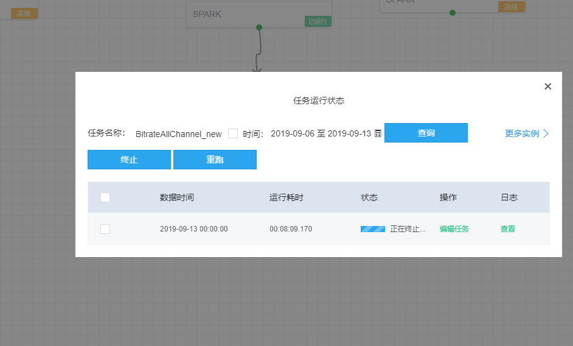

问题：  
终止任务实例，实例一直显示正在终止（两三分钟以上）

现象：如下图  

定位步骤   
1. 确认状态  
在页面F12 查询status 对应的值  
  
2. 状态为4   
4 表示 终止命令正在下发   
如果一直停留在4状态，可能原因是 base 停止了，或者前一次执行节点对应的 loader 已经停止    
可以去8080 页面查看 taskSchedule 服务组件的状态是不是都是正常的  
3. 状态为5  
5 表示 正在执行终止命令  
如果一直停留在5状态，可能原因是 执行停止命令失败  
可以去kill命令执行的 loader 节点 查看 /usr/local/lhotse_runners/log/lhotse_task_loader.log 日志（关键字是 taskId）  
4. 状态恢复  
状态为4 的情况，可以通过恢复服务的方式自动恢复。  
状态为5 的情况，必须要手动干预，通过将lb_task_run 对应记录的state 状态重置为4   
