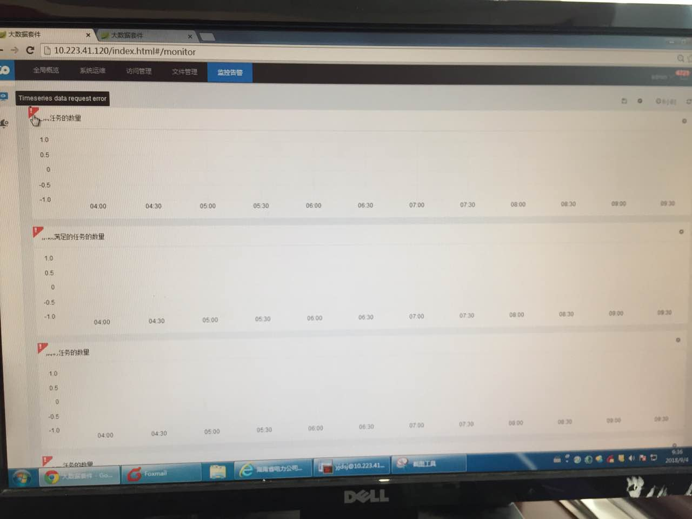
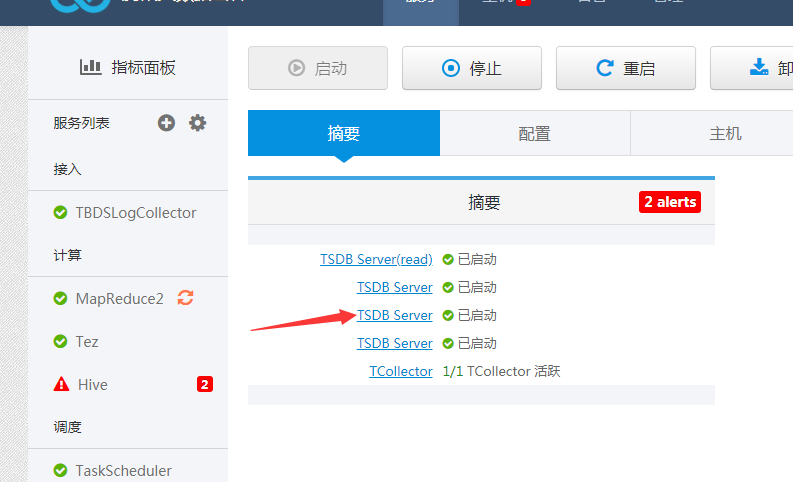
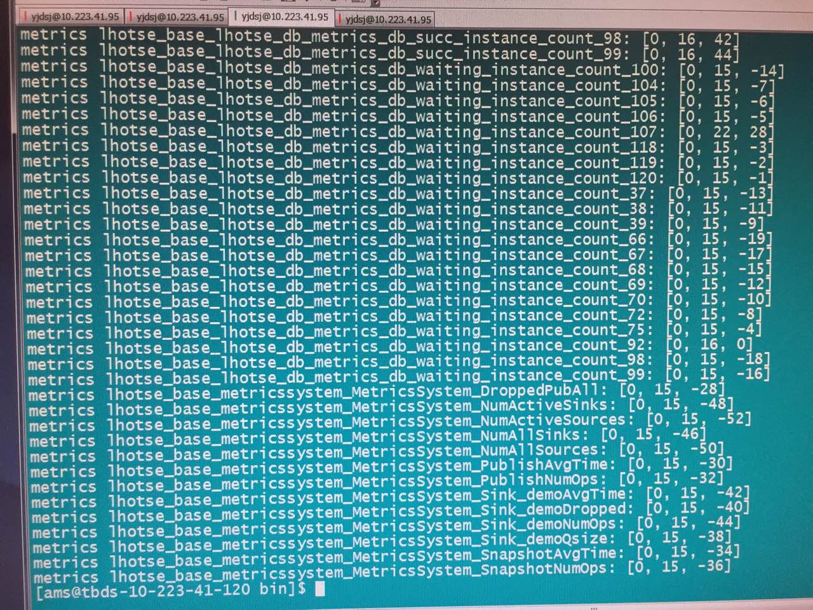
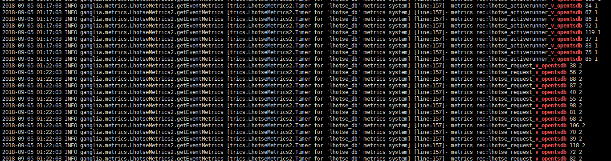
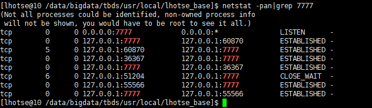
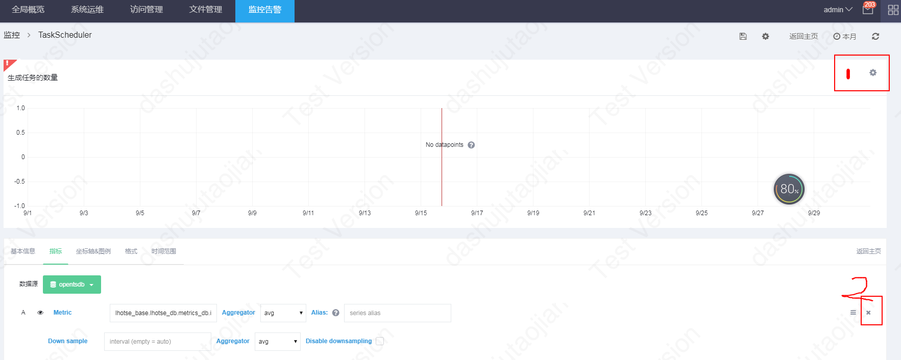

该文档用来帮助定位taskSchedule指标信息为空

#### 问题现象


<br>
#### 定位方式
1. 先切到opentsdb的机器  su到ams账户  到opentsdb的安装路径下执行下一个步骤的命令  


2. 执行命令
```
./tsdb uid grep metrics '.*lhotse_*'
./tsdb uid grep tagk '.*lhotse_activerunner_v_.*'
./tsdb uid grep tagv '.*lhotse_activerunner_v_.*'
```
如果得到如下图结果,则表示taskSchedule指标已经上报db  ，可以跳过第三步  
如果没有，继续执行第三步。   


3. 查看base 日志，确认相关指标上报到7777 端口  
切到base 节点，执行   
/data/bigdata/tbds/usr/local/lhotse_base]$ tailf log/lhotse_base.log |grep v_opentsdb
如果出现下图内容，则表示base正在发送指标信息  

监听base 本地7777端口，如果显示正在监听，则表示监听端口ok  


4. 查询portal 页面是否其中某个指标类型  
如下图位置，启用编辑，删除所有指标  

然后在下图位置输入 lhotse 关键字，如果出现lhotse 相关参数，则表示有部分数据已经上报。如果没有出现下图提示，继续执行第五步。  


5. 如果上面一切ok，那有可能是因为上报的指标名称和显示的指标名称不一致。需要在portal 修改显示的指标名称。
6. 如果上一步没有发现异常，请确保 Dashboard ,kafka,Flume,hbase,TSDB 服务正常。 
