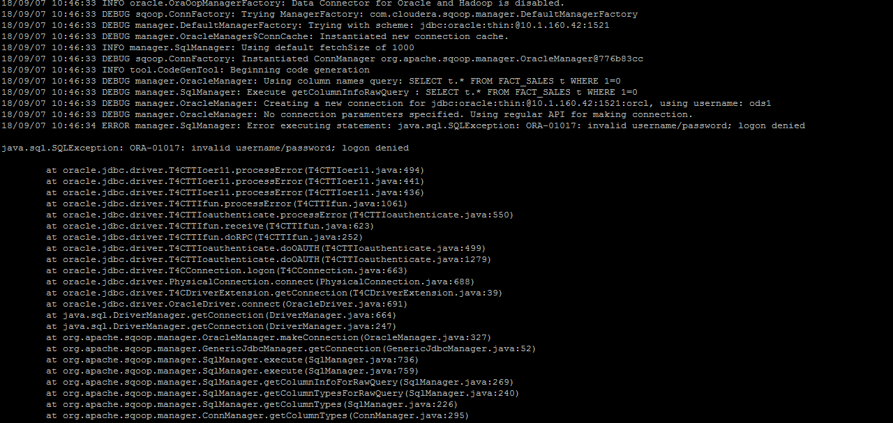

从关系型DB导入HDFS

### 功能说明
支持从mysql,postgre,sql server,oracle  导入到hdfs .

### 其他说明

### 任务设置
#### 1. 基本信息  
参考 [基本信息设置](/workflow/workflow/runnerBasicInfo.md)  
#### 2. 调度  
参考 [调度设置](/workflow/workflow/runnerCycle.md)  

#### 3. 参数
参数设置如下图：

1. 源服务器  
待导入数据 所在的db server  
更多信息参考 [服务器配置](/workflow/services/readme.md)

2. 目标服务器  
存储最终结果所在的HDFS server   
更多信息参考 [服务器配置](/workflow/services/readme.md)

3. select SQL  
查询SQL
支持[时间隐式参数](/workflow/workflow/more/implicitVariable.md)

4. 读并发度  
指定读取db 数据时使用的读并发线程数。

5. 写并发度  
指定写入hdfs 时使用的写并发线程数。

6. 出库HDFS目录  
指定从db读取数据写入到哪个目录

7. 分隔符  
指定写入hdfs时，不同字段时间使用的分隔符。

8. 导出文件编码  
指定写入hdfs数据的编码  

9. 脏数据阀值  
整数值，表示允许失败的百分比。如果不填，表示不允许失败。

10. 是否忽略空数据源  
如果选 是 ，查询sql 结果记录数为0 任务成功。  
如果选 否 ，查询sql 结果记录数为0，任务失败。

### demo
如上图所示

### demo资源

### 其他
oracle版本对应ojdbc驱动版本号[查看](
https://www.oracle.com/technetwork/database/enterprise-edition/jdbc-faq-090281.html#01_01)

可能存在的异常情况

解决版本参考
http://www.dba-oracle.com/t_ora_01017.htm
