#### 一、目标
以游戏用户数据为例，介绍工作流相关功能和使用以及常见问题的定位方法。  

#### 二、需求 
**场景一**  
统计不同平台每天的登录次数，并将结果导出到mysql，方便后续使用黄金眼（报表）  
涉及如下任务类型：  
thive2hdfs  -> mr -> hdfs2hive  -> hive sql -> hive2mysql 

**场景二**  
用户登陆趋势图  
涉及如下任务类型：  
thive2hdfs  -> mr —> spark  -> hive2mysql  
		
下面将通过实现场景1和场景2来说明相关任务类型的功能和使用。  

#### 三、 业务分析
根据具体业务梳理出需要用到任务
###### 3.1 场景一
1. 创建thive导入hdfs 任务，将数据入HDFS
2. 创建MR任务将用户登陆数据按平台拆分
3. 创建hdfs2hive任务将苹果平台数据导入对应hive表
4. 创建hive sql 任务实现统计
5. 创建hive2mysql任务将统计结果导入关系型db(mysql)

###### 3.2 场景二
1. 创建thive导入hdfs 任务，将数据入HDFS
2. 创建MR任务将用户登陆数据按平台拆分
3. 创建spark 任务实现登陆次数趋势统计
4. 创建hive2mysql任务将统计结果导入关系型db（mysql）

#### 四、具体实现
##### 4.1 数据准备
利用实时接入导入的player_login 表记录。

##### 4.2 创建服务器
1. 创建thive server  
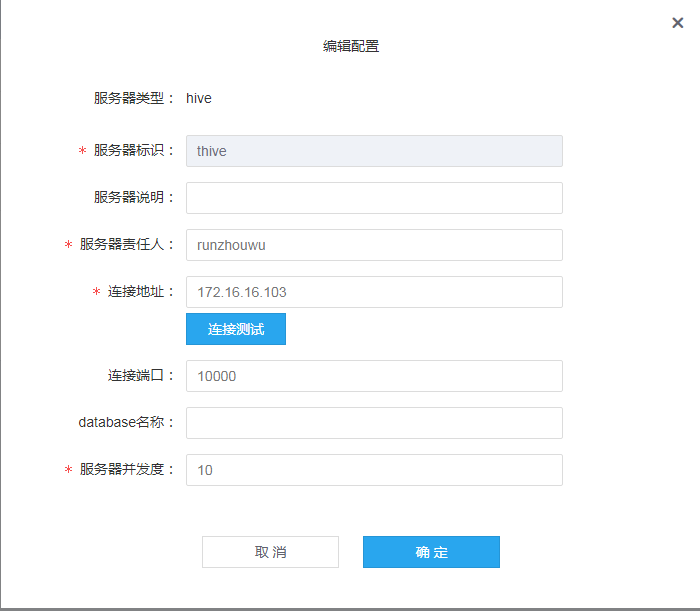

2. 创建 hdfs server  
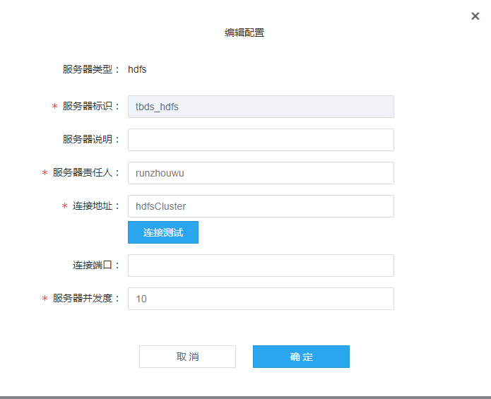

3. 创建 mr server  
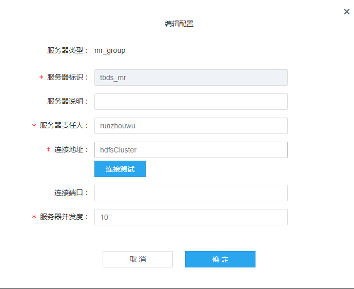

3. 创建 hive server  
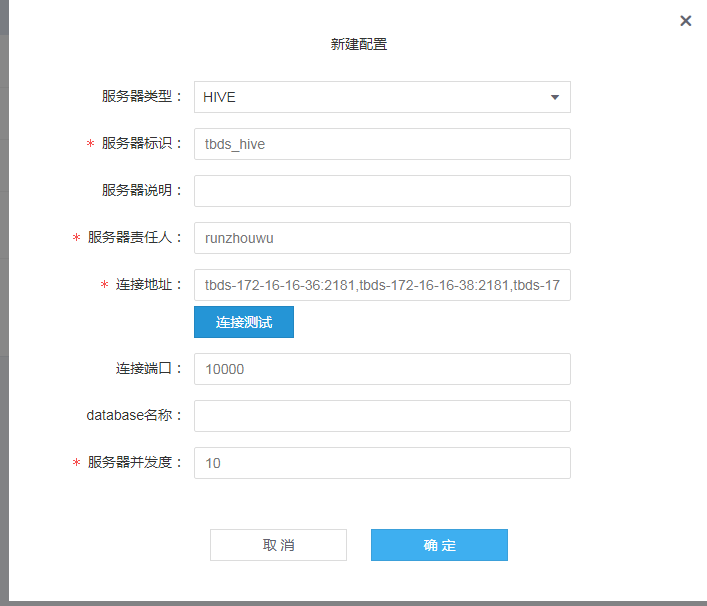

4. 创建 mysql server  
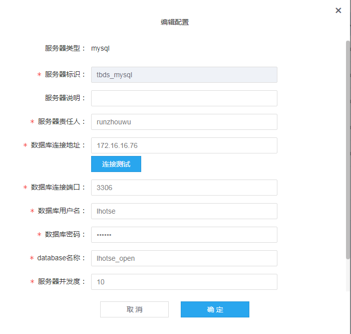

##### 4.3 创建任务
###### 4.3.1 创建thive导入hdfs  
目标：将thive 中的导入数据按小时落地到hdfs 目录  
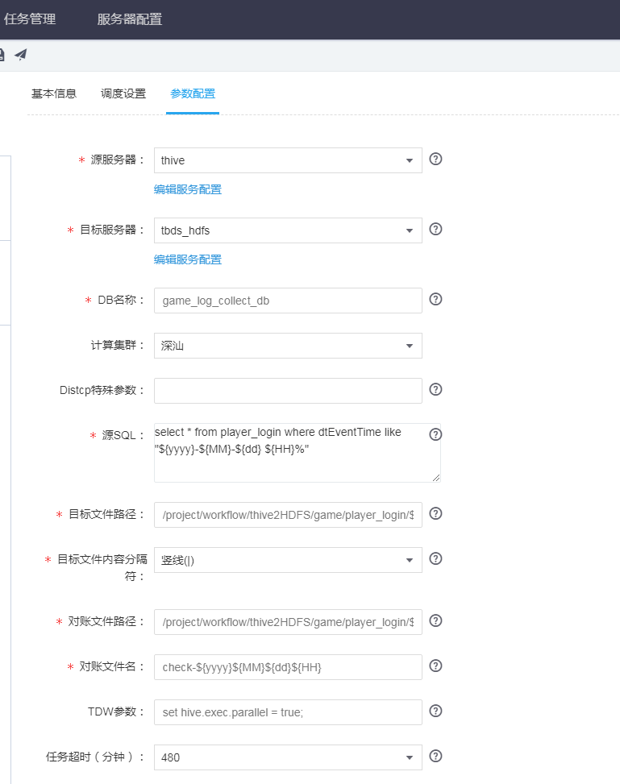  
任务实现逻辑  
利用导出目录创建hive 外表，执行insert into ... select ...   
注意：  
1. 目标文件路径不要存放数据，不然会被清理。  
2. 目标文件路径为hive 表 location 指定的位置，要特别注意。处理不好会导致表数据被删。

###### 4.3.2 mapreduce 任务
目标:将用户登陆数据按平台拆分到不同目录  
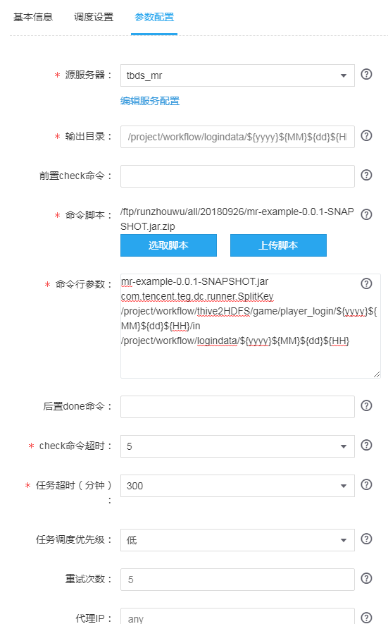   
任务实现逻辑   
拼接hadoop -jar 执行命令，并导入环境变量。  
注意：  
1. 不需要在代码中指定权限相关变量。  
2. 如果需要用到yarn 相关配置文件，需要在代码中指定。  

###### 4.3.3 hdfs导入hive 任务
目标：将被拆分的苹果平台的数据导入到不同的hive 表
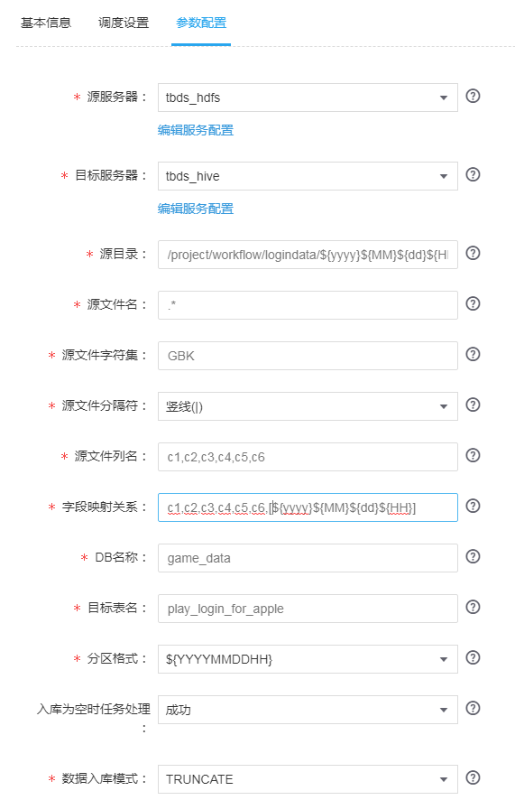   
任务实现逻辑   
基于源目录创建hive 外表，执行 insert into ... select ...   
注意：  
1. 目标表必须存在
2. 按周期导入数据，目标表最好分区

###### 4.3.4 hive sql 任务
目标：统计苹果平台每天的登录用户数据量   
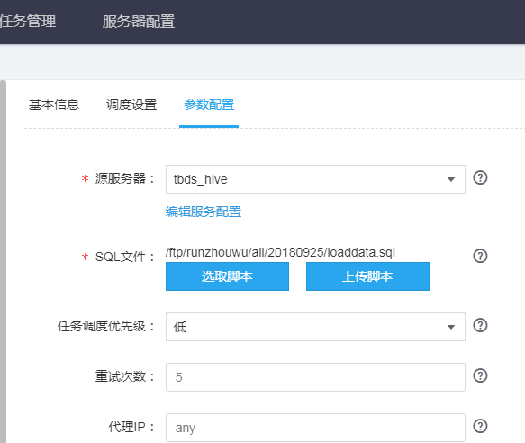   
任务实现逻辑   
拼接beeline执行命令，并将环境变量添加到执行文件中。  
注意：  
1. 跨db 查询，需要指定db  

###### 4.3.5 hive导入mysql 任务
目标：统计结果导出到关系型db(mysql)  
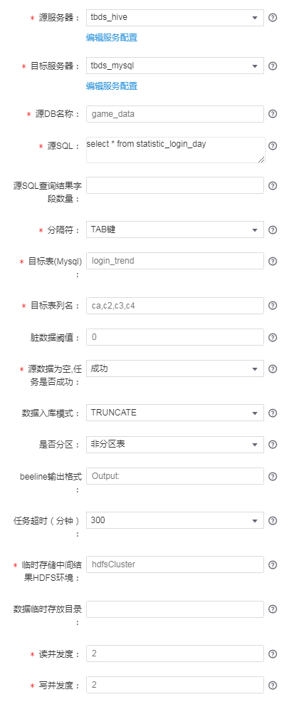   
任务实现逻辑   
先将数据导入hdfs,然后将数据导出mysql     

###### 4.3.6 spark 任务
目标：实现全平台的登录次数统计（十分钟）  
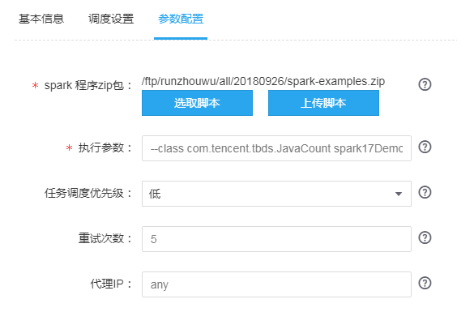   
任务实现逻辑   
拼接spark-submit 执行命令，导入相关环境变量。  
注意：  
1. 如果需要用到yarn 相关配置文件，需要在代码中指定。  
2. 支持执行py 脚本

###### 4.3.7 shell 任务
目标：结果存在性判断  
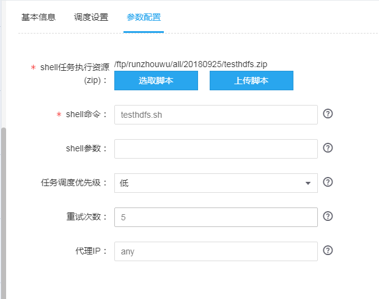   
任务实现逻辑   
创建对应用户，使用portal 用户执行shell 脚本    
注意：  
1. 执行失败，需要exit 1

##### 4.4 实例状态检查
1. 实例状态转换图  
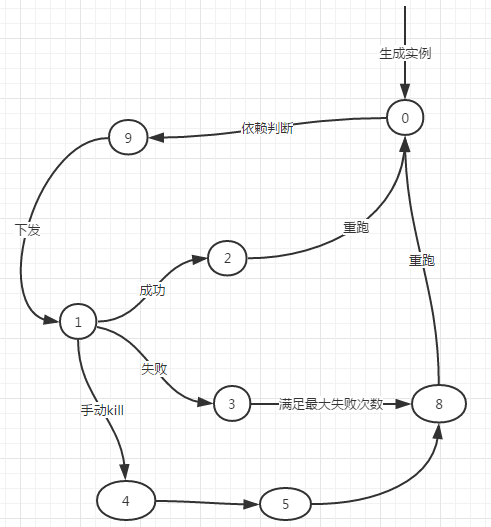

2. 实例状态查看  
实例运行状态和更多实例都可以查看实例状态
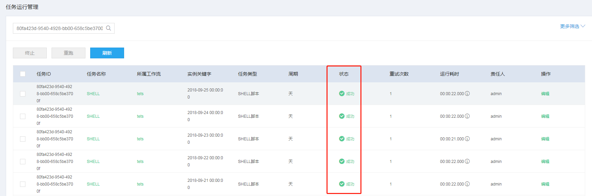
3. 实例状态相关配置属性  
重试次数不大于任务设置的最大重试次数,失败的实例会一直重试。  
4. 实例下发诊断  
显示实例当前所在位置。  

##### 4.5 日志查看
在两个位置提供日志查看功能：1. 工作流->任务->更多实例 2. 任务管理->运行管理->日志  
第一个位置，直接定位到日志内容。  
第二个位置，提供最近五个实例日志列表。主机地址就是实例运行节点ip.  

##### 5. 常见问题定位
1. 全局结构  
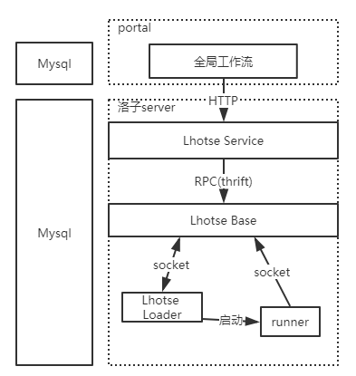

2. 相关组件日志位置
portal :/usr/local/tbds-portal/log/application.log
lhotse-service: /usr/local/lhotse_service/logs/lhotse_service.log
lhotse-base: /usr/local/lhotse_base/log/lhotse_base.log
lhotse-runner: /usr/local/lhotse_runners/log/lhotse_task_loader.log
