## 一、集群

### 1、内置集群

TBDS多集群版安装完成后会内置一个**默认集群**，集群标识为：**default\_cluster**，该集群管理了套件运行的基本服务组件，保证TBDS系统的正常运行。
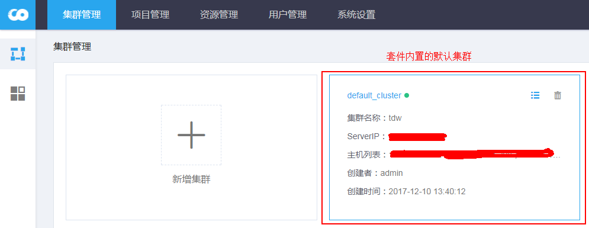

**备注：**

- 集群状态：集群标识旁的圆点颜色代表集群的状态，绿色：集群状态可用；红色：集群状态无效；
- 集群添加成功后不支持删除操作；
- 若无法通过api获取集群的服务，则添加的集群无效，不可用；
- 集群名称：添加集群的时候通过api自动获取，可以重复；
- 主机列表：通过添加集群的连接信息，通过api自动获取主机列表，无需手动设置；

### 2、新增集群

点击新增集群的标识，进入集群添加页面：

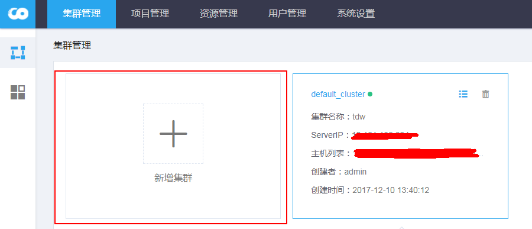

添加集群页面：
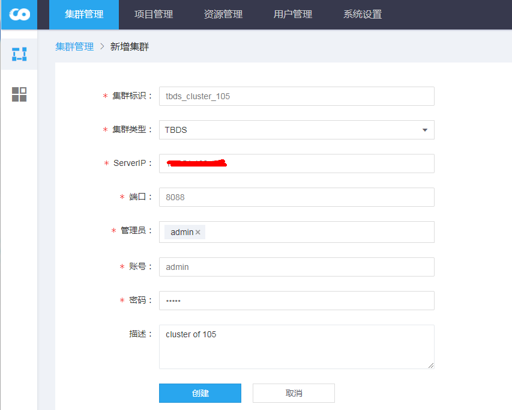

添加成功后，可以集群列表中查看：

**备注：**

- 集群标识：集群的唯一识别，用户手动设置，不可重复；
- 集群类型：目前仅支持TBDS、CDH集群；
- serverIp： 是集群的控制节点，如：TDBS的portal主机，CDH的Cloudera Manager主机；
- 端口：集群控制节点的连接端口：TBDS 默认是8088， CDH默认是7180；
- 管理员：集群的责任人，管理人；
- 账号：登陆集群控制节点的用户名；
- 密码：登陆集群控制节点的对应用户的密码；
- 描述：可随意对进行进行描述备注；

### 3、集群信息
通过集群后上角角标可以查看集群信息，并进行集群编辑：

集群详情页面：
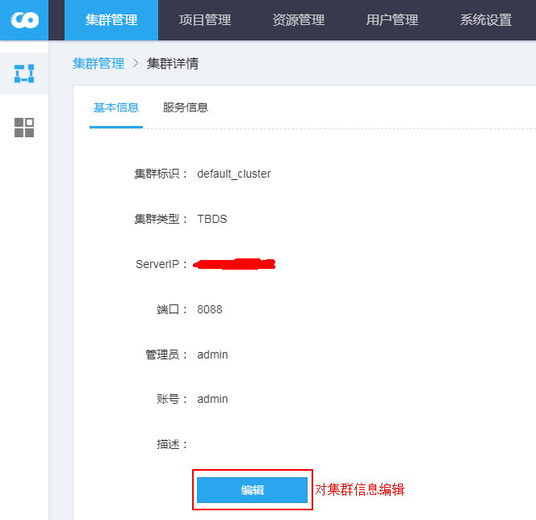

集群编辑页面：
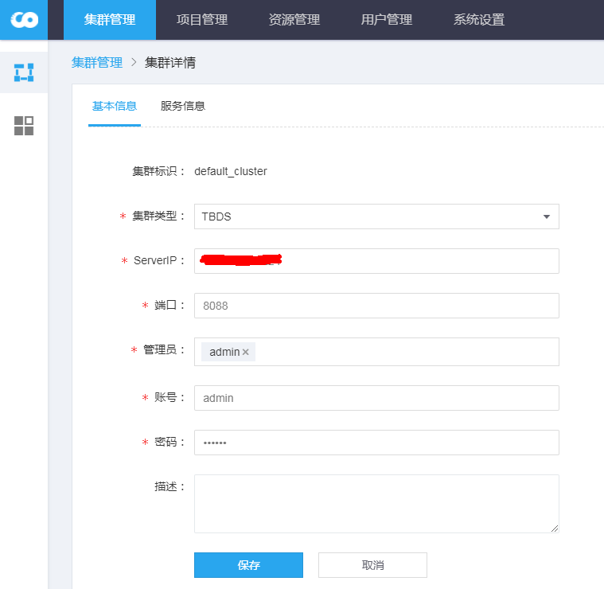

**备注：**
- 集群添加成功后不支持删除操作，所以删除按钮置灰；
- 集群一经添加后，不支持修改集群的标识；

### 4、状态变更

当集群状态为无效时，如：因为网络无法连接，无法获取集群信息造成。当解决网络问题后，可以直接使用一键按钮，将集群状态从无效设置为有效。该按钮只有在集群状态是无效的时候才显示。

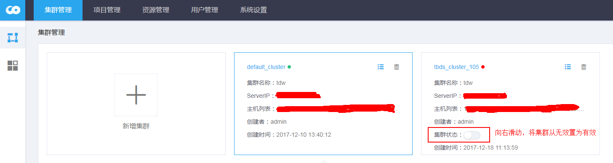

## 二、集群服务
集群添加成功后，会自动通过API获取TBDS、CDH的相应集群服务。点击集群的展示框，可以展示和收起集群的服务信息。

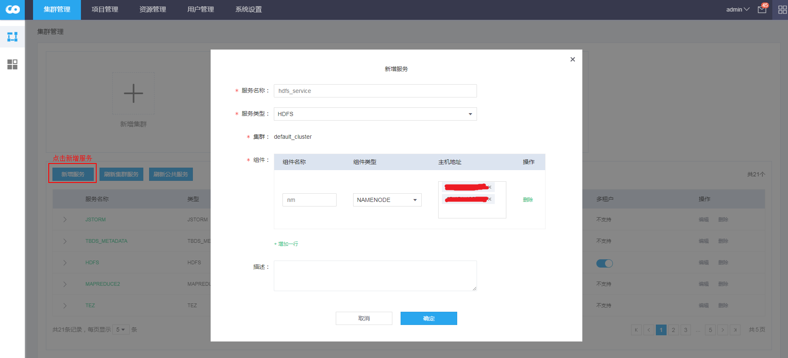

**备注：**
- 通过集群API获取的集群服务不支持删除、编辑功能；
- 一个集群服务可以包括多个组件：如HDFS服务,包括：NAMENODE、DATANODE等组件信息；
- 多租户：集群服务若支持多租户，默认是开启状态，在创建项目的时候会进行该服务的租户设置；若关闭，则创建项目的时候不显示对应服务的租户设置；
- 多租户组件：目前支持：**HDFS、YARN、HBase、Kafka **服务允许为多租户；

### 1、新增服务

若向集群中手动新增服务，但无法通过API获取集群信息，套件支持手动的添加服务信息：目前支持的服务包括：YARN、HDFS、Hive、Hbase、Lhotse 服务。

**备注：**
- 服务名称：可以任意填写，便于以后区别；
- 服务类型：目前支持YARN、HDFS、Hive、Hbase、Lhotse 服务；
- 集群：默认在所选中的集群下，添加集群服务；
- 服务组件：一个服务允许多个组件，但多个组件不能重复；组件类型根据所选的服务类型确定，是相互关联对应的；
- 主机地址：默认只能选择集群内的主机信息，不支持集群外的主机，如果需要添加集群外的主机服务，可在公共服务模块操作；
- 集群服务不支持同种类型服务的重复添加；

### 2、刷新集群服务

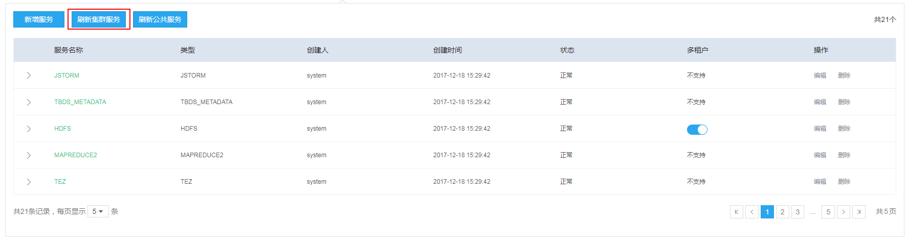

刷新集群服务，是通过集群信息，以API的形式重新获取集群服务信息，并保存到套件数据库中。

**使用场景：**
- 当集群新增服务，集群管理不会自动发现，需要通过刷新集群服务，才能纳入管理，以便后续使用该服务；
- 集群状态变更后，集群管理不会自动发现，需要通过刷新集群服务，才能保存最新的服务状态，只有服务状态为**正常**，该服务才能提供后续使用；
- 刷新服务只会刷新集群自动获取的服务信息，对于手动添加的服务则保持不变；

### 3、刷新公共服务

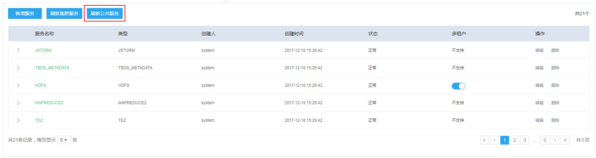

为了避免用户重复添加公共服务，在添加集群的时候，会默认把集群的HDFS、Hive、Kafka 服务生成对应的公共服务。公共服务可供套件内的数据接入、任务调度等模块使用。

**备注：**
- 若对应的集群服务状态是不可用，则无法生成对应的公共服务；
- 集群生成的公共服务命名规则：集群标识_服务类型_INIT, 如：tbds_cluster_105_HIVE_INIT；
- 集群生成的公共服务不支持修改和删除；
- 集群生成的公共服务可供该集群下的所有项目使用；

### 4、安装runner

功能待完善

## 三、公共服务
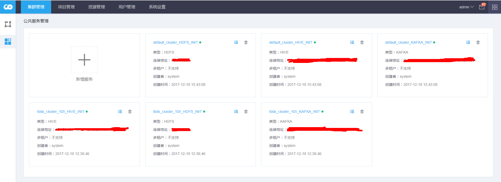
公共服务是对服务组件进行统一管理，对应的服务可供数据接入、任务调度等模块使用。公共服务可分为两大类：集群内置、用户手动新增。公共服务允许用户手动添加指定服务，扩展了套件对服务的使用能力。

集群的公共服务属于该集群下对应的所有项目；手动添加的公共服务可以属于所有项目，也可以指定属于特定项目；

### 1、集群公共服务
参考：2.3 刷新公共服务内容
集群公共服务是添加集群后，默认会新增的公共服务，目前的支持：HDFS、Hive、Kafka 三种服务。

### 2、新增公共服务
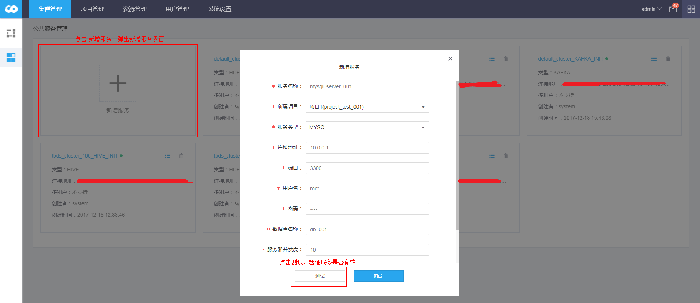

**备注：**
- 服务名称：公共服务的名称是全局唯一的；
- 所属项目：服务关联的项目，可选服务属于所有项目、或服务属于特定项目；
- 服务类型：支持：MYSQL、POSTGRE、ORACLE、FTP、KAKFA、SPARK、STORM、HBASE服务；

### 3、修改公共服务
只有手动添加的公共服务支持修改、删除操作。
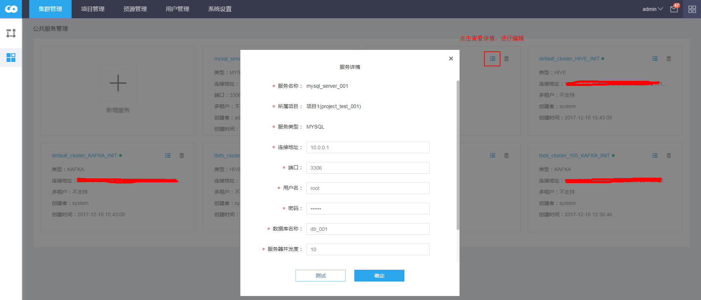

**备注：**
- 服务名称、所属项目、服务类型不支持修改操作；
