#
# 一、项目管理

在平台管理->项目管理下进行项目管理操作

### 1、创建项目

创建项目一共分为两步：1、添加项目基本信息；2、为项目分配租户资源；

点击页面右上角的**创建项目**按钮，进行添加操作：
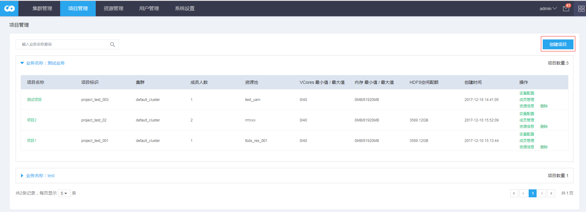

添加项目基本信息：
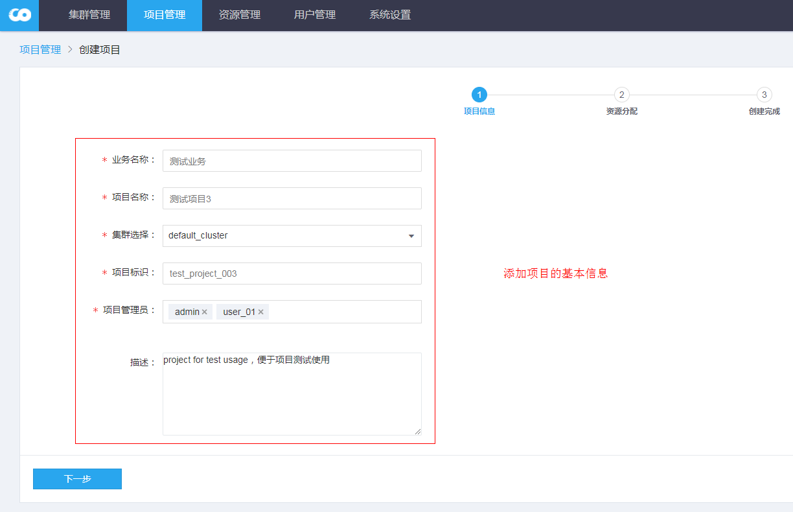

**备注：**
- 业务名称：项目归属的页面，相同业务的项目，会在同一个业务页签下显示，便于项目归类整理；
- 项目名称：项目的指代意义，代表项目的具体使用场景；
- 集群选择：项目关联的集群，项目默认可以使用该集群下HDFS、YARN、HIVE、HBase等资源；
- 项目标识：项目的唯一标志，**不可重复**；
- 项目管理员：在该项目下拥有projectManger角色的用户，可以多选；


### 2、设置多租户资源
目前支持的多租户资源分配：HDFS、YARN、HBASE、KAFKA；

**备注：**
- 集群服务中对应的多租户是开启状态，创建对应集群的项目才能进行该服务的资源分配；
- 创建项目时，可以跳过资源分配、直接点击创建，创建一个没有被分配任何资源的项目；
- 创建项目时，可以只对某些资源进行分配，支持资源分配的跳过功能，只有点击“提交” 按钮，才会分配资源；

**注意：** 无资源的项目，在使用套件其他模块可能会引起报错，无法获取该项目的对应必须资源。

#### 2.1、HDFS

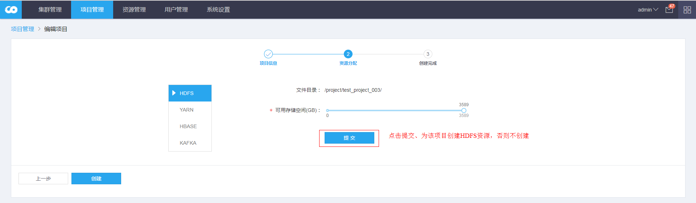
创建项目对应的HDFS目录，默认的目录是：/project/项目标识，创建的目录时会授权允许对应项目组的用户进行操作，对应的组用户信息通过LDAP获取。
设置的存储空间，不可超过HDFS服务的最大存储空间。以HDFS的Configured Capacity 为上限。

#### 2.2、YARN

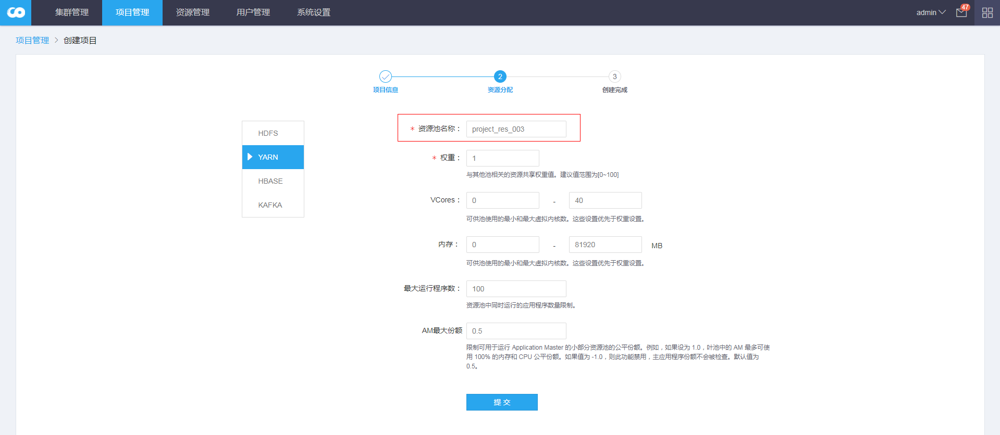
输入项目关联的yarn queue队列的名称。工作流和查询任务会将任务提交到对应的该queue；

#### 2.3、HBASE

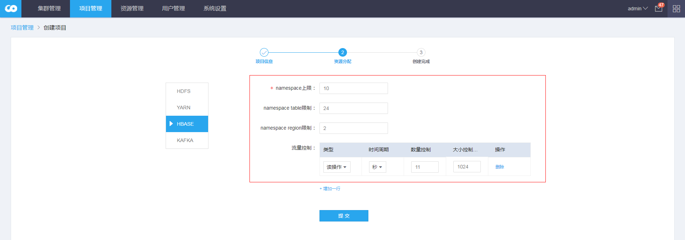
HBASE多租户通过设置Hbase的限额来控制，使用配额管理做到对namespace和table 的rpc请求的限制。

**前提：**默认不开启Hbase配额，修改hbase-site的配置文件（套件HBASE服务默认允许Hbase quota设置），设置如下：

```
hbase.quota.enable=true
```
**参数解释：**
1. namespace上限：该项目至多可创建的namespace数目；
2. namespace table限制：每个namespace中可创建的table数目上限；
3. namespace region限制：每个namespace使用的region数目上限
4. 流量控制：从**读操作、写操作、request请求**三个维度限制HBase的rpc流量，时间周期维度有：秒、分钟、小时、天；数量控制是请求的个数限制，大小控制是请求的大小限制（单位：字节）。数量控制和大小控制允许只设置其中一个维度，也可以两个维度都设置。


**备注：**
- HBase版本要求在1.1.0及以上；低版本对应的patch是HBase-11598
- Quotas功能默认是关闭，需要在配置文件hbase-site.xml中通过设置hbase.quota.enabled为true打开；
- 若设置HBase配额，则该项目对应的namespace个数上限是必填值，其他参数可选；
- HBase配额设置后，会对该项目下的所有HBase namespace、table都进行相对应的设置；


#### 2.4、KAFKA


分区数上限：设置在该项目下创建的kafka topic的分区数上限值，不设置则没有分区数上限。

**备注：**
- CDH集群内一般不安装Kafka服务，可以在项目环境变量中设置变量：**NUM_PARTITION_KAFKA**，定义为该项目下的Kafka topic分区最大数。


进行以上分配租户资源操作后，点击左下角的创建完成项目的最终创建。


### 3、项目更新
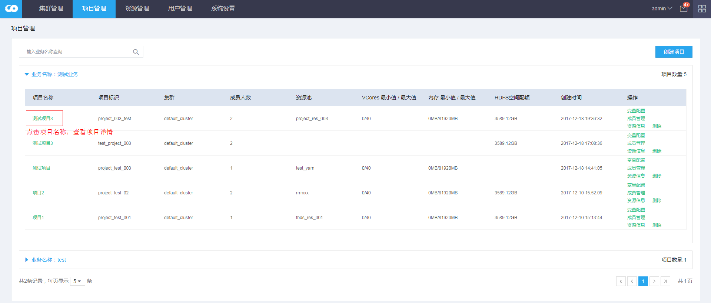
在项目列表页面，点击项目名称，可跳转到项目查看、编辑页面。


#### 3.1、基本信息
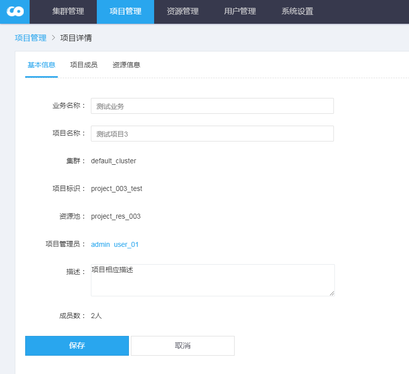
编辑项目基本信息，可编辑的信息包括：业务名称、项目名称、项目描述。

#### 3.2、成员信息

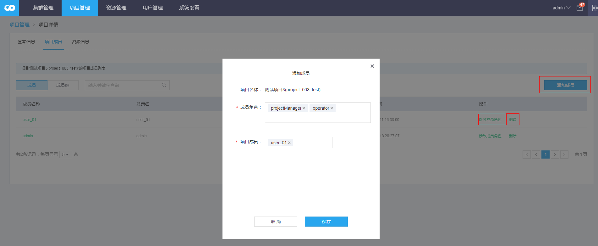

支持新增、修改项目的成员（成员组）、以及成员（成员组）拥有的角色。

#### 3.3、资源信息
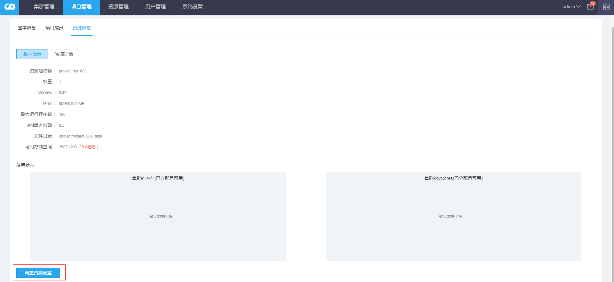
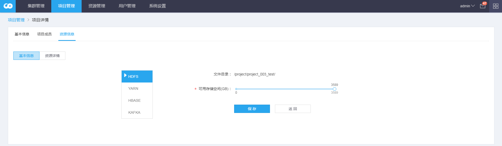
通过点击“调整资源配置”，重新对该项目的资源进行重分配。分配步骤跟创建项目相似，支持分配多租户的服务。


资源详情：
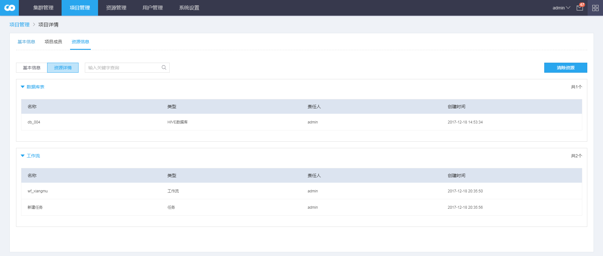

**备注：**
- 资源详情：显示该项目下已经创建的库表资源、任务调度资源；
- 只有当项目的资源详情为空时，才能直接删除该项目；若项目对应的资源不为空，则清除资源后，才能删除项目，右上角提供 一键清除资源 的功能按钮，该操作慎用。

### 4、变量配置
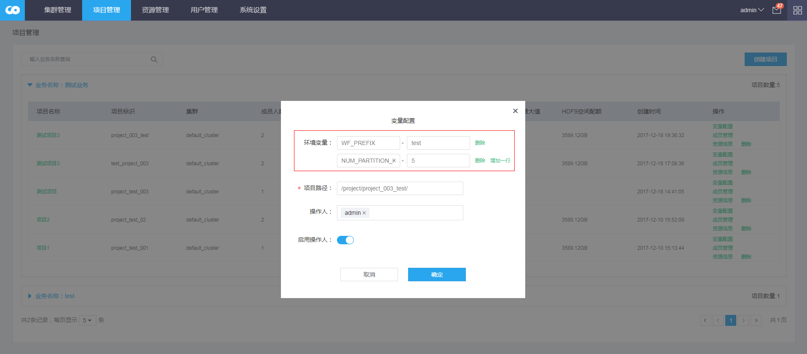
在项目列表页面，展开业务下的项目，可看到设置项目级别环境变量的按钮。

**参数解释：**
1. 环境变量：设置工作流中的环境变量，如设置WF_PREFIX，在该项目对应的工作流保存任务时，使用$WF_PREFIX 变量即可，生成任务时，将以WF_PREFIX 对应的值来替代； **Kafka分区设置**：约定使用 **NUM_PARTITION_KAFKA** 作为Kafka分区变量，在创建该项目下的Kafka topic，会确认分区数不超过定义的上限；
2. 项目路径：默认路径是 /project/project标识，该路径会在文件管理使用；定义项目操作HDFS文件的项目路径；
3. 操作人：定义工作流统一执行的任务的用户，默认不启用，如果开启，则执行工作流的操作人为统一的操作人。
