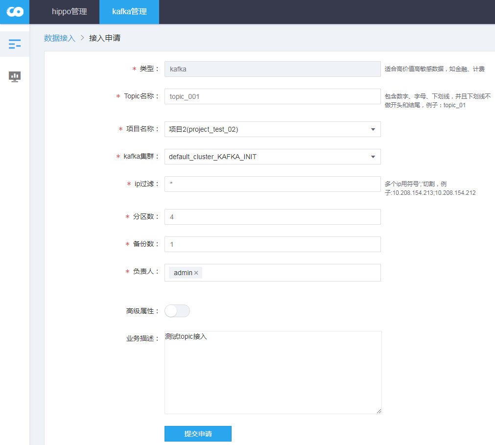
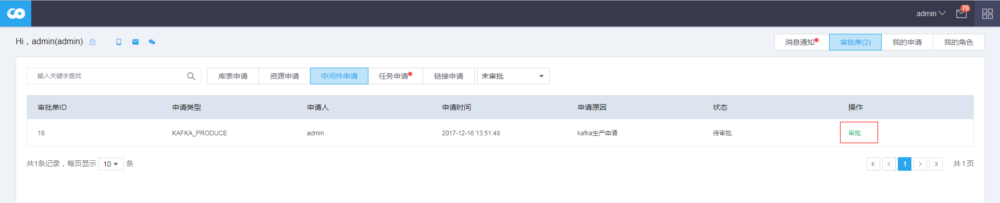
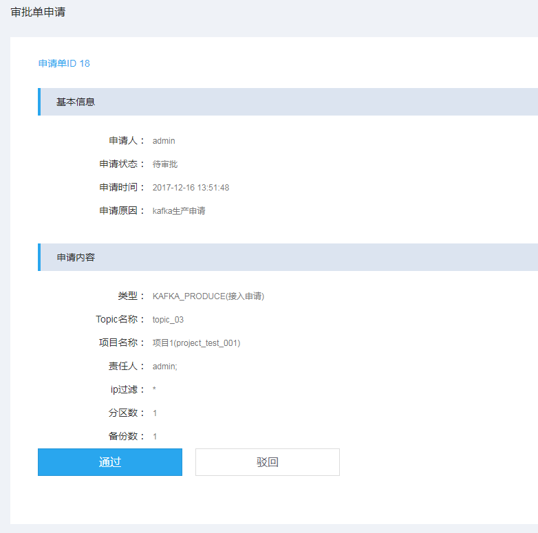
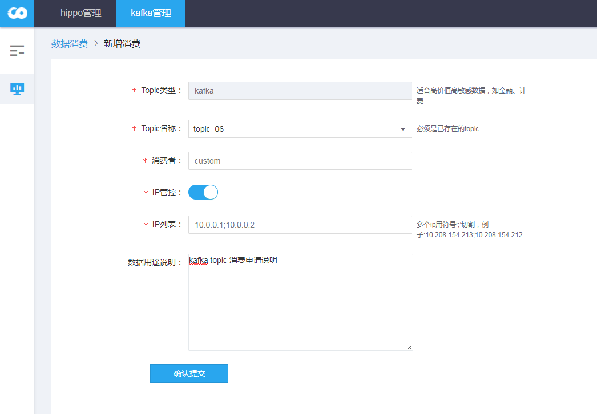
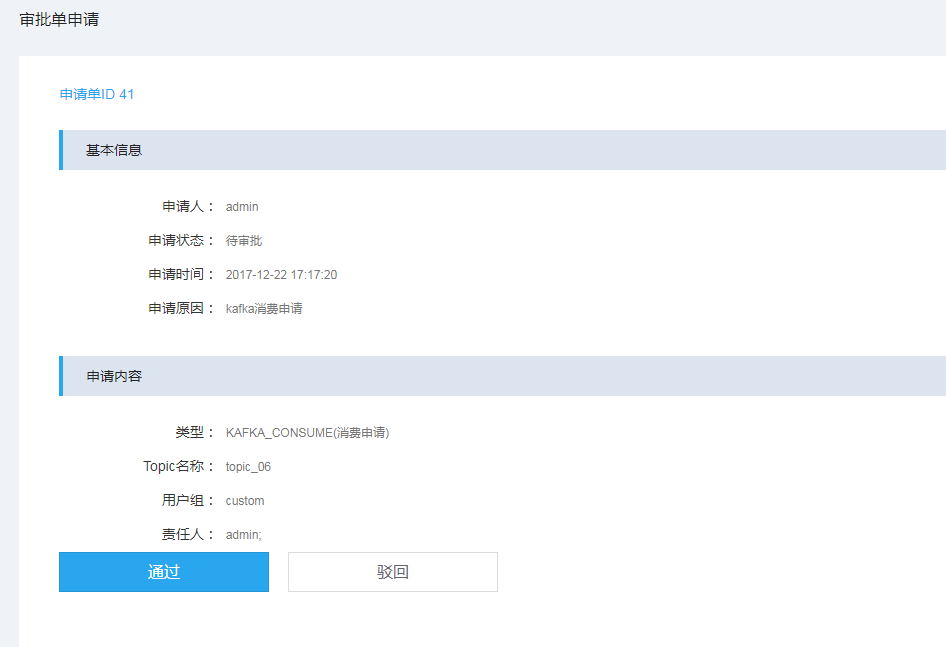

#
# 一、数据接入

### 1、topic创建

申请创建指定Kafka集群的topic

**参数解释：**
- Topic名称：创建Kafka topic的名称；
- 项目名称：新建topic关联的项目；
- kafka集群：创建topic关联的kafka集群，kafka集群会从项目关联集群的内置Kafka服务和新建公共服务中有权限的kafka集群获取；
- ip过滤：对kafka生产者进行ip顾虑，不过滤 *， 多个ip地址以分号";"分隔；
- 分区数：创建的kafka topic分区数；
- 备份数：topic的备份数

**备注：**
- 分区数可以针对项目，设置最大的分区数，可在创建项目时设置kafka分区数上限，也可在项目环境变量中设置：**NUM_PARTITION_KAFKA**

### 2、topic审批
在个人中心，中间件申请可以查看Kafka的申请单，进行审批；

topic申请，执行通过或驳回：


**备注：**
- Kafka topic 项目管理员可以对审批单进行操作，如果申请人是关联项目的管理员且且关联项目的管理员有多位，则申请人自己不能进行审批；

## 二、数据消费

### 1、topic消费

kafka topic的消费申请，针对某个topic进行申请

**参数解释：**
- Topic名称：选择消费的topic，只有审批通过后的topic才会现在在列表中；
- 消费者：申请kafka消费用户；
- ip管控：对kafka生产者进行ip过滤管控

### 2、topic审批


通过或驳回kafka消费申请；


**备注：**
- 在portal /usr/local/tbds-portal/conf目录下, 修改配置文件custom.properties。
默认启动Kafka topic创建审批和topic消费审批，若false是关闭


```
kafka.produce.withapprove=true #topic创建
kafka.consume.withapprove=true #topic消费

```
