#
# 一、数据库

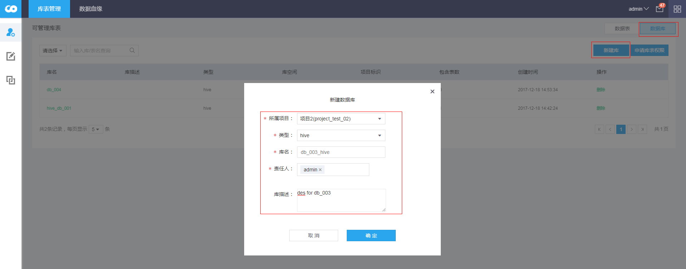
点击数据管理，进入库表管理页面；点击右上角** 数据库**tab页签，点击 **新建库** 新建数据库，支持创建Hive数据库、Hbase namespace。

**参数解释：**
- 所属项目：选择新建数据库所归属的项目；
- 类型：支持Hive、Hbase 两种类型；
- 库名：创建的Hive DB 名称 或 Hbase Namespace 名称；
- 责任人：该数据库的责任人；对该数据库进行操作权限；

**备注：**
- 库表管理暂不提供数据库的更新的操作，只能进行新增、删除操作；

## 二、数据表
库表管理支持Hive、Hbase的数据表操作，点击右上角** 数据表**tab页签，点击 **新建表** 进行新建数据表操作。

### 1、Hive表新建
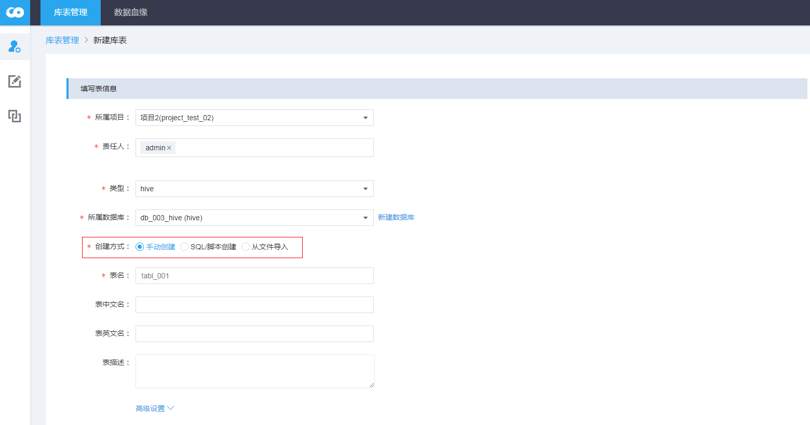
新建Hive表支持手动创建、SQL脚本创建、文件导入三种方式。

#### 1.1、手动创建

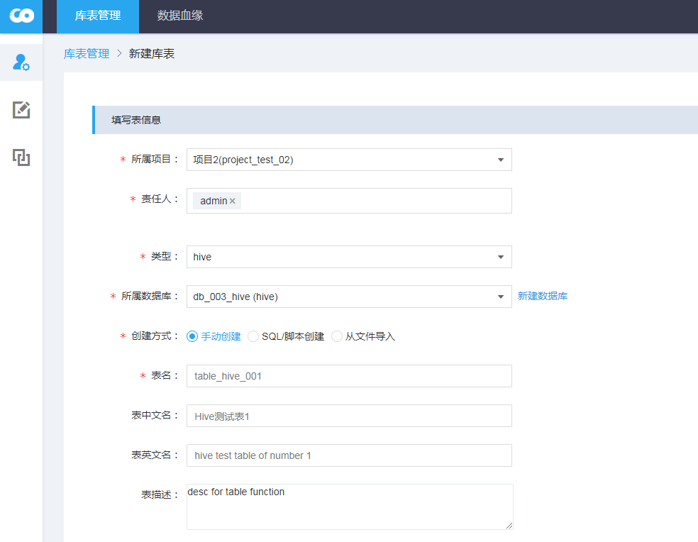
填写创建Hive表的基本信息，便于数据表的授权、管理；

**参数解释：**
- 所属项目：新建表关联的项目，一个表只能属于一个项目；
- 责任人：新建表的责任人，默认是当前用户，可以有多个，责任人可以在可管理库表页签下查看新建的表；
- 类型：暂支持hive、hbase两种；
- 所属数据库：列出所属项目下，类型相同的数据库；
- 创建方法：hive支持手动创建、SQL/脚本创建、从文件导入
- 表名：自定义hive表名；
- 表中文名：表中文注释名，可选；
- 表英文名：表英文注释名，可选；
- 表描述：表的备注信息，可选；

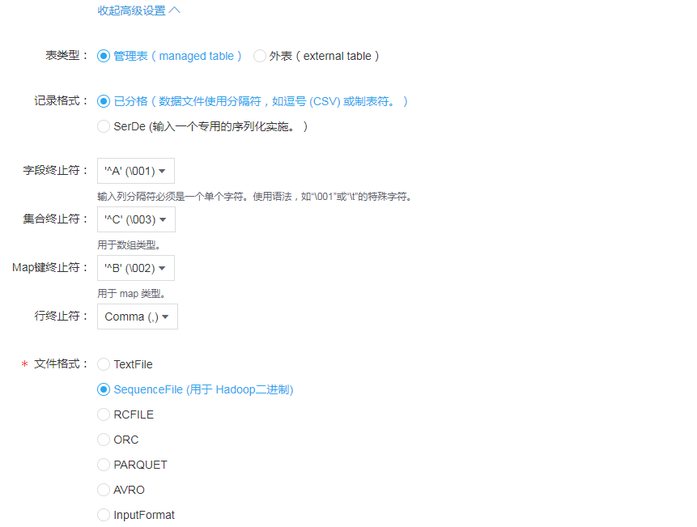

设置Hive表的高级属性值，丰富Hive表的创建能力；

**参数解释：**
- 表类型：Hive表手动创建支持创建管理表、外表；
- 记录格式：支持按照分隔符分隔、SerDe序列化；
- 字段终止符：Hive默认是\u001，支持自定义输入，可选；
- 集合终止符：对于数组数据类型的分隔符，可选；
- Map键终止符：对于map数据类型的分隔符，可选；
- 文件格式：支持Hive常用的文件格式，包括：TextFile、SequenceFile、RCFILE、ORC、PARQUET、AVRO、InputFormat，默认使用TextFile;

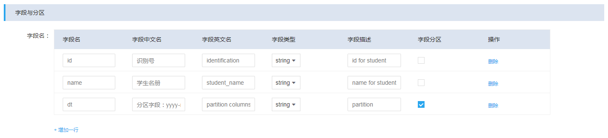
添加Hive表的字段值和对应的数据类型，备注信息；
**参数解释：**
- 字段名：新建Hive表字段的名称；
- 字段中文名：表字段中文注释名，可选；
- 字段英文名：表字段英文注释名，可选；
- 字段类型：支持Hive允许的字段类型；
- 字段描述：字段的备注信息，可选；
- 字段分区：设置该字段是否为分区字段，默认是非分区字段；

#### 1.2、SQL脚本创建

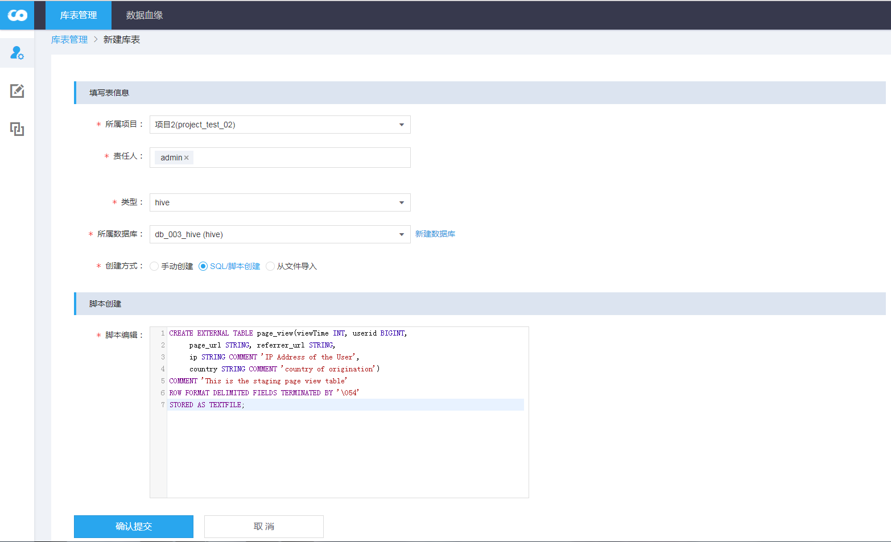

库表管理支持以Hive SQL的方式直接创建数据表，便于添加已有SQL语句的数据表，方便用户执行SQL语句。
**参数解释：**
- 脚本编辑：输入框，里面填写创建Hive表语句，末尾无需以";" 分号分隔；

**备注：**
- 通过HiveSQL创建的数据表，默认归属的数据库以参数 **所属数据库** 确定，即SQL语句中指定的数据库归属是无效的；

#### 1.3、文件导入
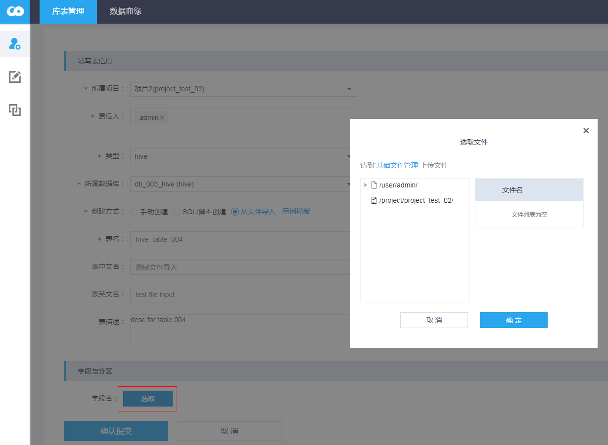

库表管理支持上传数据文件的形式，创建Hive表，并将数据文件加载到对应的Hive表。数据文件从HDFS**用户根目录**和所属项目的HDFS**项目目录**两个路径加载。

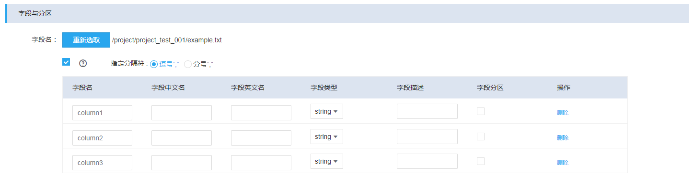
可以通过下载示例模板、获取支持的文件格式。加载时默认第一个行是字段名信息。目前支持字段分隔符有逗号、分号；

**备注：**
- 通过文件导入方式创建的表是Managed Table，管理表；
- 导入的文件不会被删除、也不会被移动，会复制临时文件，用于表创建，并将数据导入新建表中；

#### 1.4、字段操作
点击表名查看表详情：
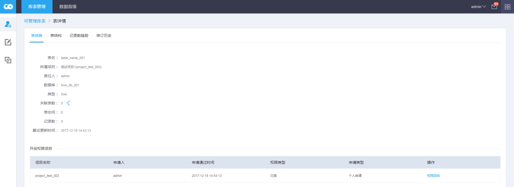

在表结构支持对表进行ALTER操作，如下图：
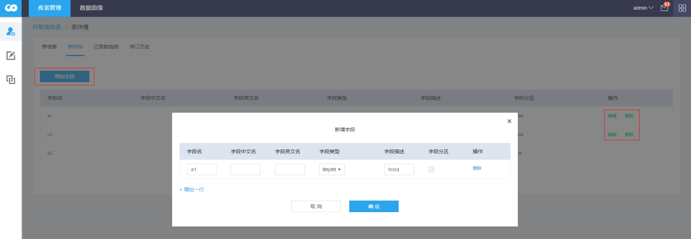

Hive支持的表结构操作有：新增、更新、删除非分区字段，对于分区字段不支持操作。

### 2、HBase表新建

#### 2.1、手动创建
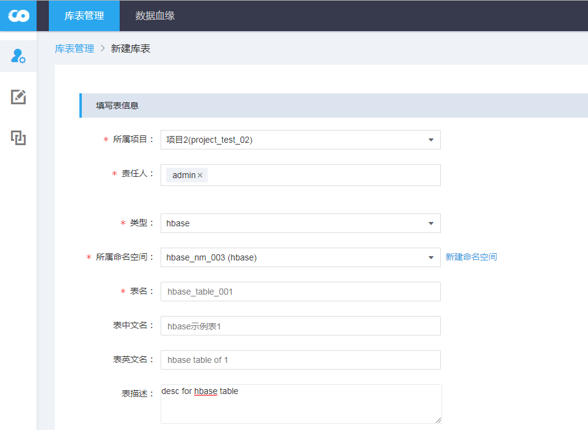
填写HBase的基本信息，基本信息与Hive一致，不重复介绍。

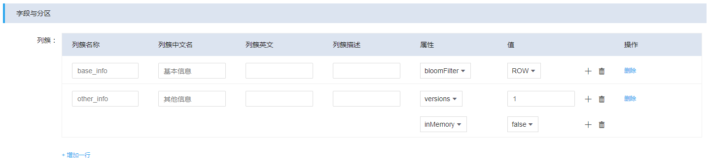
HBase的列簇信息，支持设置HBase的列簇属性，多个属性可以以“+” 追加设置，相同的属性不能重复设置。

**参数解释：**
- bloomFilter（布隆过滤器）：ROW 默认值,过滤器以Table Row作为Key；ROWCOL 过滤器以Table Row和Columns作为Key；NONE 不开启；
- versions （数据存储版本）：1 默认值；
- minVersions （数据最小存储版本）：0 默认值；
- inMemory （激进缓存）： false默认值，不开启；true 开启，赋予数据块在缓存里更高的优先级（LRU缓存）；
- keepDeletedCells（保留删除单元数）：FALSE 默认值，删除的Cell不保存；TRUE 删除后也保存，直到达到TTL或Version的限制后，被移除；TTL 删除的单元会被一直保存；
- dataBlockEncoding（数据块编码方式）：NONE 默认值；其他值：PREFIX、DIFF、FAST_DIFF、PREFIX_TREE
- ttl（数据生存时间）：Integer.MAX_VALUE 是默认值；
- compression（数据块压缩）：NONE默认值；其他值：LZO、GZ、SNAPPY、LZ4
- blockCache（数据块缓存）：true 默认值，false不缓存；
- blockSize（数据块大小）：默认是64K
- replicationScope（配置集群复制）：默认是0；

#### 2.2、列簇操作

点击表名查看Hbase表详情，Hbase支持对列簇的新增、删除；不支持列簇的修改；
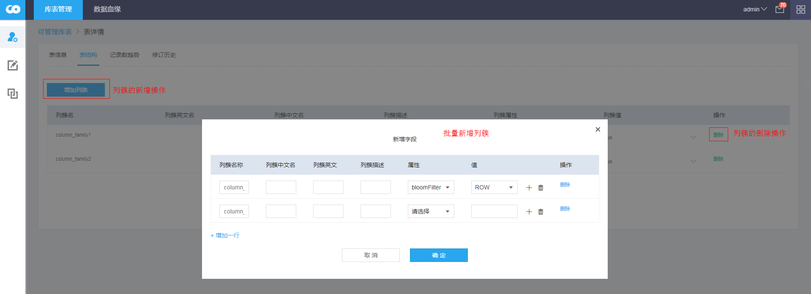

### 3、统一操作人创建表

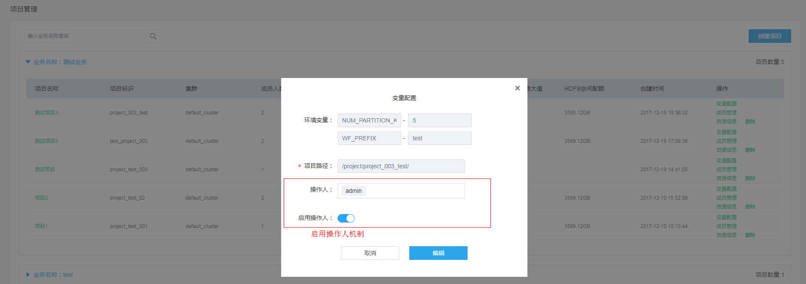
只有项目中的ADM用户具有建表权限，则需要在项目环境变量中设置统一的操作人，创建数据表的时候，若满足以下条件，会使用统一操作用户，执行底层创建Hive、Hbase表，否则：使用当前登录用户创建Hive、Hbase表。

**条件：**
- 项目关联的集群类型是CDH；
- 对于新建表的所属项目，当前登录用户拥有ProjectManager角色；
- 新建表的所属项目，已经设置变量 操作用户，并启用该功能；
