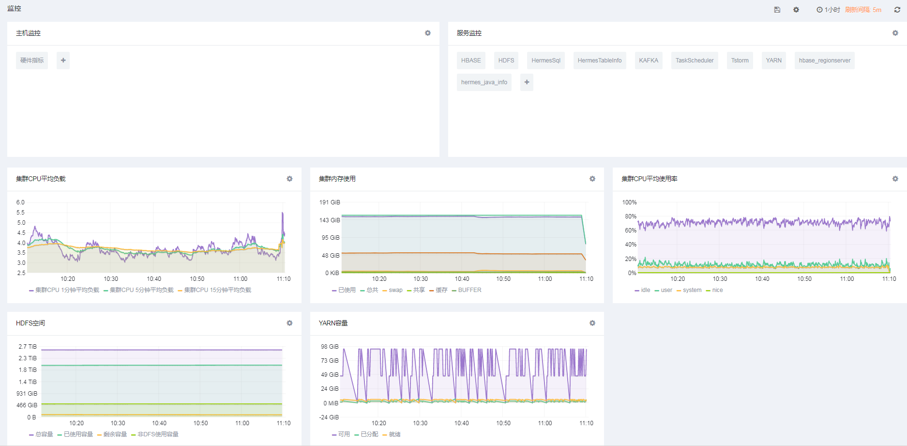
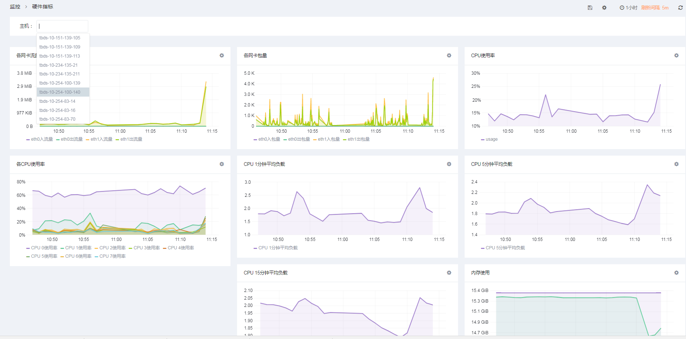
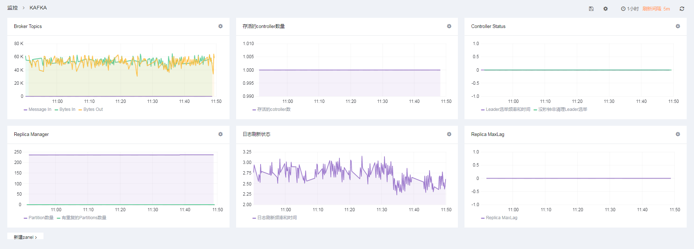
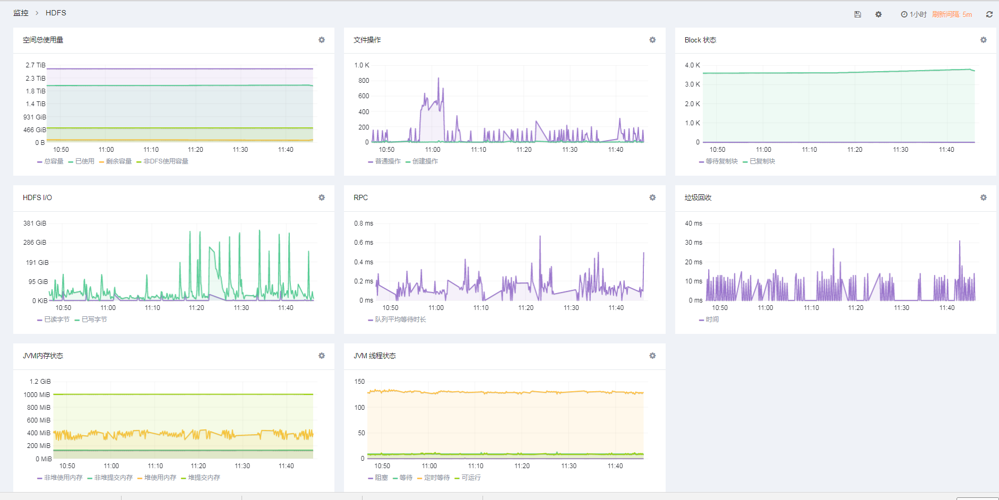
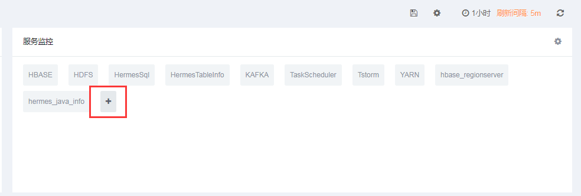
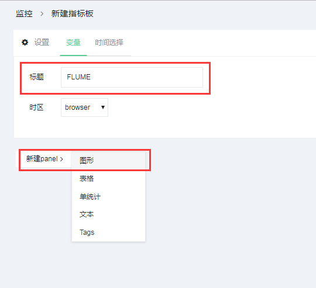
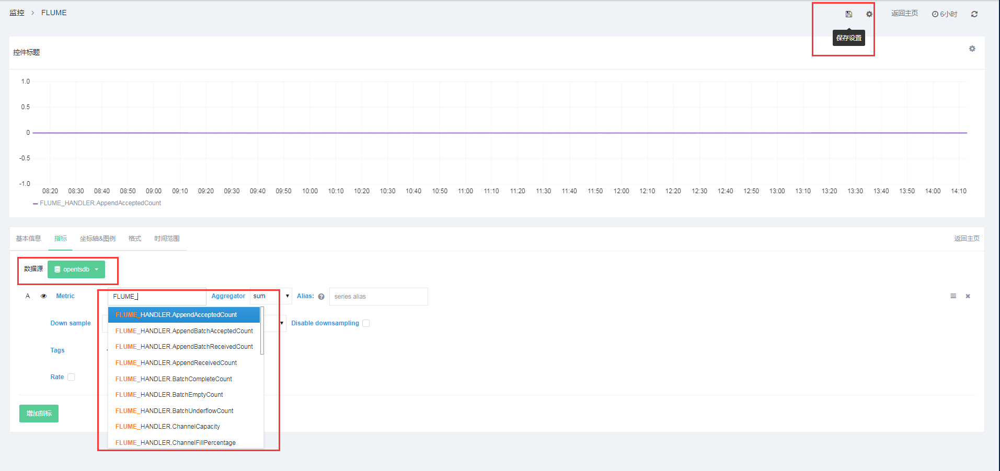

## 1. 概述

监控指标分为两个维度：主机指标和服务指标。 
主机指标包含：硬件指标。 
服务指标包含：HBASE，Hbase_regionserver，HDFS，HermesSql，HermesTableInfo，hermes_java_info,Kafka，TaskScheduler，Tstorm，YARN。

## 2. 主机指标
### 2.1 硬件指标
硬件指标主要收集CPU，内存，网络IO，磁盘读写等指标。用户可以通过选择主机来查看具体某台机器上的负载信息。

## 3. 服务指标
### 3.1 KAFKA指标
KAFKA指标收集了topic信息，Controller等指标

### 3.2 HDFS指标
HDFS指标收集了空间使用总量，文件操作，block状态，HDFS IO等指标。

### 3.3 其他指标
此外，默认还有HBASE，Hbase_regionserver，HermesSql，HermesTableInfo，hermes_java_info,TaskScheduler，Tstorm，YARN等指标。

## 3. 自定义指标模版
除了监控页面每个服务展现出来的指标模版，用户还可以自定义自己的指标模版。在指标收集中，TBDS监控平台已经收集几乎覆盖服务所有的指标，用户只需要在页面配置自定义模版即可。

添加服务指标

填写指标名创建模版 

选择数据源opentsdb，输入指标名，指标名会根据输入自动提示。指标名以服务名称大写为前缀加下划线，比如FLUME，那指标统统以“FLUME_”为前缀。最后保存即可。

