自助报表使用文档
==========================
自助报表是一款可视化运营报表门户制作工具，适用于运营数据分析结果的展示环节

可以输入2种报表门户，分别是基础版、高级版

|类型|基础版|高级版|
|:----- |:------- |:-----|
|适用对象 |运行开发 |产品经理、运营开发等|
|定位|快速创建在线运营报表门户，支持多维对比筛选|标准数据报表门户，拥有完整网站信息导航，能自定义页面元素|
|适用对象|运营开发|产品经理、运营开发等|
|页面模板|	标准折线图报表模板|通览模板、左右两栏模板、自定义页面链接模板|

** 一、基础版 **

** 1.创建门户 **

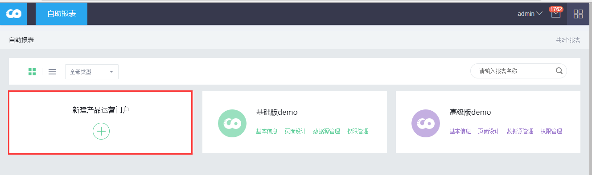
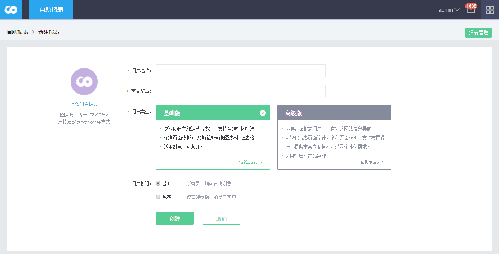
> 基础版，高级版选定创建后不能更改
> 门户权限公开则创建后所有人可见

** 2.配置数据库 **

创建门户后，可以进入“数据源管理”模块设置数据库
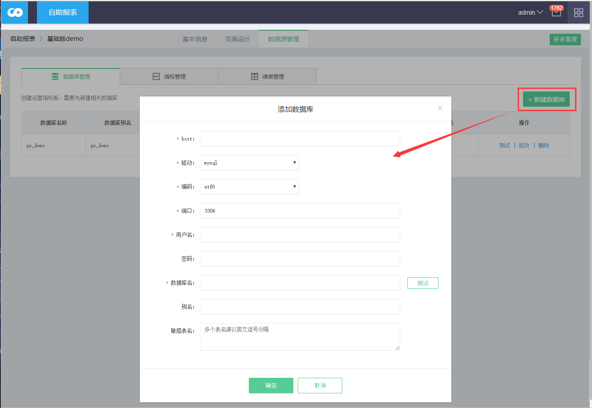
> 填写完后可点击“测试”测试配置是否正确

** 3.设计页面 **

选择上个步骤的数据库，然后选择表，字段，配置字段
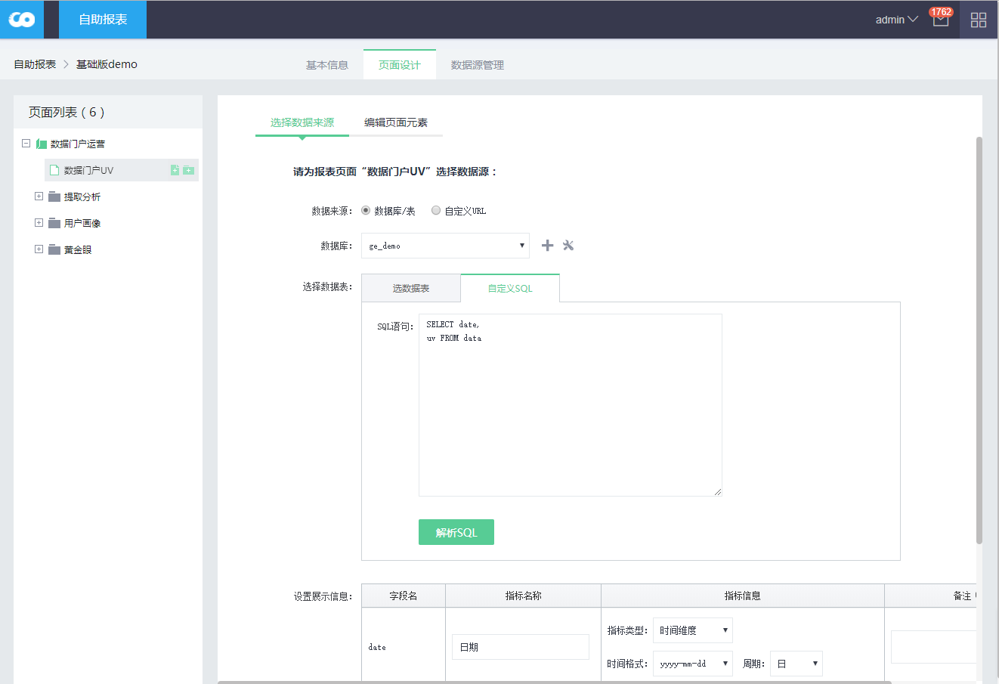
> 数据来源选择“自定义URL”可以嵌入第三方URL
> 选择数据表 选择“自定义SQL”可以自己写表sql

编辑字段指标信息
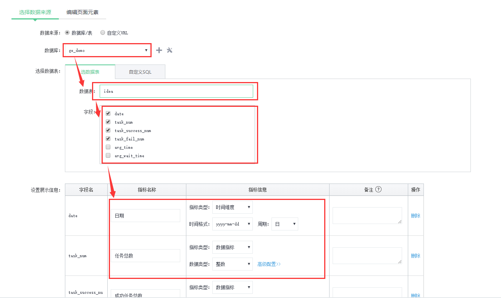
> 自助报表的报表基于时间轴，必须指定表的一个字段为日期字段，时间格式配置需和数据库实际数据一致

编辑页面元素
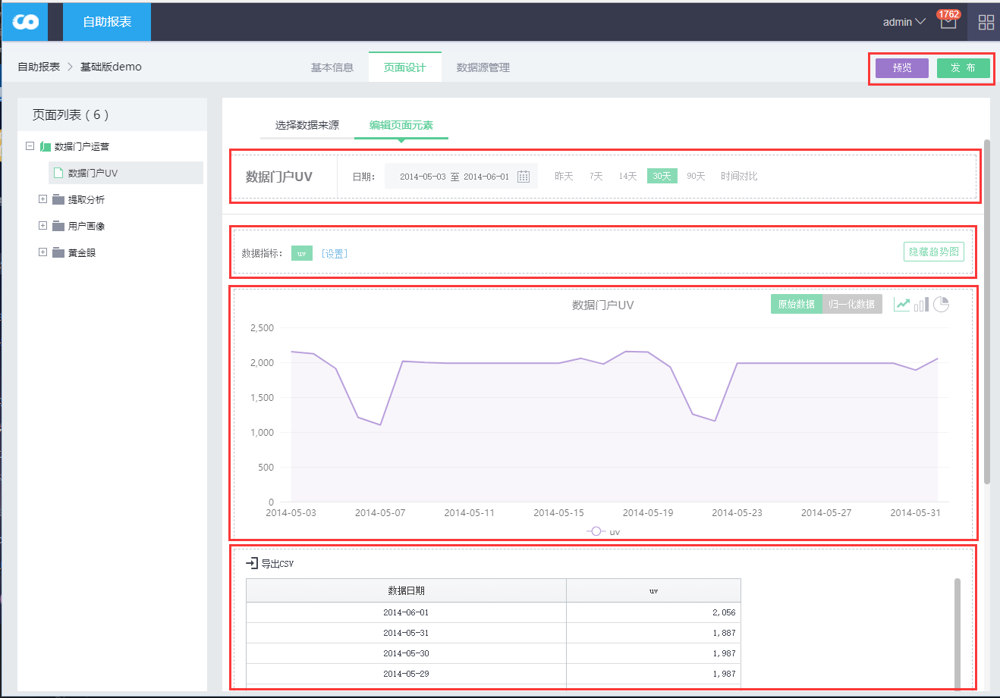
> 如图中每一个区域块都可以点击做相关配置设置
> 设置完成后，可以点击“预览”看页面效果，点“发布”后页面其他有权限的人才可见

至此一个基础门户基本过程就完成了

***
** 二、高级版 **
** 1.创建门户 **
同基础版

** 2.配置数据库 **
同基础版

** 3.配置指标 **

从数据源管理，切换到“指标管理”
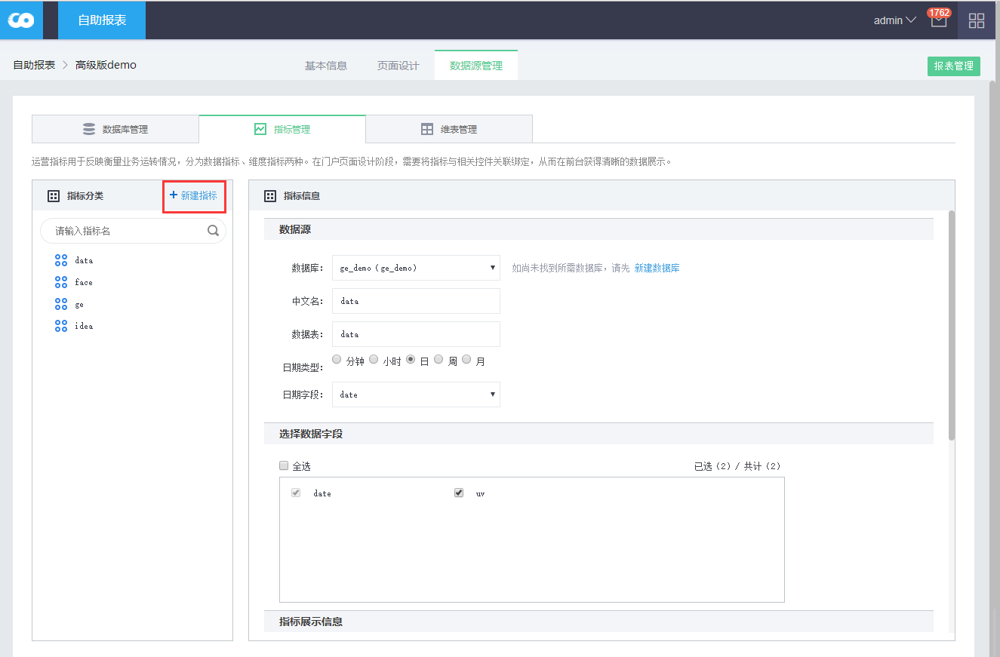

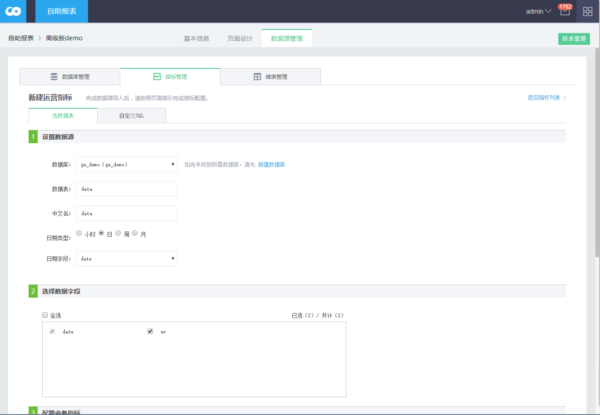
> 配置过程同基础版设计页面第一个步骤

** 4.纬表管理 **

如果一个指标字段需要翻译，比如“省市”，就需要配置纬表
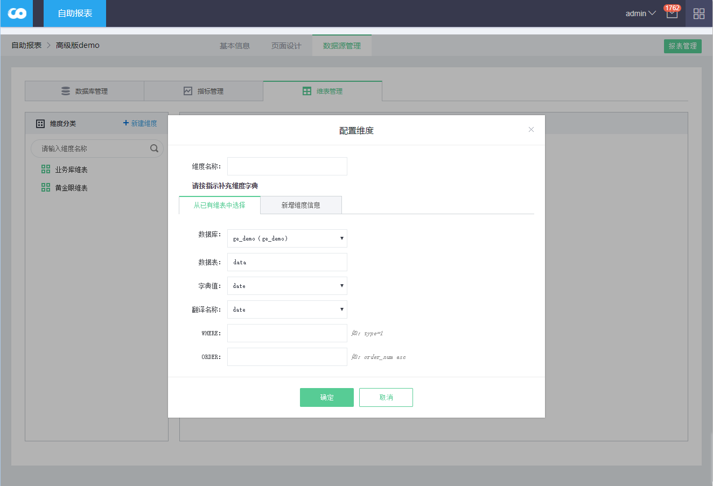
> 可以从库表选择已有的翻译对照表，也可以切换到“新增纬度信息”直接输入文本
> 配置好后在指标配置的时候，选择“纬度累i型”，然后就可以选择对应的纬表了

** 5.页面设计 **

拖拽一个页面组件到页面区域，选择组件类型
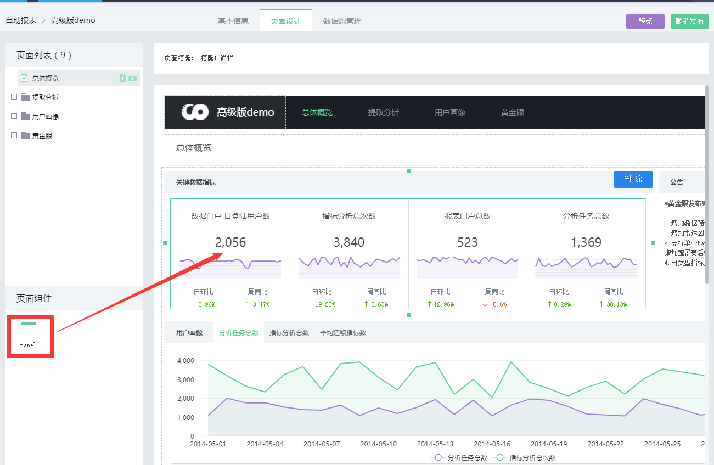
> 页面菜单和左侧菜单是对应的，切换左侧菜单进行对应的页面设计

点击页面组件，选择指标
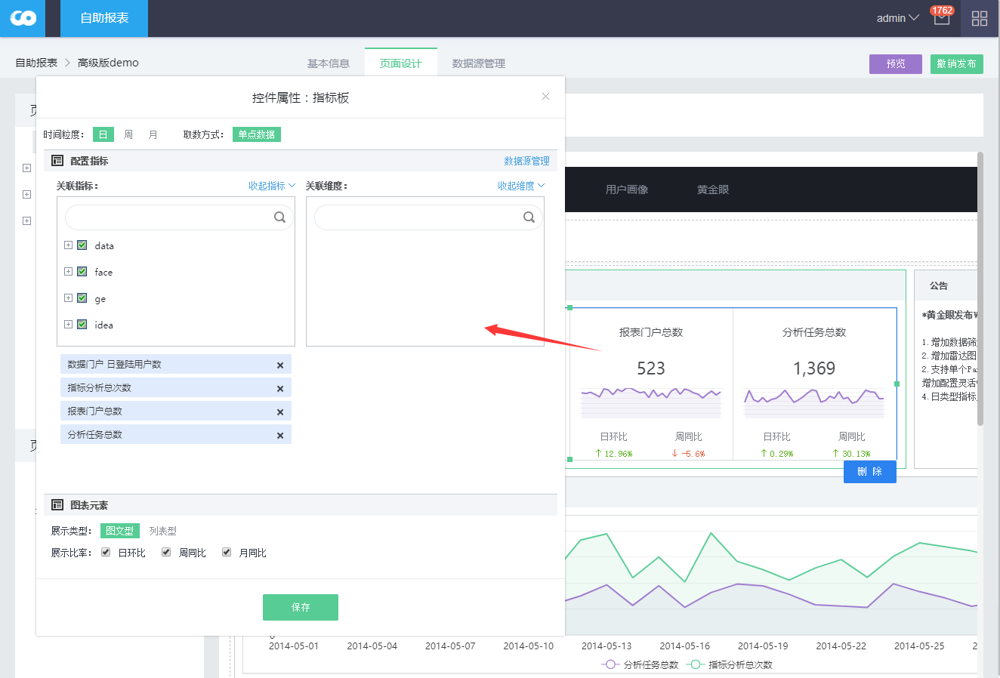
> 页面组件的大小可以拖拽调整，删除
> 设置完成后，可以点击“预览”看页面效果，点“发布”后页面其他有权限的人才可见

至此一个高级门户基本过程就完成了