## 数据接入示例文档

### 1、DB —> DB
>原理：通过采集Agent获取DB数据，采集数据存储在Hippo，TDSort消费Hippo数据，存储到对应目的DB

**操作步骤**

1、【基本信息】配置

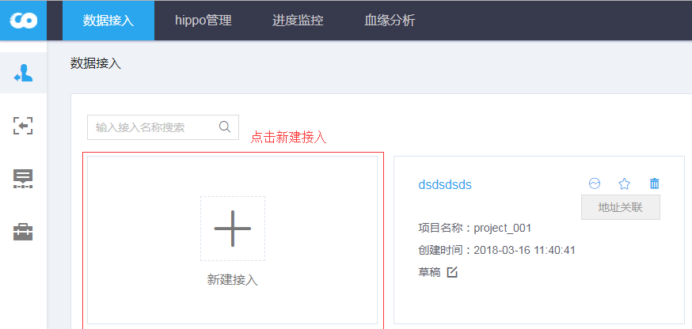

使用目的数据库：``tdbank_dest``
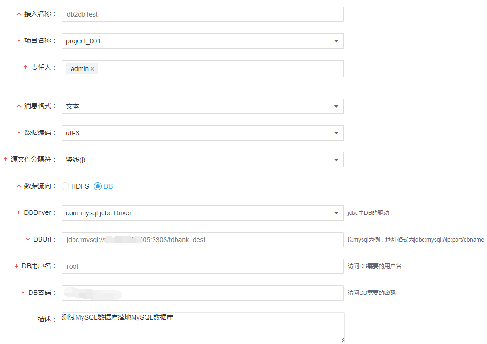

**备注：**
- 接入名称：全局唯一，agent采集数据对应的接入名称
- 项目名称：该接入关联的所属项目
- 责任人：接入的责任用户，后续创建hive表或工作流会使用该用户
- 消息格式：目前仅支持文本
- 数据编码：目前仅支持UTF-8
- 源文件分隔符：接入文本的分隔符，``必须与agent设置的分隔符保持一致``，TDsort会基于该分隔符落地数据
- 数据流向：数据的落地目的，目前仅支持HDFS、DB
- 落地HDFS配置
  - hadoopJobUgi：访问hdfs需要的用户名密码信息，目前该配置未使用，可``任意填``，满足格式即可
  - fsdefaultname：落地hdfs的路径，落地TBDS内的HDFS集群，默认使用``hdfs://hdfsCluster``
  - isHadoopJobUgi：未使用该参数，可默认选true

- 落地DB配置
  - DBDriver：目前仅支持MySQL Driver
  - DBUrl：``落地数据的目的数据库信息``，以MySQL为例：``jdbc:mysql://ip:port/dbname``
  - DB用户名/DB密码：目的数据库的连接用户名、密码信息，点击[下一步]时会校验DB连接信息

2、【接口信息】配置

接入的源数据库表信息：``源DB：tdbank, 源Table:student, teacher``，接口名称：``db2dbTest``

配置对应的目的数据接口：
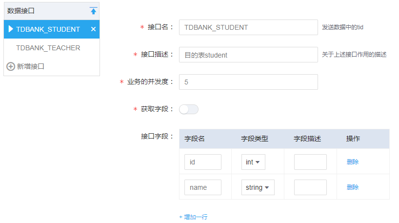

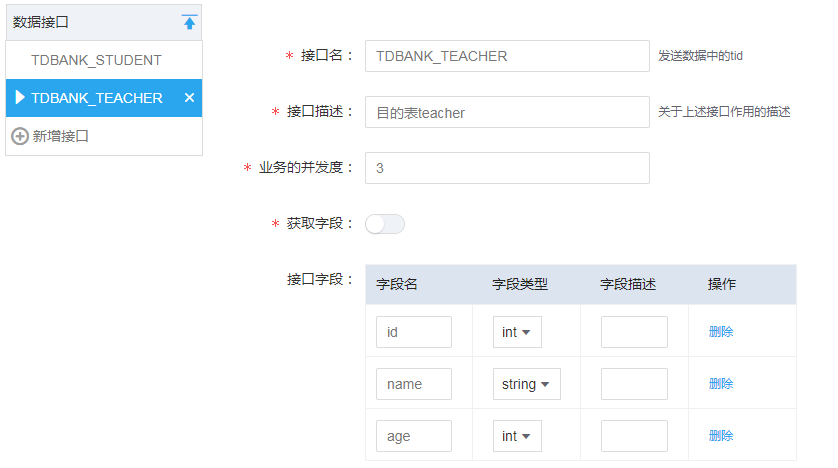

确保在目的数据库``tdbank_dest``，已经创建对应接口名的表，字段和上述保持一致。
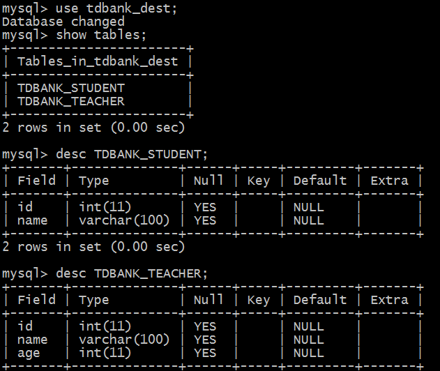

**备注:**
- 接口名：命名规定``源DB名_源Table名``，落地的目的Table名称与接口名保持一致，接口名不能重复
- 接口描述：接口的描述信息，可任意填写
- 业务并发度：TDSort落地该接口数据的并发度
- 接口名称：落地的数据表字段信息

> 如果接口名不符合命名规范，则数据无法落地的期望的目的。TDSort消费时会抛弃该数据

3、【资源信息】配置

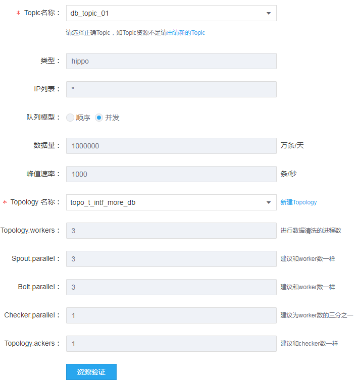

**备注：**
- topic名称：每个数据接入对应一个Hippo Topic，Topic不能重复被不同接入使用
- 类型：目前仅支持Hippo
- IP列表：允许该Topic进行数据生产的IP列表，逗号分隔，``*``代表不进行IP限制，允许所有IP访问
- 数据量、峰值速率：该Topic的数据流量控制
- Topology名称：TDSort使用的Topo配置的名称，目前TDSort基于TStorm运行
- Topology.workers：TDSort使用的woker数量
- Spout.parallel：TDSort的Spout并行度
- Bolt.parallel：TDSort的Bolt并行度
- Checker.parallel：
- Checker.parallel：
- 资源验证：提交接入任务前，需要进行资源验证，校验有足够的接入资源

> Hippo创建，数据接入创建后，需要所属项目管理员进行审批，只有审批通过后，才能正常使用。审批成功后，数据接入从``草稿``变成``启动``状态。

4、【采集Agent】配置

数据接入审批成功后，配置数据接入Agent，配置的参数详情，参考[TDBank采集接口详解]
- 配置data-hub：common.properties

```
data.hub.manager.ip={DataHub Server对应的IP地址}
data.hub.manager.port={DataHub Server对应的heartbeat.port配置，默认:9292}
data.hub.agent.name=agent-db-test
data.hub.name=db2dbTest #对应接入名称
data.hub.source=MySQL #数据类型
data.hub.target=DB #落地的数据类型
```

- 配置Flume：log4j.properties

追加以下配置信息，用于接入的指标采集
```
log4j.logger.metrics=INFO, METRICS
log4j.appender.METRICS=org.apache.log4j.rolling.RollingFileAppender
log4j.appender.METRICS.rollingPolicy=org.apache.log4j.rolling.TimeBasedRollingPolicy
log4j.appender.METRICS.rollingPolicy.ActiveFileName=${flume.log.dir}/metrics.log
log4j.appender.METRICS.rollingPolicy.FileNamePattern=${flume.log.dir}/metrics.log.%d{yyyy-MM-dd}
log4j.appender.METRICS.layout=org.apache.log4j.PatternLayout
log4j.appender.METRICS.layout.ConversionPattern=%d{yyyy-MM-dd HH:mm:ss} %m%n
```
- 配置Flume：flume.conf

```
agent1.sources = sqlSource
agent1.channels = ch1

##################### HippoChannel #####################
agent1.channels.ch1.type = com.tencent.tbds.datahub.agent.flume.channel.hippo.HippoChannel
agent1.channels.ch1.hippo.topic = db_topic_01 #接入对应的HippoTopic名称
agent1.channels.ch1.hippo.controllerIpList = 10.0.0.2:8066 #HIPPO Controller对应IP和跟broker的心跳端口，默认：8066
agent1.channels.ch1.hippo.producerGroup = group_db_001 #生产hippo数据的group组
agent1.channels.ch1.hippo.producer.secretId = {secureId在Hippo topic的详情页面查看}
agent1.channels.ch1.hippo.producer.secretKey =  {secureKey在Hippo topic的详情页面查看}
agent1.channels.ch1.hippo.producer.sendAsync.fqueue.path = /data/fqueue

##################### 全量数据采集 #####################
agent1.sources.sqlSource.channels = ch1
agent1.sources.sqlSource.type = com.tencent.tbds.tdbank.flume.source.sql.SQLSource
agent1.sources.sqlSource.hibernate.connection.url = jdbc:mysql://10.0.0.1:3306/tdbank #源数据库连接信息
agent1.sources.sqlSource.hibernate.connection.user = root
agent1.sources.sqlSource.hibernate.connection.password = 123456
agent1.sources.sqlSource.hibernate.connection.isolation = 2
agent1.sources.sqlSource.hibernate.dialect = org.hibernate.dialect.MySQL5Dialect
agent1.sources.sqlSource.hibernate.connection.driver_class = com.mysql.jdbc.Driver
agent1.sources.sqlSource.database = tdbank #采集数据源DB
agent1.sources.sqlSource.tables = student,teacher #采集数据源表，多个表逗号分隔

## 增加以下配置可使用索引字段（假设为id）提升查询性能
## 另外也可以使用自定义SQL
## agent1.sources.sqlSource.tables.tbl_poc1.whereClause = WHERE id > :index ORDER BY id
## agent1.sources.sqlSource.tables.tbl_poc1.column.name = id

agent1.sources.sqlSource.recoveryMode = true #true代表数据采集完成后自动退出
agent1.sources.sqlSource.status.filePath = /data/sqlStatus

agent1.sources.sqlSource.hibernate.connection.provider_class = org.hibernate.connection.C3P0ConnectionProvider
agent1.sources.sqlSource.hibernate.c3p0.min_size=1
agent1.sources.sqlSource.hibernate.c3p0.max_size=10
```

- 配置Tmetric: agent.ini

```
[agent]
;agent主机地址，非必填项；默认使用本机ip
hostName=10.0.0.2
;agent监听的rpc端口，必填项；
port=8003 #Tmetrics Agents对应rpc端口，默认8003
masterAddressList=10.0.0.4:9000 #Tmetrics Master的Ip和Master对应rpc端口，默认9000

bdbFilePath=/data/metric-2.0/bdb
metricSpliter=#
;配置指标文件路径
metricFiles=/data/flume/logs
;配置单条指标的模式
metricPartern1=hippo@PRODUCER#topic#group#clientIp#time#agentCnt#agentPkg#agentSize@true@4#yyyyMMddHHmm@70@5#6#7
metricPartern2=bus@TDBus#topic#interface#group#clientIp#brokerIp#time#agentPkg#agentSize@true@6#yyyyMMddHHmm@120000@7#8
metricSuffixPartern=[1-9][0-9]{3}-[0-1][0-9]-[0-3][0-9]
metricPrefixDateFormater=yyyy-MM-dd HH:mm:ss
metricAggrThreadNum=2
metricSendThreadNum=2
maxCntOnePkg=200
partAggrCacheSize=5000
needCompress=true

queueFlushInterval=10000
heartbeatPeriodInMills=5000
isShouldPrint=true

;FQueue
queueCleanInterval=10
queueDataTTL=20
failoverQueuePath=/data/metric-2.0/failover
```

启动Agent、Tmetric命令：
```
cd ${FLUME_PATH}
nohup bin/flume-ng agent -Dlog4j.configuration=conf/log4j.properties --classpath /{DataHub_PATH}/conf:/{DataHub_PATH}/lib/* --conf conf/ -f conf/flume.conf -n agent1 > stdout 2>&1 &
cd ${TMetric_PATH}
bin/agent.sh start
```

5、【指标查询】

点击数据接入详情，查看数据流向：
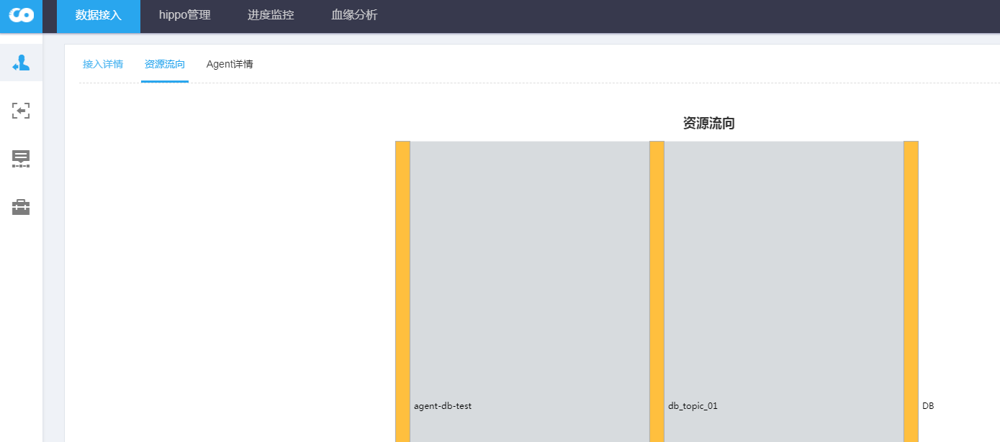

在Hippo管理界面查看，对应Topic的生产消费情况（Agent数据采集、TDSort落地情况）
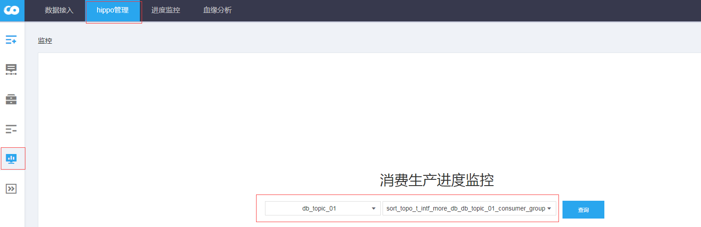

供接入30条数据：student表20条，teacher表10条
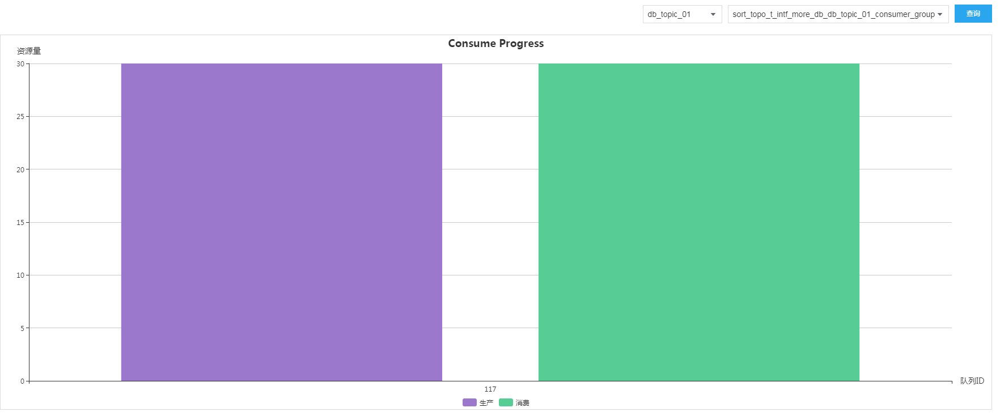

在【进度监控】->【数据趋势】查看数据累计趋势图
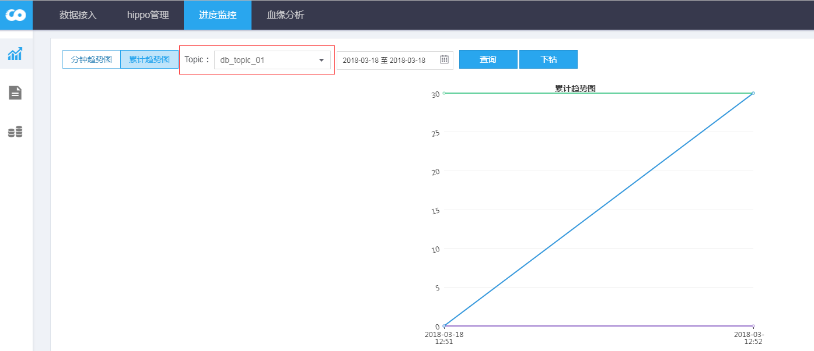

在【进度监控】->【数据明细】查看对账数据
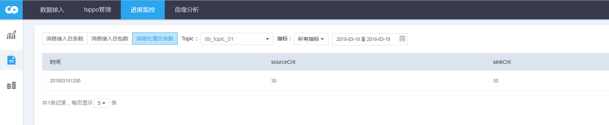
