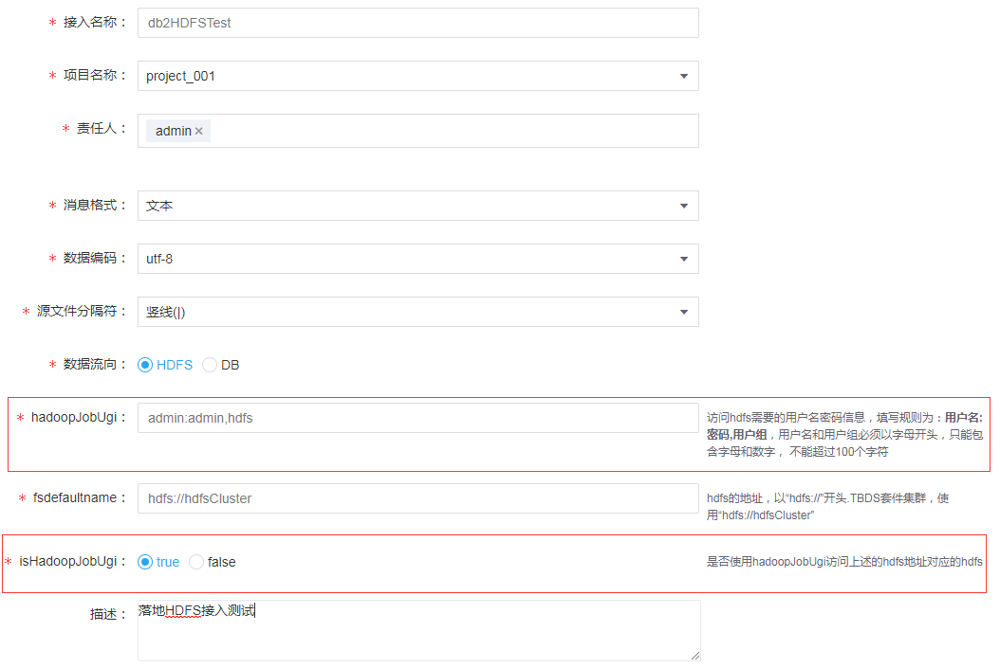
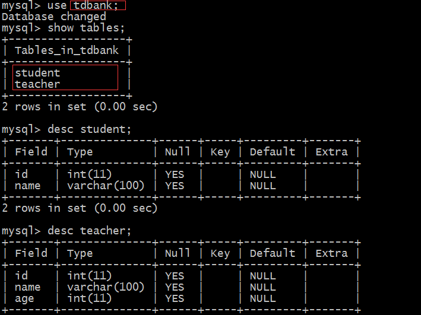
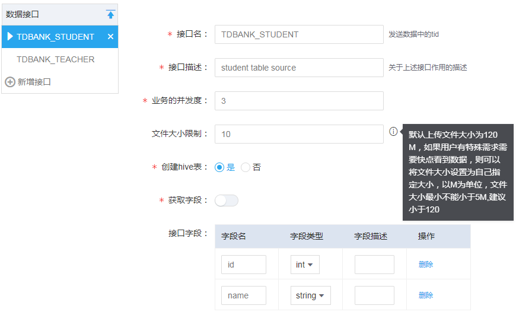
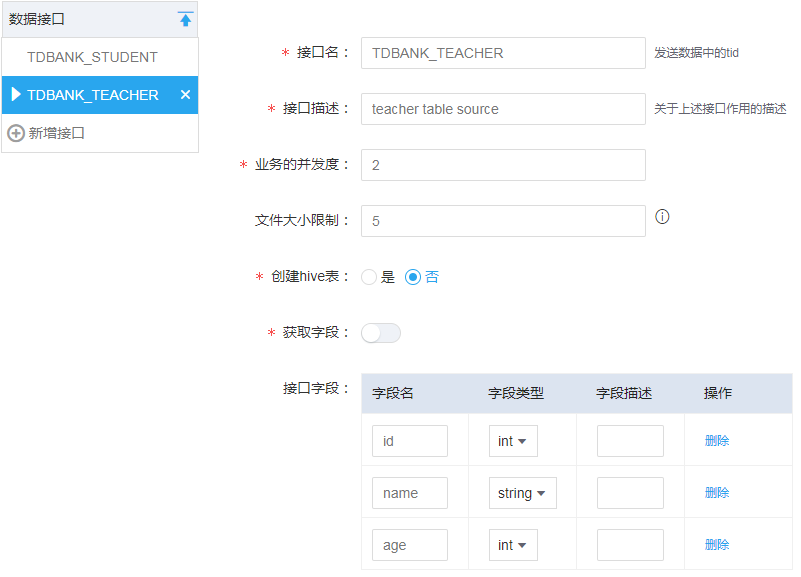
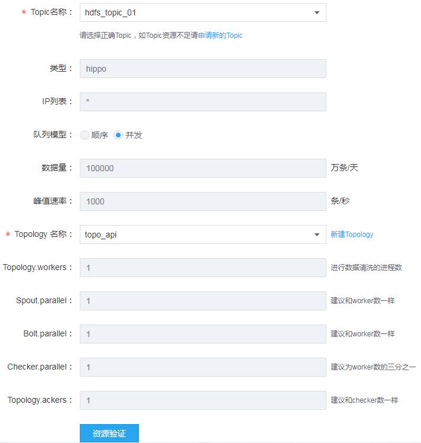
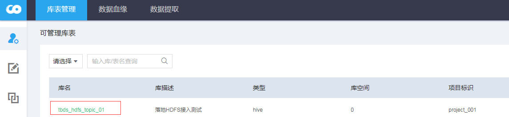
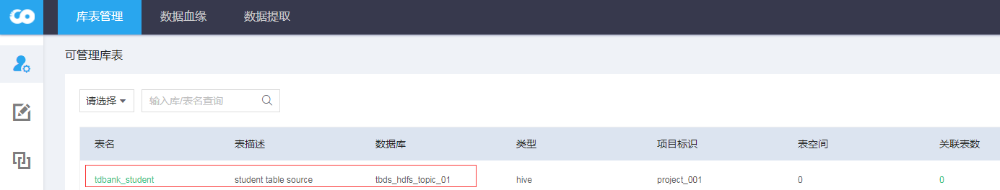
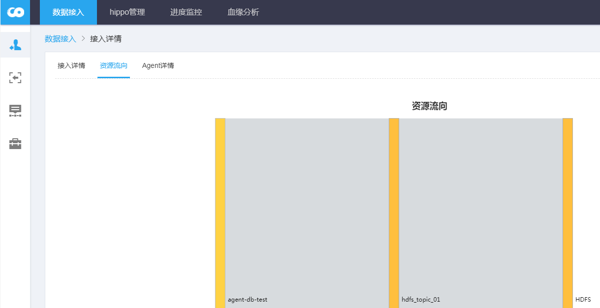
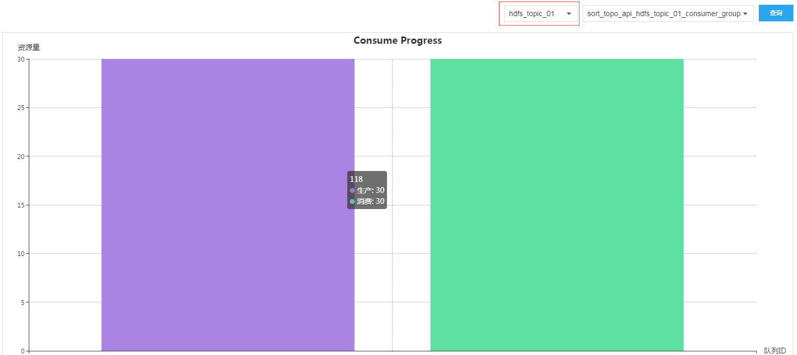
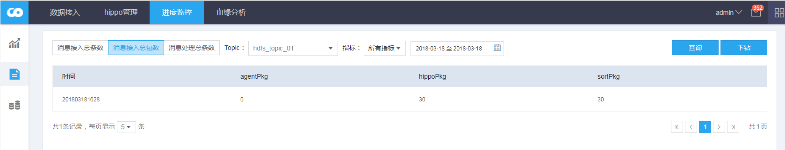

## 数据接入示例文档

### 2、DB —> HDFS
>原理：通过采集Agent获取DB数据，采集数据存储在Hippo，TDSort消费Hippo数据，存储到对应目的HDFS目录下

默认的HDFS存储路径 ``DataHub Server``服务下``tdsort-hdfs``配置中的``dfs.data.dir``参数，默认值：``/tdbank/data/hippo``；指标数据存储路径对应``moniter.log.dir``，默认值：``/data/tdbank/storm/storm-tdbank/tdbank_sort_logs``。

1、【基本信息】配置


**备注：**
- hadoopJobUgi、isHadoopJobUgi 两个参数暂未使用


2、【接口信息】配置

接入的源数据库表信息：``源DB：tdbank, 源Table:student, teacher``，接口名称：``db2HDFSTest``


配置对应的目的数据接口：选择自动创建``tdbank_student``hive表




**备注：**
- 接口名：命名规定``源DB名_源Table名``
- 文件大小限制：默认120M，即文件达到对应限制值后，会执行一次TDSort落地HDFS。如文件尚未达到限制值，TDSort默认每个小时调度一次，如果期望文件快速落地，可调小限制值
- 创建hive表：是->默认在接入所属的项目下创建对应的库表，库名：``tbds_{小写接入Hippo topic名称}``，表名：``{小写的接口名称}``， 创建hive表是方便之后基于【工作流】将hdfs数据导入Hive表
- 创建hive的hive表，默认会带有分区字段：``frequency_date``,按照小时入库

3、【资源信息】配置

该接口使用的Hippo Topic名称为：``hdfs_topic_01``


4、查看创建的Hive表

接入审批通过后，会自动创建对应的Hive表（接口配置设置自动创建hive表），在【数据资产】->【库表管理】下可查看对应的库表信息。 <br/>
创建库名：``tbds_{小写接入hippo topic}``，表名：``{小写接入名称}``；即库名：``tbds_hdfs_topic_01``，表名：``tdbank_student``






5、【采集Agent】配置
数据接入审批成功后，配置数据接入Agent，配置的参数详情，参考[TDBank采集接口详解]
- 配置data-hub：common.properties

```
data.hub.manager.ip={DataHub Server对应的IP地址}
data.hub.manager.port={DataHub Server对应的heartbeat.port配置，默认:9292}
data.hub.agent.name=agent-db-test
data.hub.name=db2HDFSTest #对应接入名称
data.hub.source=MySQL #数据类型
data.hub.target=HDFS #落地的数据类型
```
- 配置Flume：log4j.properties

追加以下配置信息，用于接入的指标采集
```
log4j.logger.metrics=INFO, METRICS
log4j.appender.METRICS=org.apache.log4j.rolling.RollingFileAppender
log4j.appender.METRICS.rollingPolicy=org.apache.log4j.rolling.TimeBasedRollingPolicy
log4j.appender.METRICS.rollingPolicy.ActiveFileName=${flume.log.dir}/metrics.log
log4j.appender.METRICS.rollingPolicy.FileNamePattern=${flume.log.dir}/metrics.log.%d{yyyy-MM-dd}
log4j.appender.METRICS.layout=org.apache.log4j.PatternLayout
log4j.appender.METRICS.layout.ConversionPattern=%d{yyyy-MM-dd HH:mm:ss} %m%n
```

- 配置Flume：flume.conf

```
agent1.sources = sqlSource
agent1.channels = ch1

##################### HippoChannel #####################
agent1.channels.ch1.type = com.tencent.tbds.datahub.agent.flume.channel.hippo.HippoChannel
agent1.channels.ch1.hippo.topic = hdfs_topic_01 #接入对应的HippoTopic名称
agent1.channels.ch1.hippo.controllerIpList = 10.0.0.2:8066 #HIPPO Controller对应IP和跟broker的心跳端口，默认：8066
agent1.channels.ch1.hippo.producerGroup = group_db_001 #生产hippo数据的group组
agent1.channels.ch1.hippo.producer.secretId = {secureId在Hippo topic的详情页面查看}
agent1.channels.ch1.hippo.producer.secretKey =  {secureKey在Hippo topic的详情页面查看}
agent1.channels.ch1.hippo.producer.sendAsync.fqueue.path = /data/fqueue

##################### 全量数据采集 #####################
agent1.sources.sqlSource.channels = ch1
agent1.sources.sqlSource.type = com.tencent.tbds.tdbank.flume.source.sql.SQLSource
agent1.sources.sqlSource.hibernate.connection.url = jdbc:mysql://10.0.0.1:3306/tdbank #源数据库连接信息
agent1.sources.sqlSource.hibernate.connection.user = root
agent1.sources.sqlSource.hibernate.connection.password = 123456
agent1.sources.sqlSource.hibernate.connection.isolation = 2
agent1.sources.sqlSource.hibernate.dialect = org.hibernate.dialect.MySQL5Dialect
agent1.sources.sqlSource.hibernate.connection.driver_class = com.mysql.jdbc.Driver
agent1.sources.sqlSource.database = tdbank #采集数据源DB
agent1.sources.sqlSource.tables = student,teacher #采集数据源表，多个表逗号分隔

## 增加以下配置可使用索引字段（假设为id）提升查询性能
## 另外也可以使用自定义SQL
## agent1.sources.sqlSource.tables.tbl_poc1.whereClause = WHERE id > :index ORDER BY id
## agent1.sources.sqlSource.tables.tbl_poc1.column.name = id

agent1.sources.sqlSource.recoveryMode = true #true代表数据采集完成后自动退出
agent1.sources.sqlSource.status.filePath = /data/sqlStatus

agent1.sources.sqlSource.hibernate.connection.provider_class = org.hibernate.connection.C3P0ConnectionProvider
agent1.sources.sqlSource.hibernate.c3p0.min_size=1
agent1.sources.sqlSource.hibernate.c3p0.max_size=10
```

- 配置Tmetric: agent.ini

```
[agent]
;agent主机地址，非必填项；默认使用本机ip
hostName=10.0.0.2
;agent监听的rpc端口，必填项；
port=8003 #Tmetrics Agents对应rpc端口，默认8003
masterAddressList=10.0.0.4:9000 #Tmetrics Master的Ip和Master对应rpc端口，默认9000

bdbFilePath=/data/metric-2.0/bdb
metricSpliter=#
;配置指标文件路径
metricFiles=/data/flume/logs
;配置单条指标的模式
metricPartern1=hippo@PRODUCER#topic#group#clientIp#time#agentCnt#agentPkg#agentSize@true@4#yyyyMMddHHmm@70@5#6#7
metricPartern2=bus@TDBus#topic#interface#group#clientIp#brokerIp#time#agentPkg#agentSize@true@6#yyyyMMddHHmm@120000@7#8
metricSuffixPartern=[1-9][0-9]{3}-[0-1][0-9]-[0-3][0-9]
metricPrefixDateFormater=yyyy-MM-dd HH:mm:ss
metricAggrThreadNum=2
metricSendThreadNum=2
maxCntOnePkg=200
partAggrCacheSize=5000
needCompress=true

queueFlushInterval=10000
heartbeatPeriodInMills=5000
isShouldPrint=true

;FQueue
queueCleanInterval=10
queueDataTTL=20
failoverQueuePath=/data/metric-2.0/failover
```

6、【指标查询】

点击数据接入详情，查看数据流向：


在Hippo管理界面查看，对应Topic的生产消费情况（Agent数据采集、TDSort落地情况）


在【进度监控】->【数据明细】查看对账数据

