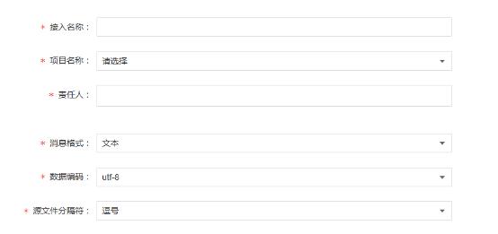
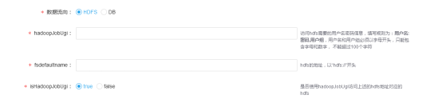
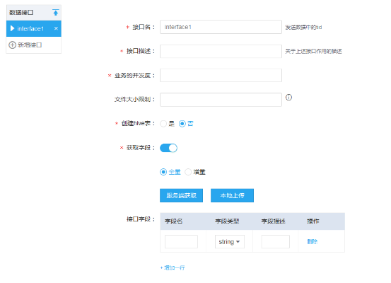
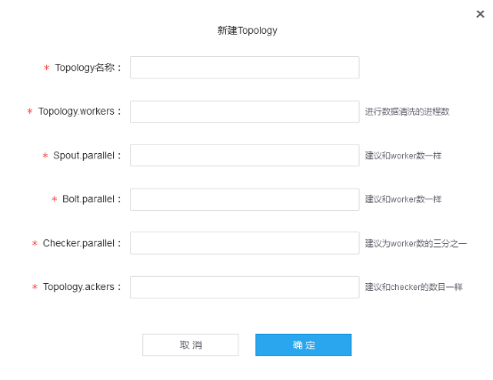
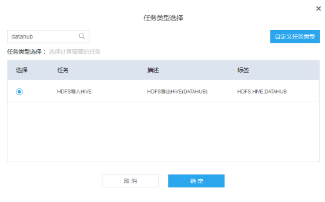

## 概述

TDBank数据接入需要以下步骤：

1. 新建项目（可选）
2. 新建Hippo topic（可选）
3. 新建接入
4. 部署agent
5. 工作流任务配置（可选）


## 1. 新建项目

由于数据接入必须与项目关联，因此如果还没有创建项目则需要新建项目。

操作示例（以下示例操作都是以admin用户登陆）：

| **序号** | **操作步骤** | **预期结果** | **备注** |
| --- | --- | --- | --- |
| 1. | 点击 平台管理-项目管理-创建项目 |   |   |
| 2. | 输入 <br/> 项目名称：POC测试项目 <br/> 项目标识：project\_poc <br/> 项目管理员：admin <br/> 点击 下一步 |   |   |
| 3. | 输入 <br/> 资源池名称：resources\_poc <br/> 权重：1 <br/> 点击 下一步 |   |   |
| 4. | 点击 创建 | 项目管理页面中可以看到 POC测试项目 |   ||


## 2. 新建Hippo topic

由于数据是通过消息中间件Hippo来接入，因此如果还没有创建Hippo topic则需要新建。新建topic分为两步，申请与审批。

### 2.1 topic申请

操作示例：

| **序号** | **操作步骤** | **预期结果** | **备注** |
| --- | --- | --- | --- |
| 1. | 点击 数据接入-hippo管理-接入申请 |   |   |
| 2. | 输入 <br/> Topic名称：topic\_poc <br/> IP列表：\* <br/> 队列模型：并发 <br/> 数据量：10000 <br/> 峰值速率：100 <br/> 负责人：admin |   |   |
| 3. | 点击 确认提交 |   |   ||

### 2.2 topic审批

操作示例：

| **序号** | **操作步骤** | **预期结果** | **备注** |
| --- | --- | --- | --- |
| 1. | 点击admin - 个人中心 - 审批单 - hippo - 审批 |   |   |
| 2. | 输入 <br/> 勾选 集群选择 <br/> 新增队列数：2 <br/> 点击 通过 | 在 数据接入-hippo管理-数据接入-接入列表 中可以看到 topic\_poc |   ||


## 3. 新建接入

点击 数据接入-数据接入-新建接入 开始填写数据接入信息，需要填写3部分信息：基本信息，接口信息，资源信息。

### 3.1 基本信息

与数据流向无关的信息，



- 接入名称
- 项目名称
- 责任人
- 消息格式：agent端发送的Hippo消息格式，目前只支持文本
- 数据编码：agent端发送的消息编码，目前只支持UTF-8
- 源文件分隔符：agent端发送的消息字段分隔符

数据流向信息，分为流向HDFS与流向DB，



- hadoopJobUgi：此配置暂时没有使用，可以填写user:pswd,group
- fsdefaultname：要流向的HDFS集群。如果是TBDS的HDFS集群，则默认为hdfs://hdfsCluster
- isHadoopJobUgi：此配置暂时没有使用，可选择true

流向DB则填写DB连接的相关信息，这里就不赘述了。

### 3.2 接口信息



数据接入中，一个接口对应了一张数据源表。一个接入配置中可以配置多个接口。下面对各个字段给出说明：

- 接口名：此字段用来唯一标识此接入中的数据源表，不可随意填写，填写规则为`大写库名_大写表名`。例如要接入的源表为db\_poc库的tbl\_poc表，则接口名应填写为DB\_POC\_TBL\_POC。agent端发送的消息，会在消息头带上接口名。若使用OGG采集，接口名规则有所差异，参考OGG部署文档。
- 接口描述：填写描述信息
- 业务的并发度：此字段为源表接入数据被消费的并发度控制，如果是大表可设置较高的并发度。
- 文件大小限制：当流向HDFS时，此字段为数据写入HDFS文件大小阈值，即当数据达到此大小就立刻写入HDFS。默认为120M。若业务需要尽快在HDFS看到数据则可将此阈值调小，但随之而来的就是会产生较多的小文件。
- 创建hive表：若勾选是，则系统将自动创建对应的hive表，以便后续将HDFS的数据导入hive表中。目前自动创建的库名为`tbds_topic名称`，表名为接口名，均为小写，表字段与接口字段一致。注意，创建hive表可能会失败，若创建失败将会给用户发送告警信息，可在个人中心查看，此时需要用户手动在库表管理页面创建hive库表。
- 获取字段：接口字段有三种方式来输入：1. 纯手动输入。此时不需要勾选获取字段；2. 服务端获取。通过获取工作流配置的表信息，自动导入表结构；3. 导入表结构文件。通过我们提供的表结构导出工具，将源表结构导出成文件，并在此处导入。另外，全量与增量的不同在于，增量字段会比全量字段多出来4个字段：操作类型（增删改），源表标识符，操作时间，当前时间。
- 接口字段：agent端发送的消息字段。如上述三种方式输入。

另外，当有大量的表需要接入时，我们提供了批量导入的功能，可以点击来导入。同样的，需要先使用我们提供的表结构导出工具来将源库表结构导出成文件。

### 3.3 资源信息

这里只需要选择要使用的topic跟topology。目前topic跟接入是一一对应的，也就是一个topic只能被一个接入使用。而topology则是可以被多个接入复用的。这里我们还没有创建topology，需要先新建。



这里要配置的是TStorm运行该topology的参数，需要根据TStorm集群的情况来配置，这里就不赘述了。

接入配置（流向HDFS）操作示例：

| **序号** | **操作步骤** | **预期结果** | **备注** |
| --- | --- | --- | --- |
| 1. | 点击 数据接入-数据接入-新建接入 |   |   |
| 2. | 输入 <br/> 接入名称：datahub\_poc <br/> 项目名称：POC测试项目 <br/> 责任人：admin <br/> 消息格式：文本 <br/> 数据编码：utf-8 <br/> 源文件分隔符：^A(\u0001) <br/> 数据流向：HDFS <br/> hadoopJobUgi：user:pswd,group <br/> fsdefaultname：hdfs://hdfsCluster <br/> isHadoopJobUgi：true <br/> 点击 下一步 |   |   |
| 3. | 输入 <br/> 接口名：DB\_POC\_TBL\_POC <br/> 接口描述：db\_poc库tbl\_poc表的全量数据 <br/> 业务的并发度：2 <br/> 文件大小限制： 10 <br/> 创建hive表： 是 <br/> 接口字段： <br/> id int <br/> content string <br/> 点击 下一步 |   |   |
| 4. | 点击 新建Topology  <br/> 输入 <br/> Topology名称：topo\_poc <br/> Topology.workers：3 <br/> Spout.parallel：3 <br/> Bolt.parallel：3 <br/> Checker.paralle：1 <br/> Topology.ackers：1 <br/> 点击 确定 |   |   |
| 5. | 输入 <br/> Topic名称：topic\_poc <br/> Topology名称：topo\_poc <br/> 点击 资源验证 <br/> 点击 提交申请 | 资源验证通过提交成功 |   ||

提交申请后，需在 个人中心-审批单-接入申请 中进行审批，类似topic审批操作。


## 4. agent部署

数据接入采用了开源的Flume来作为采集数据的agent。agent部署需要区分全量数据采集与增量数据采集。以下为安装步骤，详细配置请参考[TDBank采集接口详解](tdbank_conf.md)。

### 4.1 全量数据采集

所需软件包：

1. apache-flume-1.7.0-bin.tar.gz
2. data-hub-1.0.0-SNAPSHOT.tar.gz
3. metric-2.0-bin.tar.gz

安装步骤：

1. 安装Flume agent
2. 安装TMetric agent

#### 4.1.1 安装Flume agent

1. 解压apache-flume-1.7.0-bin.tar.gz到flume目录
2. 解压data-hub-1.0.0-SNAPSHOT.tar.gz到data-hub目录
3. 修改data-hub/conf/common.properties配置
4. 拷贝data-hub/conf/flume.conf到flume/conf目录
5. 修改flume/conf/flume.conf配置
6. 修改flume/conf/log4j.properties配置
7. 启动Flume agent：

```
nohup bin/flume-ng agent -Dlog4j.configuration=conf/log4j.properties --classpath /data-hub目录/conf:/data-hub目录/lib/* --conf conf/ -f conf/flume.conf -n agent1 > stdout 2>&1 &
```

#### 4.1.2 安装TMetric agent

1. 解压metric-2.0-bin.tar.gz到tmetric目录
2. 修改tmetric/conf/agent.ini配置
3. 启动TMetric agent：bin/agent.sh start

### 4.2 增量数据采集

增量数据采集有两种方式：使用Oracle GoldenGate（以下简称OGG）采集，或者使用Flume的SQLSource采集。

- 使用OGG可以采集到所有的增量数据，但是配置较为繁琐；
- 使用SQLSource可以用程序生成配置文件，但是无法采集到所有的增量数据，限制如下：
  - 无法采集到delete的数据；
  - 增量insert/update的数据必须具有自增的主键或者时间戳字段；

#### 4.2.1 使用OGG

所需软件包：

1. apache-flume-1.7.0-bin.tar.gz
2. data-hub-1.0.0-SNAPSHOT.tar.gz
3. metric-2.0-bin.tar.gz
4. OGG相关软件包

安装步骤：

1. 安装Flume agent。同全量。需修改source配置；
2. 安装TMetric agent。同全量；
3. 安装OGG Flume Adapter，参考[TDBank采集接口详解](tdbank_conf.md)；
4. 安装OGG for MySQL/SQLServer/Oracle等，参考[TDBank采集接口详解](tdbank_conf.md)；

#### 4.2.2 使用SQLSource

所需软件包：

1. apache-flume-1.7.0-bin.tar.gz
2. data-hub-1.0.0-SNAPSHOT.tar.gz
3. metric-2.0-bin.tar.gz

安装步骤：

1. 安装Flume agent。同全量；
2. 安装TMetric agent。同全量；


## 5. 工作流任务配置

若需要将HDFS的数据自动导入到Hive表中，则需要在创建接入时勾选创建hive表，并且配置工作流任务。选择如下工作流任务类型，创建任务并运行，任务参数可以不用修改。



注意，需要保证该任务全局（整个集群）只有一个，否则会重复导入数据。
