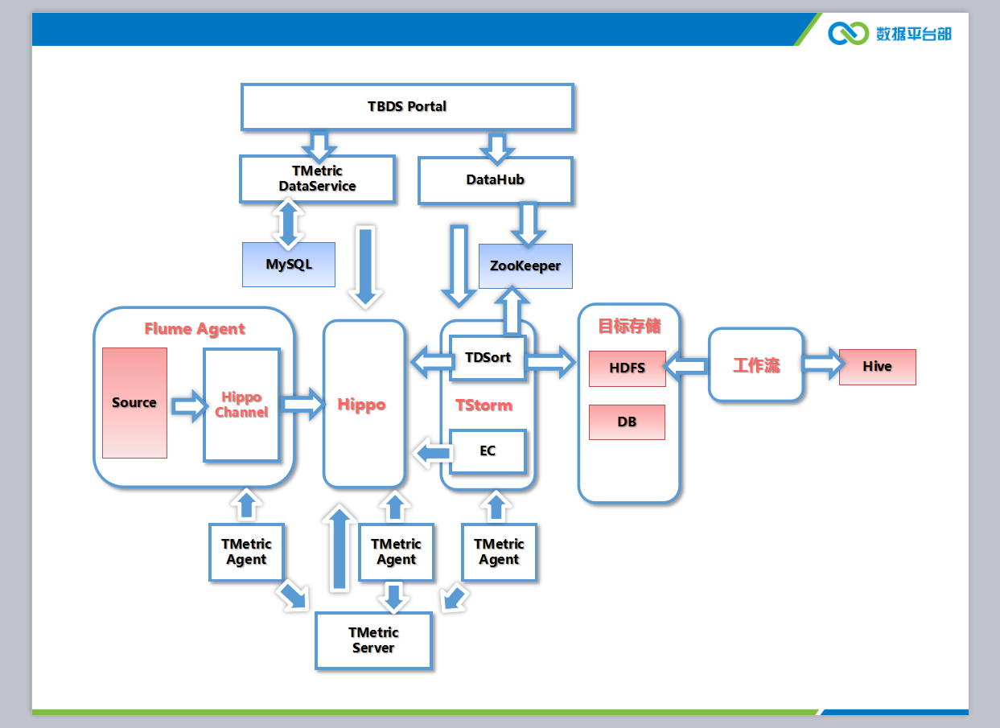
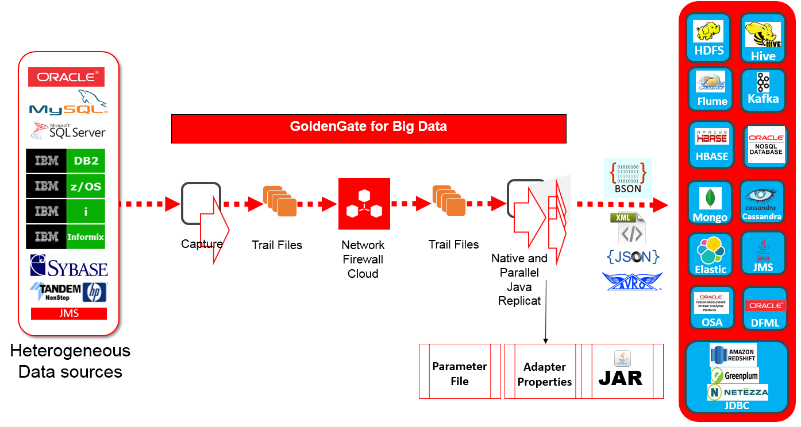
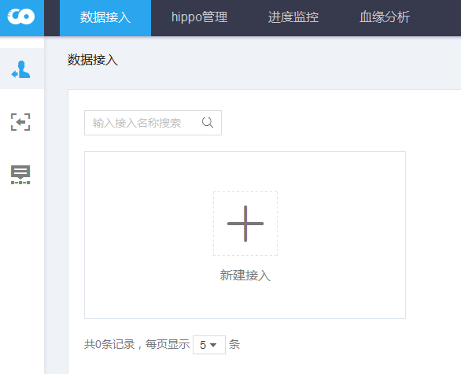
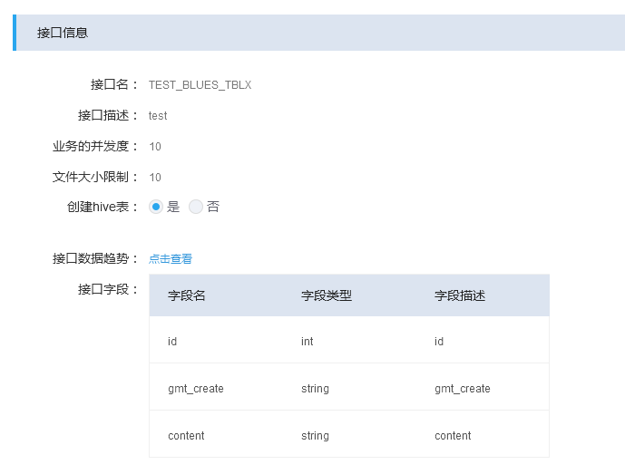

## 产品介绍

TDBank产品化后，架构如下，

整体上来说，TDBank所做的事情就是，从源端存储采集数据，根据用户的配置写入目标存储，后续再使用目标存储上的数据进行数据分析等等，这一步TDBank就不关心了。

细化下来，主要是这么几部分：

- 数据采集
- 数据传输
- 数据写入
- 用户配置
- 指标对账

接下来一一来介绍下。

### 数据采集

数据采集我们使用[Flume](https://flume.apache.org/)来完成。

由于使用了消息中间件Hippo来进行数据传输，因此agent中使用了`HippoChannel`来将数据写入到Hippo。而agent的Source则可以根据不同的源端存储采集需求，配置或者开发不同的Source。显然，[官方提供的Source](https://flume.apache.org/FlumeUserGuide.html#flume-sources)我们都可以拿来使用。

目前我们主要是针对MySQL，SQLServer，Oracle等DB来采集全量以及增量数据。

全量数据采集，目前有两种方式：

- 使用新开发的`SQLSource`，直接通过JDBC执行SQL来读取表数据，支持配置cron表达式定时执行；
- 将表数据dump成csv格式，通过官方提供的`SpoolDirectorySource`来读取；

增量数据采集，目前也有两种方式：

- 同样可以使用`SQLSource`来读取，但是存在一些限制；
- 通过[Oracle GoldenGate](http://www.oracle.com/technetwork/middleware/goldengate/overview/index.html)来完成，但是配置比较繁琐；

具体参考agent部署文档。

### 数据传输与写入

`HippoChannel`将数据发送到Hippo，然后由TStorm中的拓扑TDSort来消费。TDSort根据ZK上的配置信息，将数据写入HDFS或者DB。

由DataHub负责向TStorm提交TDSort拓扑。ZK的配置信息由前台用户填写，DataHub写入ZK。那么配置信息都有些啥？实际上TDSort的职责就是实现数据分拣，当TDSort收到一条数据（字节数组）时，它要解决两个问题：

- 怎么来解析这些字节数组？
- 解析完成后怎么知道这条数据应该写到哪？

对于第一个问题，我们需要如下的配置，

- 数据的格式，是文本还是PB还是其他？目前我们只支持文本格式；
- 文本格式我们首先就需要知道是使用了什么编码，因此需要配置数据编码；
- 然后还需要配置分隔符，用来分隔出不同的数据字段；
- 最后，我们还需要字段元信息，也就是说，一条数据进来，我们需要知道它的元信息，我们需要根据这些元信息来写入目标存储。因此也需要用户配置字段元信息。另外，当TDSort收到一条数据，怎么知道它对应的元信息呢？我们通过在消息头部加入信息来对这条数据做标识，TDSort根据标识找到对应的元信息。这个标识就是**接口名称**。一个接口名称对应一组字段元信息。这些都需要用户配置。

第二个问题，我们就配置流向信息就可以了。

另外，如果是写入HDFS的数据，可以配置工作流任务将该数据load到Hive表中。

主流程基本上就是这样了，其实也不复杂。接下来看下用户具体的配置。

### 用户配置

从源端采集数据，写入目标端，这样一个流程我们称为一个**接入**。在套件中，数据接入-数据接入 页面，我们可以新建一个接入。

从上面的介绍中，我们也可以看出来，一个接入需要的信息：

- 数据采集时，发送到Hippo所需要的Topic信息；
- 数据的格式，编码等以及接口名称，字段元信息等；
- 数据写入的目标存储的信息，也就是流向信息；
- 数据写入时所使用的拓扑信息；

一个接入与一个Hippo的Topic对应，而且是一一对应。也就是说同一个接入的所有数据都会发到同一个Topic。

再说下接口信息，

接口名称，不能随便填写。一般需要使用`大写库名_大写表名`，但如果是使用OGG采集增量数据时则不太一样，具体参考OGG部署文档的说明。
接口字段，需要根据flume端发送的数据来配置。一般是源表所有字段，若使用OGG则有所差异。为了方便配置，提供了批量导入工具。

### 指标对账

在整个数据接入的过程当中，涉及到了Agent发送数据，Hippo接收数据，TDSort消费数据，为了监控整条链路的可靠性，我们在这三个地方都加了指标日志，分别是，Agent每分钟每个Topic发送了多少条数据，Hippo每分钟每个Topic接收了多少条数据，TDSort每分钟每个Topic消费了多少条数据。

然后由TMetricAgent来读取这些指标日志文件，并发送给TMetricServer，再由TMetricServer将这些指标数据发送到Hippo（重用Hippo是为了减少组件依赖，理论上使用外部组件来监控比较合理）。TStorm中的拓扑EasyCount会消费这些指标数据，然后按分钟和按小时来进行聚合（两个拓扑）。聚合后的结果重新写回Hippo，由TMetricDataService来消费，写入MySQL，用于前台页面展示。这里提供了系统灵活性，如果以后不使用MySQL来存储聚合结果，或者说MySQL支持不了大量的指标数据了，只需要增加其他消费者用其他方案来存储就可以了。

## 存在的问题

目前比较大的问题主要是以下两个：

- 假如Hippo负载太高，消息处理不过来，会导致超时，然后Agent会重传数据。这就有可能导致数据重复的问题；
- 数据落地到HDFS的场景下，TDSort在消费完Hippo消息后，是先将数据缓存在内存中，等数据量达到一定大小（可配置）才全部写入HDFS一个文件当中。如果在还未写入HDFS时，TStorm的worker因为某些原因（人为或者系统不稳定）挂掉了，则缓存的这一部分数据就会丢失；

## 使用指引

具体操作与配置，参考[TDBank数据接入指引](tdbank_guide.md)。
