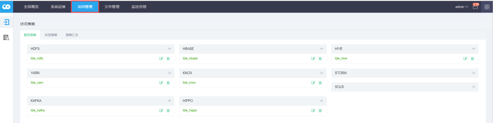
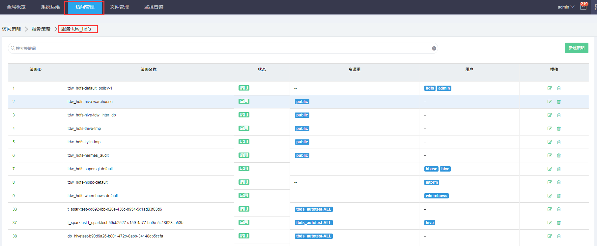
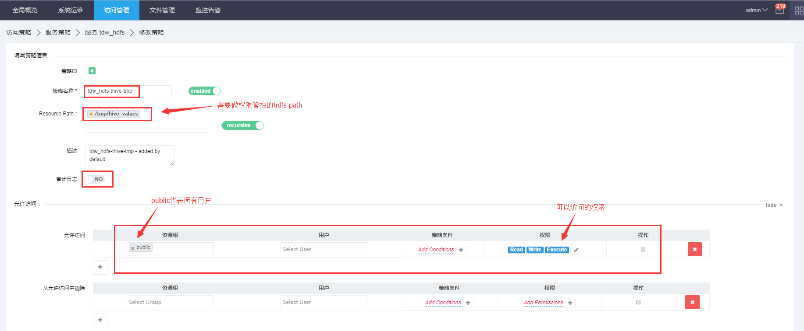
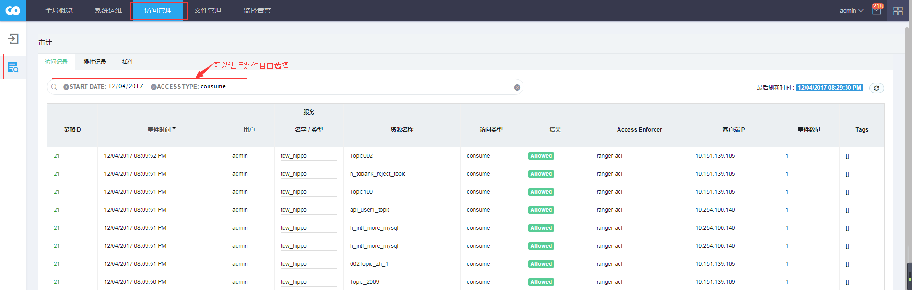

## 概述

套件授权组件是tbdsAuthorizer，配置的访问规则叫策略，一条访问策略能够指明who can\(not\) access which resource。

## 使用

### 配置访问策略

使用tbdsAuthorizer进行大数据组件的权限管理，可以在portal门户进行集中配置。

**步骤1.**以管理员身份进入portal web，依次点击选择进入：运维中心--&gt;访问管理，如下图

**步骤2.**点击要进行权限管理的服务，如hdfs则点击tdw\_hdfs,得到hdfs路径的策略列表：

**步骤3.**点击任意策略条目邮编的编辑按钮，进入策略详情编辑，可以指定具体的访问规则：

###

### 查看审计日志

审计日志记录了用户数据访问的具体信息，包括访问的资源、访问的时间，客户端IP是否被允许等等。

**步骤1.**同上节"配置访问策略"的步骤1，以管理员身份进入：运维中心--&gt;访问管理。

**步骤2.**点击访问管理页面左侧导航栏的审计日志链接，即可查看：

