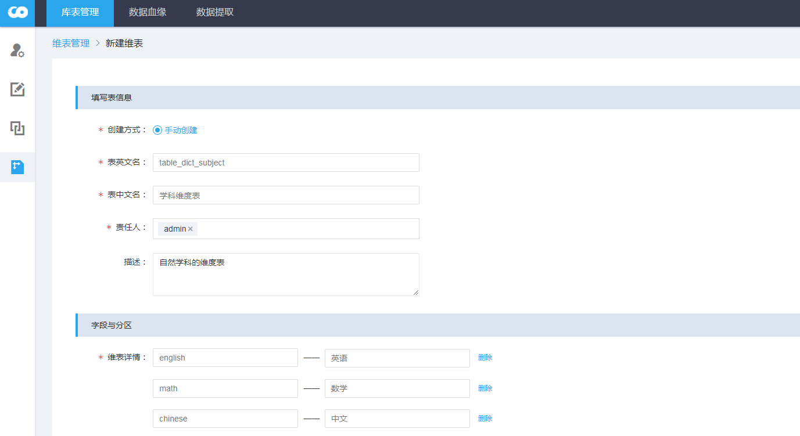
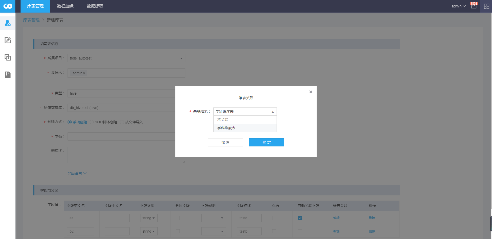
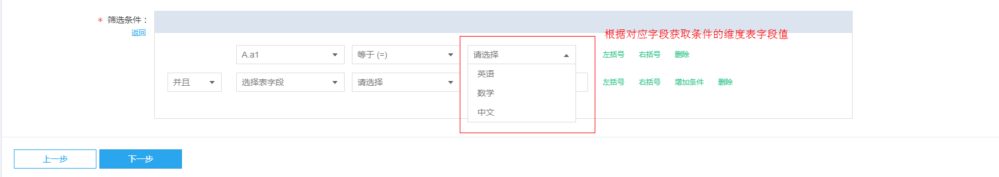

### 1  创建维表
维表管理即对数据字典进行维护，便于供数据提取进行关联查询，同时也规范数据管理。

**参数解释：**
- 创建方式：目前仅支持手动创建
- 表英文名：维表英文名称；
- 表中文名：维表中文名称；
- 责任人：该维表所关联的责任人；
- 描述：对该维表的描述信息；
- 维表详情：KV形式的字典值映射；

#### 2 维表关联
在创建hive数据表的时候，可以设置hive字段所关联的维表。设置的关联维表可以在**数据提取**使用。

在创建**提取分析**任务时，针对某个表的字段，可以获取关联维度表的字典值。

