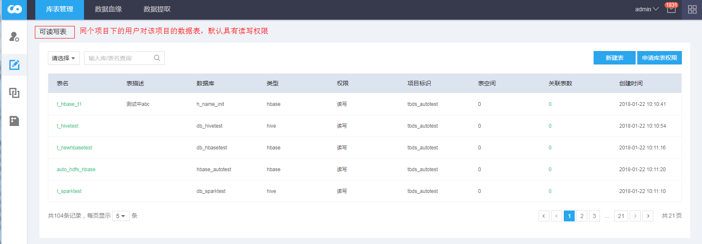
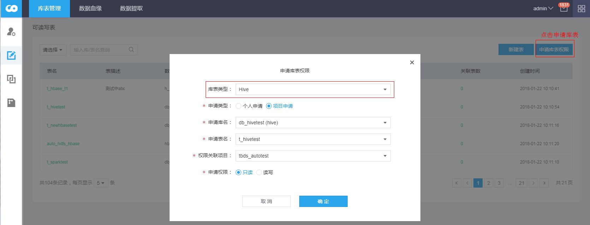
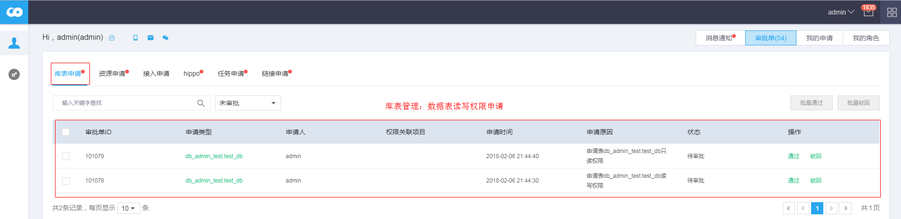
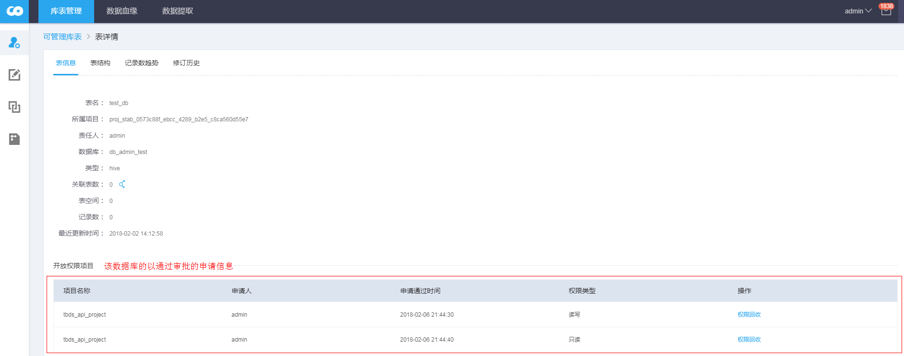

### 1、可读写表

若数据库库表的责任人包含当前登录用户，则这些库表显示在当前登录用户的**可管理库表**页签下；
若同项目下的其他用户创建了库表，且责任人不包含当前登录用户，则创建的数据表会显示在**可读写表**页签下，同项目的用户默认拥有读写权限；

### 2、申请库表权限

用户可以申请所有项目下数据表权限，并将申请的数据表，关联到某个项目下（用户属于该项目的项目成员）。

**参数解释：**
- 库表类型：选择要申请库表的类型，Hive、Hbase
- 申请类型：个人申请 只给当前登录用户申请该库表；项目申请 基于项目进行申请；
- 申请库表：选择对哪个数据库进行申请，该处会列出所有的数据库；
- 申请表名：列出对应数据库的所有表，选择申请对应库下的数据表；
- 权限关联项目：申请的数据库表关联的项目，即在对应项目申请操作这些库表的权限，一次申请只能对应一个关联项目；
- 申请权限：只读、读写权限；

**备注：**
- 读写权限是基于Ranger权限管控，Hive 只读：select；读写：select、update、create、index；HBase 只读：read；读写：read、write、create、admin；

### 3、权限审批

被申请数据表所属的项目，拥有项目管理员ProjectManager角色的所有用户有权限审批库表管理的申请单。项目管理员可以执行**通过**或**驳回**操作更新审批单状态。执行**通过**操作，TBDS集群会触发Ranger进行授权。

### 4、权限回收
库表责任人可以通过点击表名，查看表的申请信息，如图所示：

点击“权限回收” 可以对已经授权的库表进行权限回收；
