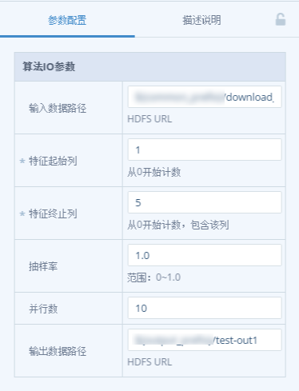
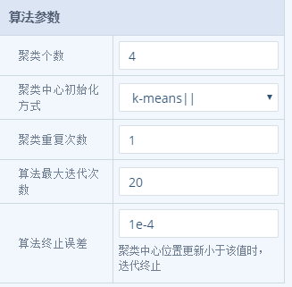
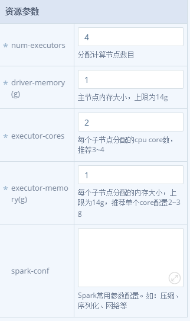

## 配置算法参数
用户可以发现DIX（高校版）中包含机器学习算法、图算法、可视化算法和模型评估算法。下面我们以机器学习算法中的聚类算法KMeans为例，简要说明算法参数的配置。单击算法节点，页面右侧出现参数配置框，包含三部分——算法IO参数、算法参数和资源参数。

    

如上图所示，每个输入框下面都给出了简单的说明，用户可以根据需要调节参数。

    

上图给出KMeans算法的参数配置样式，不同算法对应不同的参数形式。

    

上图则是为该算法设置资源参数，每个参数的含义见图中说明。

