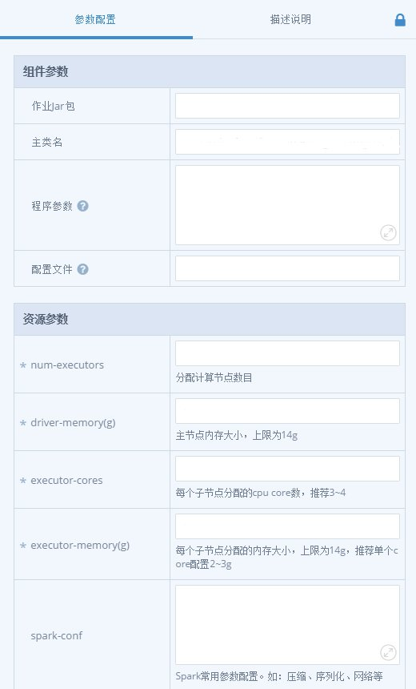
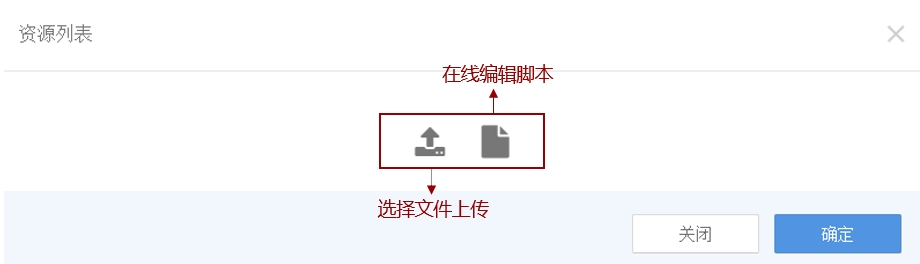

## 配置节点参数
DIX（高校版）提供一系列封装好的组件/算法，使用时只需要拖拽一个节点到画布，再上传程序包（仅组件）或配置文件，设置好组件参数，资源参数，算法参数等就可以提交任务运行。 下面以Spark为例，简要说明节点参数的配置，更多的组件和算法的使用见后续章节的详细描述。

    

组件参数的配置包括两部分：组件参数和资源参数。资源参数的配置与上文类似，不再赘述。组件参数的配置分以下两步完成，
1.  开发Spark jar包或者python脚本；
2.  点击“作业jar包”右侧空白输入框，上传jar包或脚本。当然，也可在线编辑脚本，见图十。

    

