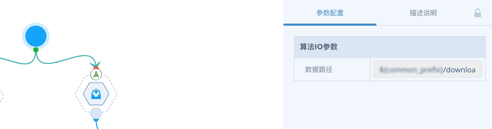
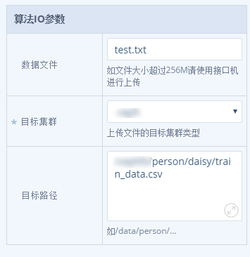

## 输入数据
> TDInsight平台支持HDFS数据，也支持本地轻量数据直接上传。 

###  数据源
平台提供2种外来的数据源组件：数据集和本地数据。 
####  数据集
为下游算法提供输入数据，指定HDFS路径即可通过数据流自动传递。 并可通过“是否检查数据”开关来判断是否数据存在以后再启动后续节点处理。

   

####  本地数据
可通过数据集组件将轻量本地文件上传到hdfs集群（注意需要有上传目标目录的写权限，大小不能超过256M）。

   

