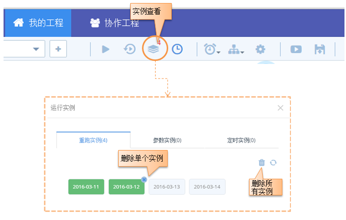
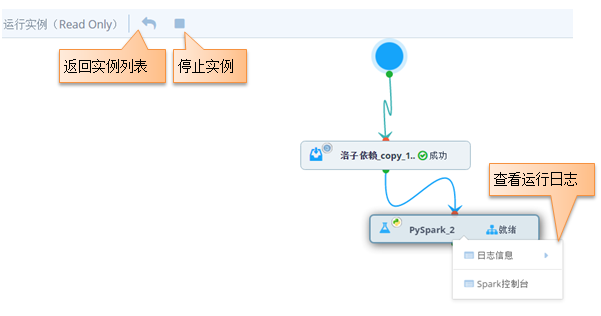

###	实例查询
>TDInsight的3种实例类型中，手工驱动的实例在画布上实时展示，其他2种类型的实例均在“实例查询”功能中。有2种方式可以查看实例

####从工作流的实例查询按钮进入
 
 

    

实例队列中绿色标注的为当前正在执行的实例，右边是待执行的实例。单击某一个实例图标，会链接到该实例的快照页面，该页面上只可做停止实例和查看日志的操作，如下：
 

    
 

**注意： **

1. 多种调度类型实例同时被调起时，手动驱动的会优先执行，其他2种优先级都是并列的
2. 定时实例如果数量〉1，说明实例没有在下一个实例执行前完成。

