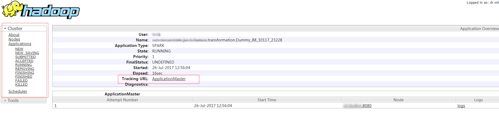
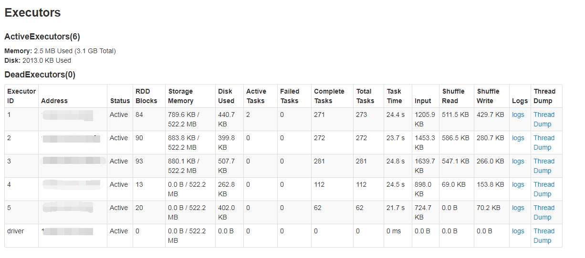
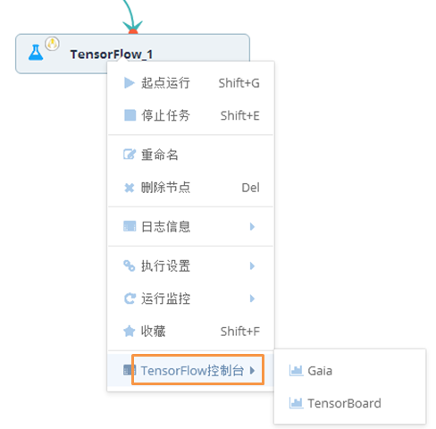

## 日志查看
TDInsight上的日志有2种，都在节点的右键菜单里有入口（历史实例也有同样的日志菜单）。

    

### 1. 执行日志

节点的右键菜单有“日志信息”的 入口，可以看到节点在TDInsight上执行的日志。

### 2. 控制台(机器学习——spark控制台，深度学习——TF,Torch,caff控制台 )

控制台都提供了查看任务在计算集群上运行时的具体执行信息，以Spark控制台为例： 

进入后可以查看Spark的标准输出以及错误日志,如果已经执行完毕，只可以看到标准输出以及错误日志，如果任务在运行态，左下角会有YarnUI的入口。 如下

    

运行态时，进入YarnUI可以进入Yarn日志页，

    

通过“Tracking URL”可以看到Excutor上的运行日志，并获取LOG，如下（图中logs可进入详情）

    

深度学习的日志略有不同，有专门的控制台，如下

    

