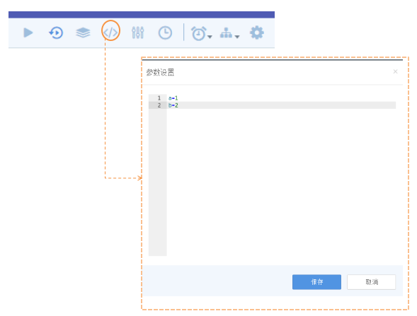
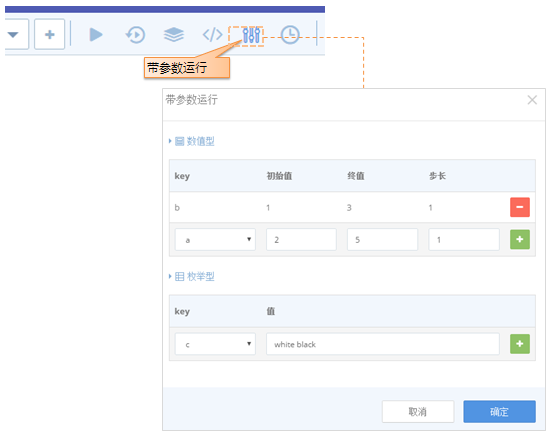
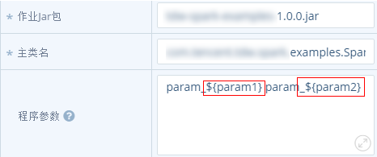
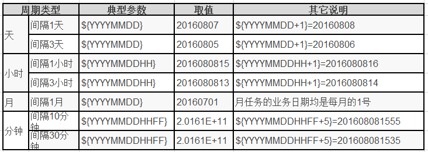

### 多实例并发执行
>TDinsight上有4种驱动方式：手动，定时，参数驱动和重跑。 对同一个工作流来说，这4种驱动方式即不同的实例类型。 在前文已介绍过手工驱动实例，这里就不再赘述，重点介绍后3种。

#### 定时实例

定时实例是指用户可以设置自动运行策略，到时间后自动生成实例并运行的功能。
调试后的工作流可设置定时策略进行例行化运行，具体如下图所示：

    
 

**注意**

1. 定时设置后，需要在工作流画布上手动保存一下才能生效
2. 设置了定时策略的作业，将使用online资源运行，保障例行化作业的资源配比

#### 参数实例

**参数驱动**

算法工程师进行模型训练时需要进行大量的参数调试，TDInsight提供带参数集的运行功能。用户可以设置数值型和枚举型参数,赋予其规则。系统将根据这种设定的规则生成多个实例，实现不同的参数组合条件下的模型训练。
1. 参数设置和初始化,先在工作流页面的地“参数设置”工具栏中先设置好参数以及初始值。用key=value的方式即可

    
 

2．带参数运行工作流

在下图的入口设置参数值，数值型的可以通过设置初始值，终值，步长的方式变化每次运行的参数值，枚举型需以空格进行分隔，设置完成后，系统就会根据参数配置的组合提交实例去运行。 例如下面的例子，第一个参数实例的参数分配是：a=2,b=white
 

    
 

**注意： **
这种方式生成的实例类型都为“参数驱动”，可进行实例查询和历史实例快照的查询。具体见实例查询章节

###### 参数的常见使用方法

参数初始化以后,可以用${参数}的方式在工作流里来使用,例如
 

    
 

参数值在执行的时候会被替换成最新传递的.

**时间参数的使用**

时间参数在TDinsight平台上也用得比较多, 有2类时间参数概念：

1. 执行时间；即用户在执行任务时对应的时间 ，由于任务每次执行时间不一样，如果用户同一个日期目录下的数据，今天执行一次，第二天再执行时，如果不进行参数的计算变更，就会无法拿到了。

2. 业务时间：是数据时间，在数平离线处理的数据加工过程中,都会加一个业务时间，用户在进行某次训练或计算时使用的是某个业务时间下的数据，此时间是固定的，只要指定了业务日期，那工作流不管何时执行，执行多少次，只要业务逻辑没有变更，结果都是一样的；

因此TDinsight使用业务时间来进行任务同步, TDinsight上可以使用${YYYYMMDD}的格式进行业务时间的参数传递,对周期工作流来说，${YYYYMMDD}取的是上一个周期的日期，举个例子, 假设当时时间为2016-08-08 16:00:00,不同的周期和参数传递后取到的值对应关系如下: 

 

    
 

使用时注意: 

1. 天任务的小时，分钟，秒都为0；

2. 月任务的时间都是每个月的1号；

3. 周任务可以使用间隔7天来实现；

#### 重跑实例

用户需要对历史某个时段的数据进行重新处理时，在工作流画布页面，选择重跑的时间区间，提交即可。

 

    
 

**注意： **

1. 如果当前的流设置了定时策略，重跑的时间设定单位与定时策略保持一致。例如定时策略设置的是每12小时运行一次，重跑的区间也是从开始时间起每12小时运行一次。

2. 支持月，周，天，时为单位的重跑，但不支持分钟任务重跑。
3. 对于“等待运行”和“正在运行”状态的重跑实例，如果新提交的请求中有相同数据时间的实例，系统会进行去重处理。 
4. 由于SparkStreaming任务的业务场景是流式计算，因此如果工作流中含有sparkstreaming任务节点，则不支持重跑功能。 
5. 单个流的重跑实例数目前上限为50， 超过则不能提交。

