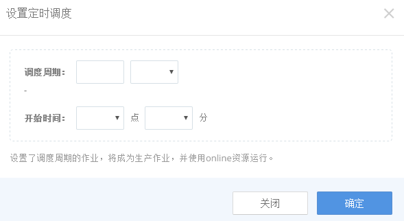
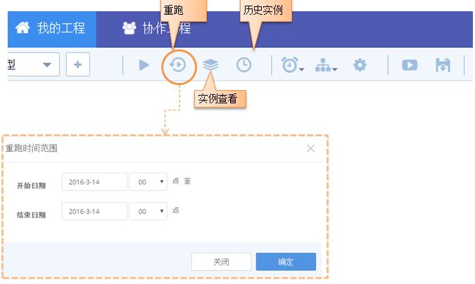

### 多实例并发执行
>TDInsight上有3种驱动方式：手动，定时和重跑。 对同一个工作流来说，这3种驱动方式即不同的实例类型。 在前文已介绍过手工驱动实例，这里就不再赘述，重点介绍后3种。

#### 定时实例

定时实例是指用户可以设置自动运行策略，到时间后自动生成实例并运行的功能。
调试后的工作流可设置定时策略进行例行化运行，具体如下图所示：

    
 

**注意**

1. 定时设置后，需要在工作流画布上手动保存一下才能生效
2. 设置了定时策略的作业，将使用online资源运行，保障例行化作业的资源配比

####重跑实例

用户需要对历史某个时段的数据进行重新处理时，在工作流画布页面，选择重跑的时间区间，提交即可。

 

    
 

**注意： **

1. 如果当前的流设置了定时策略，重跑的时间设定单位与定时策略保持一致。例如定时策略设置的是每12小时运行一次，重跑的区间也是从开始时间起每12小时运行一次。

2. 支持月，周，天，时，分钟为单位的重跑，重跑的单位也一致。
3. 对于“等待运行”和“正在运行”状态的重跑实例，如果新提交的请求中有相同数据时间的实例，系统会进行去重处理。 
4. 由于SparkStreaming任务的业务场景是流式计算，因此如果工作流中含有sparkstreaming任务节点，则不支持重跑功能。 
5. 单个流的重跑实例数目前上限为50， 超过则不能提交。

