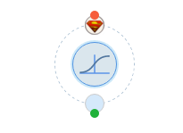

## 预测
用户在建立算法模型后，可以在另外的多个工作流中用该模型预测新的数据。模型节点被拖拽到画布后，是一个圆形的“胖节点”，如下图，此时模型节点就变成了一个内嵌模型的可执行节点。

    

具体使用步骤如下：

1. 右键单击“收藏模型”，页面左侧模型—个人模型目录下会出现收藏的模型；
2. 将模型拖拽到画布中，模型的节点会变成一个可执行预测的节点；
3. 单击该节点，右侧出现属性栏，简单填上预测数据的IO参数，就可以执行该节点。
