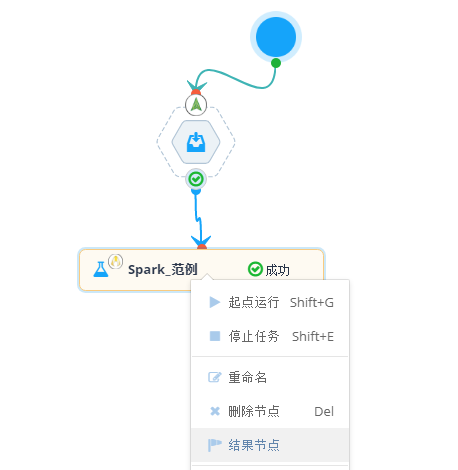

## 设置结果节点

在一个工作流中可以配置多个节点，但最终会有一个节点的输出是本次比赛预测的结果文件。这个结果文件需要提交到评分系统进行验证。 那么就要在工作流上指定某个节点的输出作为结果，工作流的实例运行完成后，可以在这个节点上提交结果检测。设置为结果节点后， 这个节点的底色会变成淡红色。

    

 注意，为了保障顺利评分，一个工作流只能有一个节点设置为结果提交节点。

### 参数设置
根据大赛的赛制，所有数据处理都在平台闭环，不提供上传下载，因此在结果节点要特别注意结果输出路径的设置
1. 如果结果节点是组件节点，则算法IO参数的输出路径要以`${hdfs_output_prefix}`开头，这样系统会自动识别为结果文件路径。例如：`${hdfs_output_prefix}/${team_id}/${executionJobId}`；
2. 如果结果节点是算法节点，指定“输出数据路径”，只需配置自己的目标路径即可，不需上述参数开头，例如`firstteam1/outputjob/`。

