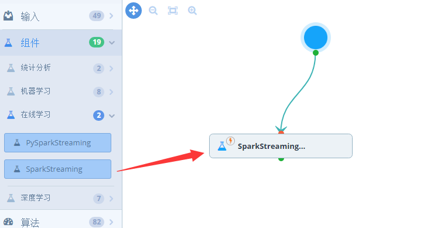
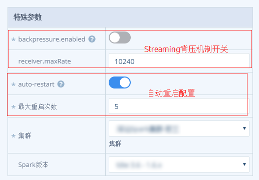

## SparkStreaming组件
> SparkStreaming组件是面向使用SparkStreaming处理实时任务的用户，用户编写SparkStreaming应用程序，通过SparkStreaming组件完成部署。和标准的Spark相比，SparkStreaming组件支持流式处理相关的特殊配置。

### 1. **从左侧组件列表里拖拽出一个SparkStreaming节点**

 

	    
	 	

### 2. **单击任务节点，会从右侧弹出配置框**

	    
	 	

	
> * backpressure开关：是否开启背压机制，即在计算跟不上数据的情况下，会自动降低接收数据的速率
> * receiver.maxRate：指定receiver最大接收速率，单位为每秒接收记录的条数
> * auto-restart：指定是否失败自动重启
> * 最大重启次数：指定任务的最大重启次数

其他配置操作与Spark组件类似。
