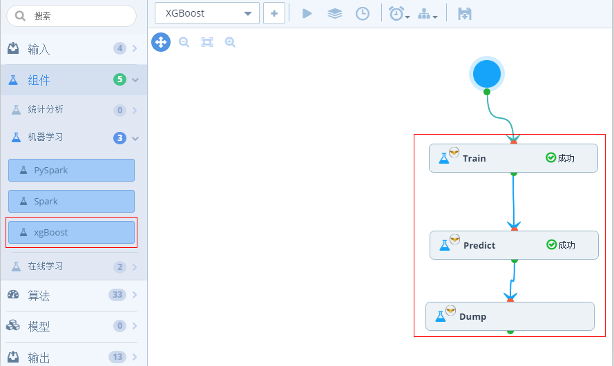
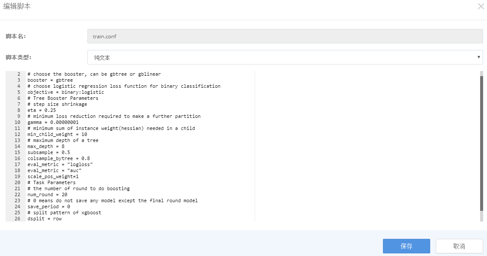
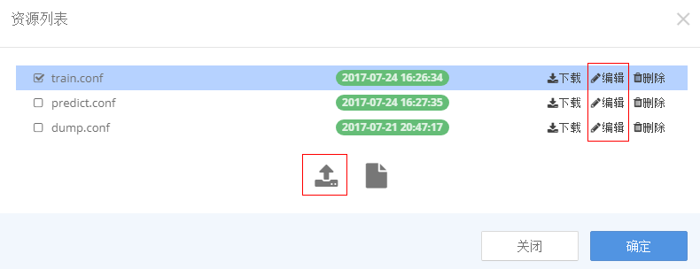
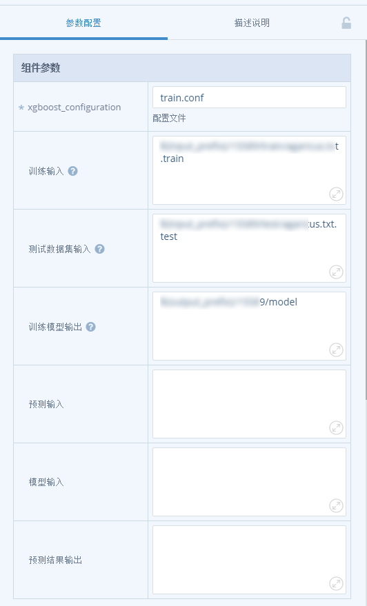

## xgboost组件
> XGBoost组件属于TDInsight中的机器学习组件，基于社区的xgboost0.6版本，可以实现Train、Predict、Dump三种功能。

	    
	 	

- XGBoost组件包含“组件参数”和“资源参数”两种参数，下面分别举例进行说明。

  - 资源参数配置如下：
	

	    
	 	

  - 组件参数配置分以下三步完成：

### 1. **编写xgboost参数配置文件，参考[xgboost官方的0.4版本](https://github.com/dmlc/xgboost/blob/v0.40/doc/parameter.md),Train阶段和Predict阶段的配置文件，举例如下：**

		    
				

		    
				

### 2. **点击“xgboost_configuration”右侧空白输入框，上传配置文件。当然，也可在线编辑脚本。**

		    
				

### 3. **Train阶段和Predict阶段中，涉及到IO相关的参数配置在外面输入框中**

		    
				

		    
				

### 4. 常见问题和排查技巧

#### LibSVM格式举例
- 可以参考xgboost官方的demo中的数据文件
  - https://github.com/dmlc/xgboost/blob/master/demo/data/agaricus.txt.train
- 内容中第一列为label(float型)，后面为一组feature_index:feature_value，空格分隔
  - 1 3:1 10:1 11:1 21:1 30:1 34:1 36:1 40:1 41:1 53:1 58:1 65:1 69:1 77:1 86:1 88:1 92:1 95:1 102:1 105:1 117:1 124:1
  - 0 3:1 10:1 20:1 21:1 23:1 34:1 36:1 39:1 41:1 53:1 56:1 65:1 69:1 77:1 86:1 88:1 92:1 95:1 102:1 106:1 116:1 120:1
  - 0 1:1 10:1 19:1 21:1 24:1 34:1 36:1 39:1 42:1 53:1 56:1 65:1 69:1 77:1 86:1 88:1 92:1 95:1 102:1 106:1 116:1 122:1
  - 1 3:1 9:1 19:1 21:1 30:1 34:1 36:1 40:1 42:1 53:1 58:1 65:1 69:1 77:1 86:1 88:1 92:1 95:1 102:1 105:1 117:1 124:1
  - 0 3:1 10:1 14:1 22:1 29:1 34:1 37:1 39:1 41:1 54:1 58:1 65:1 69:1 77:1 86:1 88:1 92:1 95:1 98:1 106:1 114:1 120:1

#### LibSVM常见错误

  - 特征值出现nan或LibSVM中特征值超过float的最大值和最小值分别为3.40282e+38（10 +38），1.17549e-38（10-38）
    - "AssertError:the bound variable must be max"
  - 逻辑回归中label列超过了[0,1]的取值范围
    - "label must be in [0,1] for logistic regression"
  - 输入数据集某些部分为空
    - "label set cannot be empty"
    - "NumCol:need column access"和"38870x0 matrix with 0 entries is loaded from hdfs:xxx"
    - "0x0 matrix with 0 entries is loaded from"
