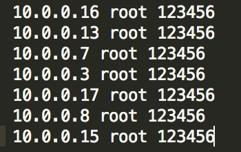
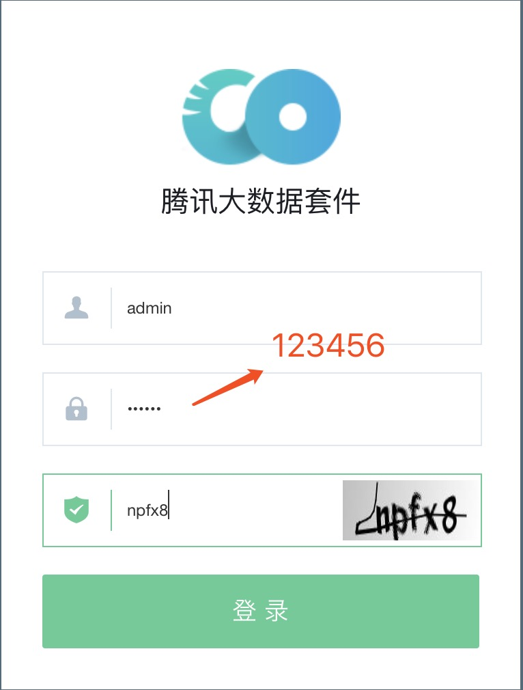
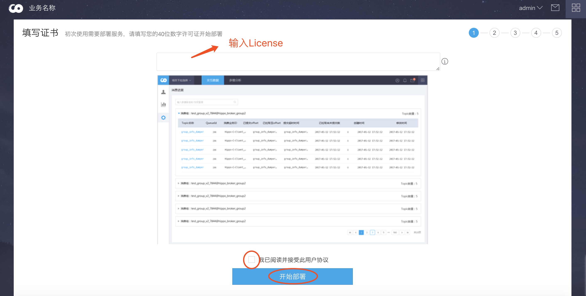
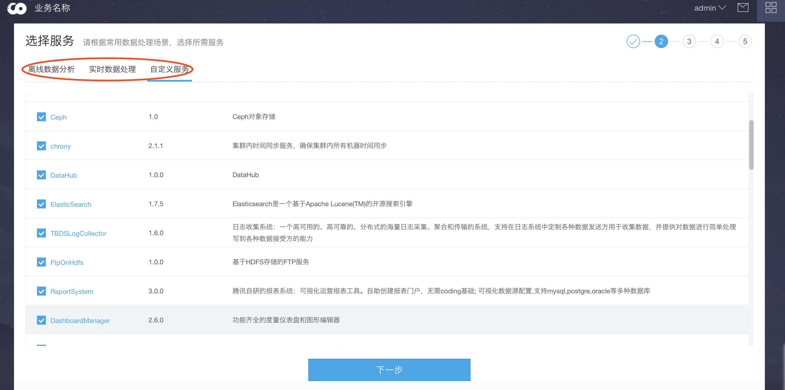
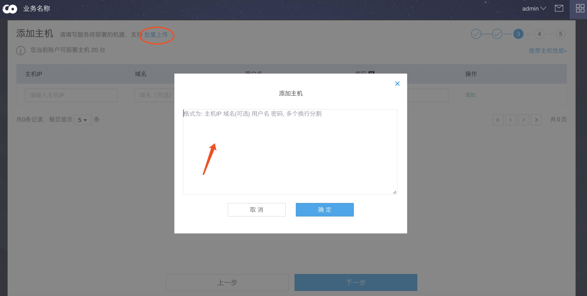
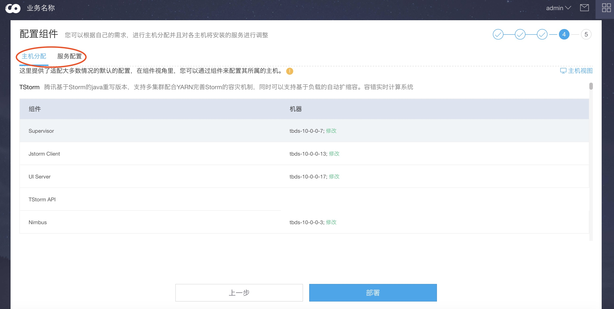
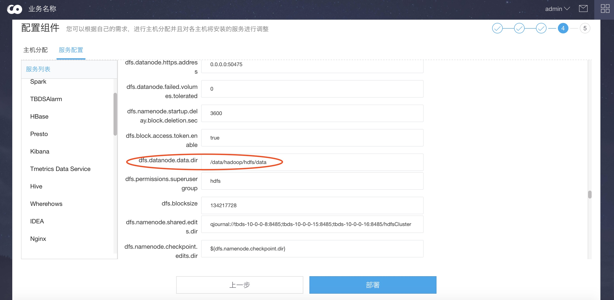
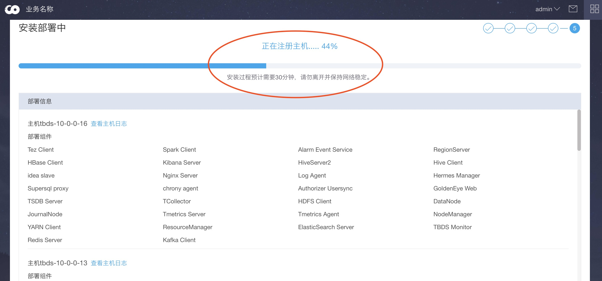

## 前置条件
软件清单
* tbds-mirror-$**version**.tar.gz   (其中$version为TBDS版本号) \*
* tbds-mirror-patch-$**version**.tar.gz
* tbds-bootstrap.sh \*
* tbds-install-portal.sh \*
* tbds-cli.sh

License
* 请联系腾讯大数据商务或供应商

系统
* 部署TBDS需要root用户
* 请提前格式化并挂载好数据盘

## 部署Portal节点

> 确保上述软件清单软件已经在 **/data **目录

创建集群描述文件

	# cd /data
	# vim cluster.info

* 注：portal节点需要在cluster.info文件的第一行, 此处假设用户/密码为root/123456

初始化集群并部署portal

    # sh tbds-bootstrap.sh init
    ...
    # sh tbds-install-portal.sh

部署成功后会显示portal的访问地址，接下来通过portal进行TBDS集群部署

## 部署TBDS集群
* 登陆portal(默认用户密码: **admin/123456**)

* 输入License, 阅读用户协议，并开始

* 选择需部署的服务

* 输入服务器列表

* 服务主机分配(根据实际情况调整)

* 服务配置（多磁盘需要在此处调整各服务配置,如下示例）

* 开始部署

